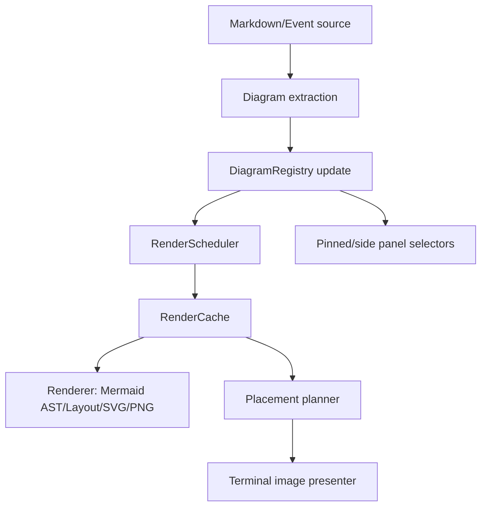

# ADR：Mermaid 渲染重构

日期：2026-05-08
状态：提议

## 问题

当前的 Mermaid 路径难以推理，因为渲染、缓存、UI 放置、活动图注册、延迟工作、调试统计和终端图像协议状态通过全局状态和副作用耦合在一起。

观察到的痛点：

- 尽管 crate 已拆分，`jcode-tui-mermaid/src/lib.rs` 仍是状态枢纽。
- Markdown 渲染直接决定 Mermaid 行为，包括流式/延迟/仅侧栏注册规则。
- 活动图作为渲染调用的副作用注册，因此仅仅准备 markdown 就会改变固定窗格状态。
- `with_preferred_aspect_ratio` 使用线程局部状态，因此缓存键和渲染尺寸依赖环境上下文。
- 同一个图可以在多个上下文中渲染：聊天行内占位符、侧栏图像、固定窗格、流式预览、调试探针。这些上下文需要不同行为但共享底层函数。
- 延迟渲染有自己的去重/纪元/全局队列，还执行活动注册，增加竞争风险。
- 图像协议渲染、PNG 生成、图像状态缓存和视口渲染混在同一个公共面中。

## 尺寸 API 方向

渲染器现在有一个 `mmdr-size-api` 路径，由 `mmdr-size-api` 特性加上 `JCODE_MMDR_SIZE_API_AVAILABLE=1` 保护。它应成为重构的主要路径：

- 渲染器应询问 Mermaid/布局测量的 SVG/canvas 尺寸，而不是依赖源文本复杂度估计来确定最终 PNG 尺寸。
- `calculate_render_size` 应成为请求目标提示，而不是输出尺寸的事实来源。
- 回退 SVG 重定向路径应只作为兼容代码保留，直到补丁渲染器总是可用。
- 调试统计应报告 `render_size_backend`，并在测试期望尺寸 API 路径但不可用时大声失败。
- 缓存键应包含归一化的目标/配置输入，而构件应存储尺寸 API 返回的测量输出尺寸。

这减少纵横比重定向、模糊放大、占位符高度不匹配和窗格调整大小振荡带来的 bug。

## 目标设计

使用显式的、分阶段的流水线，阶段之间用纯数据：



### 1. 图提取

Markdown 渲染器应只把围栏 Mermaid 块提取为不可变描述符：

```rust
struct DiagramBlock {
    id: DiagramId,
    source_hash: u64,
    source: Arc<str>,
    origin: DiagramOrigin,
    ordinal: usize,
}
```

它们不应直接改变活动图，也不应同步渲染，除非调用方显式请求阻塞回退。

### 2. 显式渲染请求

用单个请求对象替换环境式 `with_preferred_aspect_ratio` 和布尔参数：

```rust
struct RenderRequest {
    diagram_id: DiagramId,
    source_hash: u64,
    source: Arc<str>,
    target: RenderTarget,
    profile: RenderProfile,
    priority: RenderPriority,
    mode: RenderMode,
}

struct RenderProfile {
    width_cells: Option<u16>,
    preferred_aspect_per_mille: Option<u16>,
    theme: MermaidTheme,
}

enum RenderMode {
    CacheOnly,
    EnqueueIfMissing,
    Blocking,
}
```

缓存键应只从 `source_hash + normalized RenderProfile` 构建，绝不来自线程局部上下文。

### 3. 注册表拥有活动状态

引入由 TUI 应用/会话状态拥有的 `DiagramRegistry`，而不是全局 Mermaid crate 向量。

职责：

- 跟踪当前准备的记录/侧栏中可见的图。
- 用代 id 单独跟踪流式预览。
- 为固定窗格选择发布有序列表。
- 每次准备过程原子地清除/更新。

渲染应返回 `RenderArtifact`，它绝不应把注册活动图作为副作用。

### 4. 调度器拥有异步/延迟行为

调度器接收显式请求并返回以下之一：

```rust
enum RenderStatus {
    Ready(RenderArtifact),
    Pending { request_id: RenderRequestId },
    Failed(RenderError),
    ProtocolUnavailable,
}
```

规则：

- 按完整缓存键去重。
- 工作者不改变活动注册表。
- 工作者完成只发布 `MermaidRenderCompleted` 加构件元数据。
- 纪元失效限定在请求代，而不是一个全局计数器，除非确实必要。

### 5. 放置规划器与渲染分离

Markdown/侧栏准备应根据 `RenderStatus` 和期望放置插入占位符：

- 聊天/侧栏的行内图像占位符行。
- 仅侧栏模式的侧栏标记。
- 失败渲染的错误块。
- 延迟/流式渲染的待处理占位符。

图像小部件渲染应消费 `RenderArtifact` 加 `PlacementPlan`，不知道 Mermaid 源或渲染调度。

### 6. 公共模块边界

推荐的 crate 模块：

- `model.rs`：`DiagramId`、`DiagramBlock`、`RenderProfile`、`RenderTarget`、`RenderArtifact`、`RenderStatus`、错误。
- `extract.rs`：Markdown Mermaid 块提取辅助。
- `cache.rs`：磁盘和内存构件元数据缓存。
- `renderer.rs`：只做 Mermaid 解析/布局/SVG/PNG 转换。
- `scheduler.rs`：请求队列、工作者、去重、完成事件。
- `registry.rs`：活动/流式图状态，理想上由应用拥有。
- `placement.rs`：占位符/图像区域规划。
- `presenter.rs`：ratatui-image/Kitty/Sixel/iTerm 视口渲染。
- `debug.rs`：从显式事件收集的统计。

## 迁移计划

1. 添加显式模型类型和缓存键归一化测试。
2. 添加新调度器 API，同时保留旧包装器。
3. 把 `render_mermaid_sized_internal` 转换为纯化的 `renderer::render_to_png(request) -> RenderArtifact`。
4. 把活动图写入移出渲染函数，进入 markdown 准备/应用注册表更新。
5. 用显式 `RenderProfile` 传递替换 `with_preferred_aspect_ratio` 调用点。
6. 把演示器/图像状态代码与 PNG 渲染代码拆分。
7. 删除旧布尔包装器 API 和线程局部渲染配置。

## 验证标准

- 缓存键归一化和文件名解析的单元测试。
- 注册表更新顺序、流式预览替换和原子清除/更新的单元测试。
- 调度器测试：去重、缓存命中、缓存未命中待处理、工作者完成、无活动状态改变。
- Markdown 渲染器测试：Mermaid 块产生确定性占位符，无全局副作用。
- 现有滚动/固定窗格测试仍然通过。
- 调试探针可以用显式配置渲染图并报告使用的确切缓存键。

## 近期安全重构

在完整迁移之前，最高 ROI 的变更是引入显式请求/状态类型，并让旧公共函数变成薄兼容包装器。这让我们可以一次迁移一个调用点，同时减少额外布尔/线程局部行为带来的新 bug。
