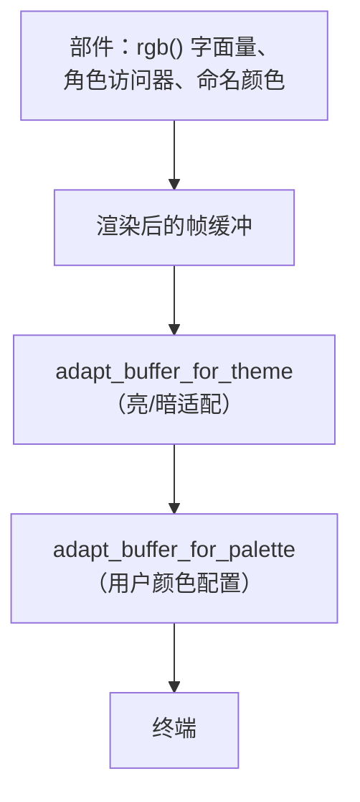

# TUI 颜色与调色板和谐

jcode TUI 渲染的每种颜色都可配置，调色板可以被客观度量而不是靠肉眼评判。

## 默认调色板是固定的

jcode 的内置调色板经过手工调校，**不**由和谐度量派生。它保持为默认。`palette.rs` 中的 `default_palette_is_frozen` 持有每个值的冗余副本，任何一个变化都会导致失败，因为生成器、评分器和修复流程都读取这些常量，容易在调工具时顺手"改进"其中一个。改变默认值会改变每个现有用户启动时看到的东西，因此必须是针对该表的刻意编辑。

默认调色板和谐分低不是改它的理由。这个度量是帮助用户评估*他们自己*选择的调色板，并让 `/colors generate` 按需生成一个。

## 配置颜色

颜色位于 `~/.jcode/config.toml`：

```toml
[display.colors]
user = "#8ab4f8"
ai = "#81c784"
accent = "#ba8bff"
error = "#ff6464"
```

在 TUI 中运行 `/colors` 列出每个角色及其当前值。变更立即生效，无需重启。

| 命令 | 效果 |
| --- | --- |
| `/colors` | 列出每个可配置角色 |
| `/colors <role> <#rrggbb>` | 设置一个角色（保存到配置） |
| `/colors generate <#rrggbb>` | 从一个种子派生整套和谐调色板 |
| `/colors harmony` | 给调色板打分并列出具体修复 |
| `/colors export` | 把调色板打印为配置 TOML |
| `/colors reset [role]` | 重置一个角色，或全部 |

## 每种颜色如何变得可配置

TUI 没有一个调色板。它有约 22 个命名语义角色，加上散布在各部件中的约 250 个不同的临时 `rgb(...)` 字面量，再加上 ratatui 的命名颜色（`Color::Red`、`Color::White`、……）。编辑每个调用点会是一个庞大且永久脆弱的变更。

相反，替换发生在每个颜色到达终端必须经过的唯一点：渲染后的帧缓冲。



顺序很重要。亮/暗 pass 存在是因为 jcode 的*内置*调色板是为暗色终端设计的，因此它翻转亮度让这些颜色在亮色终端上也能用。用户配置的颜色已经是他们想要的颜色，所以它最后运行且���不翻转：否则在白色终端上特意为错误配的深红会变成难以辨认的淡粉。因为进入的字面量此时已被翻转，角色默认值在匹配前也以同样方式预翻转。

三个值得知道的后果：

- **角色访问器返回默认值。** `theme::user_color()` 刻意返回角色的*默认*颜色，而不是配置的颜色。如果它返回配置的颜色，一个单元格会被重映射两次（一次访问器、一次缓冲 pass），色相/亮度偏移会叠加。
- **临时字面量跟随其角色。** 处于某角色默认值小感知半径内的字面量会相对新角色颜色重新表达，保留它自己的亮度和彩度偏移。因此"警告颜色的略暗变体"在你重新着色 `warning` 后仍是略暗变体。远离每个已配置角色的字面量保持不变。
- **配置的颜色按给定值精确使用**，在亮色和暗色终端上都一样，因此你放进配置的就是终端收到的。

未配置调色板是字节相同的 no-op，有测试保护，现有用户看不到任何变化。

### 真的是*每种*颜色吗？

这个说法是被检查的而不是被断言的。`palette_literals.rs` 持有 TUI crates 渲染的每个不同 `rgb(...)` 字面量（222 个），一个测试要求**全部**都能从某个角色可达：无人认领的字面量就是用户无法改变的颜色。第二个测试要求 22 个角色中的每一个都至少认领一个真实字面量（这样 `/colors` 里没有死重角色），且没有一个认领超过一半（这样族半径仍能区分角色）。当前分布从 2 个字面量（`header_session`）到 28 个（`warning`）。

ratatui 的命名颜色单独覆盖，因为它们不携带可供字面量匹配的 RGB。一个测试枚举 TUI 实际使用的每个命名颜色，并要求每个都映射到一个角色。`Color::Black` 在该测试存在之前不可达。`Color::Reset` 刻意从不被替换：它是终端自身背景透出的方式。

添加引入新色调的部件时，重新生成 `palette_literals.rs`。

## 度量和谐

`/colors harmony` 按五个标准给调色板打 0-100 分，并报告具体违规项。所有数学都在 Oklab（感知均匀空间）中进行，因此"距离"和"亮度"与眼睛报告的一致，而不是与 RGB 数字暗示的一致。

| 标准 | 权重 | 关键 | 度量什么 |
| --- | --- | --- | --- |
| 可读性 | 3.0 | 是 | 每个前景角色相对真实终端背景的亮度对比 |
| 区分度 | 2.0 | 是 | 绝不能混淆的角色之间的感知距离（`success`/`error`、`user`/`ai`、……） |
| 色相和谐 | 2.0 | 否 | 对公认配色方案（类似、互补、三角、四角、分裂互补）的拟合 |
| 彩度连贯 | 1.5 | 是 | 饱和度一致性，以及调色板是否处于舒适阅读的饱和度带 |
| 色盲安全 | 1.0 | 否 | 在模拟红绿色盲和红色盲下重新度量的区分度 |

这里有两个重要的设计决策：

**只有关键标准能拉低分数。** 总分把加权平均与*最差关键*标准混合。不可读的文本是缺陷。非常规色相方案是风格选择：Solarized 刻意打破教科书式色相规则，仍是史上最受喜爱的调色板之一。把品味当作缺陷会让度量与它自己的用户意见相左。

**聚合是最差加权。** 在一个标准内，分数是 `0.4 * 均值 + 0.6 * 最差`，因此一个不可读角色或一对碰撞角色不能躲在二十个良好项后面。那一个坏掉的东西正是用户想听说的。

### 校准

和谐分数只有与人眼判断一致才有用，因此测试套件用开发者数千人刻意选择的调色板钉住这种一致性。暗色背景上的当前分数：

| 调色板 | 分数 |
| --- | --- |
| Dracula | 76 |
| Solarized Dark | 70 |
| Nord | 69 |
| Gruvbox Dark | 67 |
| Neon chaos（对抗样本） | 56 |
| Unreadable mud（对抗样本） | 38 |

如果评分变化颠倒这些排序中的任何一个，说明度量已偏离人们对"和谐"的理解，该变化是错误的。针对真实调色板校准抓住了三个真正的校准错误，而一个自洽的测试套件会永远愉快地接受它们。

## 生成调色板

手工调校 22 个角色正是让大多数人完全不主题化的原因，因此 `/colors generate <#rrggbb>` 从一个种子颜色派生完整调色板并报告结果分数。

- 角色以分裂互补布局放置在种子的色相环上。
- 彩度被拉入舒适阅读带，因此即使是霓虹种子也能产生可用调色板。
- 亮度瞄准*当前*终端背景，因为为暗色调校的调色板在亮色上通常是错的。
- `success`、`warning` 和 `error` 保留它们的传统色相。用户对"红=错误"的依赖远超对新颖的追求。
- 必须区分的对在**亮度上以及色相上**分离。在红绿色觉缺陷下，色相分离基本坍缩到蓝-黄轴，而亮度在每种类型下都存活，这正是无障碍调色板依赖亮度的原因。`success`、`warning` 和 `error` 正是为此放在三个不同亮度级别：绿色、琥珀和红色在红色盲下都向黄色投射，因此色相在那里根本无法区分它们。
- 然后**修复 pass** 修复任何仍可混淆的对，用调色板的*全局*最弱对给候选移动打分。这比听起来重要：约束是耦合的（success、warning、error 构成三角形），因此贪心成对修复可证明会循环，一次 trace 证实了它确实如此——修复一条边又破坏另一条，直到迭代预算耗尽。候选被约束以保持对比度、彩度和传统色相，因此该 pass 永远不能通过让角色不可读或无色来换取区分度。

两个限制都是诚实的。在可读亮度带和保持红=错误的色相预算内，琥珀警告和红色错误在红色盲下无法被推到区分目标的约 0.7 以上。走得更远需要放弃对比度或语义约定，两者对用户的代价都超过额外余量带来的收益。

测试把生成器约束到度量本身：每个种子，包括纯红、纯灰和近黑，都必须在亮色和暗色背景上至少得 70 分。

## 添加角色

1. 在 `crates/jcode-tui-style/src/palette.rs` 的 `Role` 中添加变体，把它列进 `ALL_ROLES`，给它 `key()` 和等于调用点当前硬编码值的 `default_rgb()`。默认值必须保持今天的观感。
2. 如果它是背景色，在 `is_background()` 中说明；背景色用与文本不同的可读性标准评分。
3. 如果它必须与另一个角色可区分，把这对加到 `harmony.rs` 的 `MUST_DISTINGUISH`。不要添加好的调色板合理让它们相似的对（`dim`/`tool` 在几乎所有真实调色板中都是低强调灰）。
4. 在 `theme.rs` 添加访问器并在调用点使用。

`ALL_ROLES` 驱动 `/colors` 列表、补全、导出和和谐分析，因此新角色会自动被它们全部覆盖。
