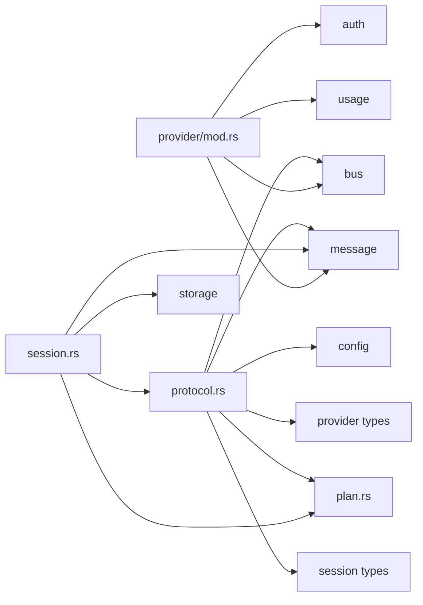

# Provider、会话与共享契约边界审计

状态：2026-04-16 审计说明

本文档审计 jcode 工作区中当前的 provider、会话和共享契约接缝，并推荐下一个**现实可行**的 crate 移动，在不制造高变更依赖环的前提下改善模块化。

它有意保守。目标是识别同时满足两者的边界：

- 结构上有用
- 变更成本低到值得现在就变成工作区 crate

另见：

- [`编译性能计划.md`](../plans/编译性能计划.md)
- [`重构路线图.md`](../重构路线图.md)
- [`服务器架构.md`](../服务器架构.md)
- [`多会话客户端架构.md`](../多会话客户端架构.md)

## 执行摘要

下一个干净的工作区移动**不是**完整的 `Provider` trait 提取，也**不是**完整的 `session.rs` 拆分。

最佳下一步是：

1. **添加一个小型 `jcode-shared-contracts` crate**，容纳那些已经表现得像共享契约的 serde-only 协议/会话重叠类型。
2. **之后，添加一个窄的 `jcode-session-contracts` crate**，容纳被广泛复用但不需要完整 `Session` 运行时的会话元数据/回放/视图结构。
3. **如果在更大的 provider 重构前还想要一个 provider 侧移动，把纯 provider 身份/选择层提取**到 `jcode-provider-core` 或一个小型 `jcode-provider-selection` crate。

目前要避免的主要事项：

- 把 `Provider` / `EventStream` 提取到共享 crate
- 提取全部 `protocol.rs`
- 提取全部 `session.rs`
- 把 `provider_catalog.rs` 整体移入 crate

那些看起来很诱人，但今天它们大多只会把现有的高变更耦合转换成工作区 crate 变更。

## 当前工作区边界状态

已经落地且方向正确：

- `crates/jcode-provider-metadata`
- `crates/jcode-provider-core`
- `crates/jcode-provider-openrouter`
- `crates/jcode-provider-gemini`

当前已提取 crate 的一个有用属性是它们仍然是**类叶子的支持 crate**。

这些 crate 当前的本地工作区依赖图：

- `jcode-provider-core`：无本地工作区依赖
- `jcode-provider-metadata`：无本地���作区依赖
- `jcode-provider-openrouter`：无本地工作区依赖
- `jcode-provider-gemini`：无本地工作区依赖

这是应该保留的正确模式。下一个 crate 移动应该继续产出小而类叶子的 crate，而不是创建所有东西都重新编译通过的新中央枢纽。

## 观察到的热点与耦合

主 crate 中的相关文件大小：

- `src/session.rs`：2730 行
- `src/provider/mod.rs`：2283 行
- `src/protocol.rs`：1198 行
- `src/provider/openrouter.rs`：1132 行
- `src/provider/gemini.rs`：1117 行
- `src/provider_catalog.rs`：775 行
- `src/plan.rs`：17 行

审计期间观察到的高层耦合：

- `src/provider/mod.rs` 直接引用 `auth`、`logging`、`bus`、`message` 和 `usage`
- `src/session.rs` 直接引用 `message`、`protocol`、`plan`、`storage` 和支持模块
- `src/protocol.rs` 直接引用 `bus`、`config`、`message`、`plan`、`provider`、`session` 和 `side_panel`
- `src/provider_catalog.rs` 特别依赖 `env`、`storage` 和 `logging`

这意味着最大的阻碍不是已经提取的支持 crate。而是主 crate 中剩余的混合运行时/门面模块。

## 依赖形状

关键的架构气味是：一些实际上属于**共享契约**的类型仍然住在大型混合职责模块里。

## Provider 边界审计

### 什么已经处于良好状态

现有的 provider crate 移动选得很好：

- `jcode-provider-metadata` 持有稳定的登录/配置目录数据
- `jcode-provider-core` 持有路由/成本/共享 HTTP 客户端/核心值类型
- `jcode-provider-openrouter` 持有 OpenRouter 特定的目录/缓存/排名/模型规格支持
- `jcode-provider-gemini` 持有 Gemini Code Assist schema/类型/支持辅助函数

这些都是相对纯粹的支持表面。

### 什么还不是好的下一步

### 暂不提取 `Provider` / `EventStream`

`src/provider/mod.rs` 仍然深陷于：

- `crate::message::{Message, StreamEvent, ToolDefinition}`
- 认证驱动的行为
- 运行时选择/故障转移
- 日志和总线通知
- provider 特定的压缩和传输行为

现在移动 trait 很可能创建一个新的共享 crate，它仍然会在运行时/provider 行为变化时跟着变。

那会改善目录布局，但不会改善边界质量。

### 暂不整体移动 `provider_catalog.rs`

`src/provider_catalog.rs` 不只是元数据。它目前混合了：

- 目录/配置值
- env 变更
- 认证探测辅助函数
- 配置文件查找
- 日志/警告

那个门面仍然太运行时感知，不能原样成为干净的叶子 crate。

### 最现实可行的 provider 移动

### 选项 A：提取 provider 身份 + 纯选择

当前支持 crate 之后最现实的 provider 侧移动：

- 移动当前由 `ActiveProvider` 代表的 provider 身份枚举
- 移动 `src/provider/selection.rs`
- 可选地移动不依赖认证/运行时状态的纯回退排序辅助函数

目标：

- 要么新的 `crates/jcode-provider-selection`
- 要么 `jcode-provider-core` 内的小型 `provider_identity` / `selection` 模块

为什么这现实可行：

- `selection.rs` 已经是纯逻辑
- 它不需要 `Message`、`EventStream`、认证状态或存储
- 它会从 `src/provider/mod.rs` 中削减一些策略代码
- 它为 provider 顺序和 provider 名称规范化规则创造稳定位置

为什么它应该保持窄：

- 一旦代码开始触碰账号故障转移、认证检查、运行时可用性或日志，它就不再是好的 crate 边界

## 会话边界审计

### 为什么 `session.rs` 暂不应整体提取

`src/session.rs` 很大，但它不是单一东西。它目前混合了：

- 持久化会话数据结构
- 运行时会话状态
- 日志/文件持久化辅助函数
- 回放事件持久化
- 启动/远程快照辅助函数
- 图像渲染辅助函数

整文件 crate 提取会拖入比它移除的更多的耦合。

当前阻碍：

- `StoredMessage` 依赖 `crate::message::{ContentBlock, Message, Role, ToolCall}`
- 回放事件类型目前依赖 `crate::protocol::SwarmMemberStatus`
- 回放事件计划快照目前依赖 `crate::plan::PlanItem`
- 会话模块还拥有持久化和存储关注点

因此下一步应该是**会话契约切片**，而不是完整会话 crate。

### 最现实可行的会话移动

### 选项 B：窄 `jcode-session-contracts`

在共享契约先被提取后，移动符合这些条件的会话类型：

- serde-only
- 在 `session.rs` 之外被复用
- 不绑定 `storage` 或完整 `Session` 运行时

好的首选候选：

- `SessionStatus`
- `SessionImproveMode`
- `StoredDisplayRole`
- `StoredTokenUsage`
- `StoredCompactionState`
- `StoredMemoryInjection`
- `RenderedImageSource`
- `RenderedImage`
- `StoredReplayEvent` 和 `StoredReplayEventKind`（一旦它们的 swarm/plan 负载不再指回 `protocol.rs`）

现在应该留在主 crate 中的：

- `Session`
- `StoredMessage`
- 会话日志/文件 IO
- 会话启动/加载/保存编排
- 消息到图像渲染函数

为什么这现实可行：

- 这些契约结构已经在 agent、server、replay 和 TUI 代码中有广泛的扇出
- 它们在语义上是会话级契约，而不是会话运行时行为
- 一旦共享 swarm/协议负载先被提取，这个移动会干净得多

## 共享契约边界审计

这是最高杠杆的下一接缝。

有几个小型、serde-only 的类型已经是明确的共享契约，但它们目前住在大型模块里：

- `src/plan.rs` 中的 `PlanItem`
- `src/protocol.rs` 中的 `TranscriptMode`
- `src/protocol.rs` 中的 `CommDeliveryMode`
- `src/protocol.rs` 中的 `FeatureToggle`
- `src/protocol.rs` 中的 `SessionActivitySnapshot`
- `src/protocol.rs` 中的 `SwarmMemberStatus`
- `src/protocol.rs` 中的 `AgentInfo`
- `src/protocol.rs` 中的 `ContextEntry`
- `src/protocol.rs` 中的 `SwarmChannelInfo`
- `src/protocol.rs` 中的 `AwaitedMemberStatus`
- `src/protocol.rs` 中的 `NotificationType`

这些被 server、tool、TUI、replay 和会话持久化流程使用，但它们不需要 `protocol.rs` 的其余部分。

### 最佳总体下一步

### 选项 C：添加 `jcode-shared-contracts`

第一遍推荐内容：

- `PlanItem`
- `TranscriptMode`
- `CommDeliveryMode`
- `FeatureToggle`
- `SessionActivitySnapshot`
- swarm 相关状态/信息结构：
  - `SwarmMemberStatus`
  - `AgentInfo`
  - `ContextEntry`
  - `SwarmChannelInfo`
  - `AwaitedMemberStatus`
  - `NotificationType`

为什么这是最佳下一步：

- 它在契约层打破 `session.rs -> protocol.rs / plan.rs` 依赖结
- 它给回放/会话持久化一个干净的 swarm 和计划快照依赖
- 它修剪 `protocol.rs`，而不尝试提取 `Request` 和 `ServerEvent`
- 它保留当前成功的模式：一个主要是 `serde` 类型的小型类叶子支持 crate

最小依赖目标：

- `serde`
- 如果可能，没有其他

## 推荐的排序

### Phase 1

创建 `crates/jcode-shared-contracts`。

预期的即时移动：

- `src/plan.rs` 内容
- 上面列出的来自 `src/protocol.rs` 的小型共享结构/枚举

现在保留在主 crate：

- `Request`
- `ServerEvent`
- `encode_event` / `decode_request`

### Phase 2

创建 `crates/jcode-session-contracts`。

只在 Phase 1 之后做，这样会话回放类型可以指向 `jcode_shared_contracts::*` 而不是 `crate::protocol::*` 或 `crate::plan::*`。

### Phase 3

如果在更大的 provider 重构前仍想要 provider 侧移动，只提取：

- provider 身份枚举
- 纯选择/回退排序辅助函数

**不要**包含：

- `Provider` trait
- `EventStream`
- 账号故障转移
- 认证状态检查
- 运行时 provider 可用性
- 日志/总线副作用

## 明确推迟的移动

这些应被视为后期重构，而不是下一步 crate 移动。

### 推迟：完整 `protocol.rs` crate

原因：

- `Request` 和 `ServerEvent` 仍然拉入 `message`、`provider`、`session`、`side_panel` 和 `bus`
- 现在提取整个文件会创建一个宽泛、高扇出的 crate，而不是干净的契约 crate

### 推迟：完整 `session.rs` crate

原因：

- 文件混合了契约、运行时状态、渲染、日志和持久化
- `StoredMessage` 仍然把会话层锚定到 `message.rs`

### 推迟：完整 provider trait / impl crate 拆分

原因：

- trait 接缝仍然与运行时行为和 provider 特定执行策略混合
- 现在移动它很可能会集中变更而不是减少变更

### 推迟：完整 `provider_catalog.rs` 提取

原因：

- 文件仍然是 env/config/auth 探测周围的运行时门面，而不只是元数据

## 为什么这个顺序避免依赖环错误

顺序很重要：

1. 先提取小型共享契约
2. 然后提取依赖那些共享契约的会话契约
3. 只有在那之后才重新审视更深的 provider 或 protocol 提取

这个顺序避免了创建需要为了基本 DTO 指回主 crate 的 crate，而这正是高变更依赖环通常开始的方式。

## 推荐的具体下一步行动

1. 添加 `crates/jcode-shared-contracts`，包含来自 `plan.rs` 和协议/会话重叠小集的 serde-only 类型。
2. 更新 `session.rs`、`protocol.rs`、server、tool、replay 和 TUI 导入指向该 crate。
3. 重新测量受影响文件的编译时间：
   - `src/session.rs`
   - `src/protocol.rs`
   - `src/provider/mod.rs`
4. 如果新接缝保持干净，随后进行窄 `jcode-session-contracts` 提取。
5. 只有在 message/runtime/provider-execution 接缝更薄之后，才重新审视 provider trait 提取。
