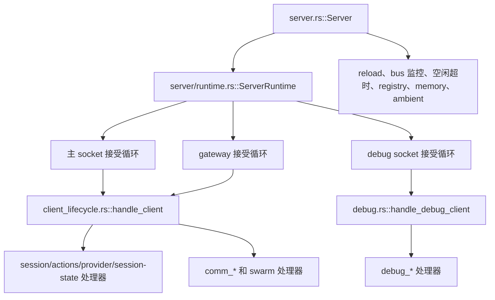
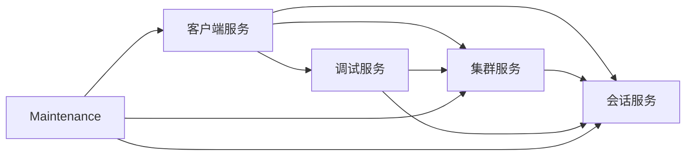

# 服务器服务拆分计划

状态：基于审计的计划

范围：当前共享服务器架构中的 `src/server*.rs` 和 `src/server/**/*.rs`。

本文档审计当前服务器技术栈，并提出增量拆分为五个进程内服务：

- 会话（session）
- 客户端（client）
- 集群（swarm）
- 调试（debug）
- 维护（maintenance）

意图是在不改变单进程运行时模型的前提下改善所有权边界并减少参数扇出。

另见：

- [`服务器架构.md`](../服务器架构.md)
- [`集群架构.md`](../集群架构.md)
- [`统一自研服务器计划.md`](./统一自研服务器计划.md)

## 执行摘要

今天服务器在文件层面已经逻辑拆分，但没有所有权边界。主导模式是：

- `Server` 在一个结构体中拥有几乎所有共享状态。
- `ServerRuntime` 把整个状态包克隆进连接处理器。
- `handle_client()` 和 `handle_debug_client()` 接收非常宽的依赖列表。
- `server.rs` 中的维护循环直接变更与 client、session、swarm 和 debug 路径使用的相同的原始 map。

这意味着主要提取接缝**不是**传输或进程边界。主要接缝是在现有进程内引入**服务拥有的状态 + 服务 API**。

最安全的路径是：

1. 保持一个服务器进程
2. 保持当前模块和行为
3. 在现有状态周围引入服务句柄结构
4. 把变更移到服务方法后面
5. 把 `handle_client()` 和 `handle_debug_client()` 缩减为少数服务/上下文参数

**不要**从 crate、trait 或 IPC 拆分开始。代码还没准备好，当前痛点主要是所有权扇出，而不是运行时拓扑。

## 当前技术栈审计

### 顶层运行时形状

当前运行时流程：



### 共享状态集中

`src/server.rs` 拥有一个大型 `Server` 结构，其状态横跨所有关注点，包括：

- 会话和默认会话 id
- 客户端计数和客户端连接 map
- 集群成员、计划、共享上下文、协调器 map
- 文件触碰跟踪和反向索引
- 频道订阅和反向索引
- 调试客户端路由和调试任务
- 集群事件历史和事件总线
- ambient 运行器、共享 MCP 池
- 关闭信号和软中断队列
- await-members 运行时

这实际上是一个服务容器，但被表示为一个宽泛的状态所有者。

### 现有积极接缝

代码已经包含一些我们应该保留的有用接缝：

- `runtime.rs` 已经把接受循环编排与引导隔离。
- `state.rs` 已经集中共享类型和投递辅助函数。
- `swarm.rs` 已经是最接近有状态领域服务的东西。
- `reload.rs` 已经与引导分离，尽管 `server.rs` 仍拥有大部分维护接线。
- `debug_*` 模块已经按调试命令领域拆分。

这些都是好的提取点。下面的计划依赖它们而不是与它们对抗。

## 模块热度图

审计时最大的服务器端模块：

| 文件 | 行数 | 当前主要关注点 | 未来服务 |
|---|---:|---|---|
| `src/server/client_lifecycle.rs` | 1767 | 客户端请求循环和路由器 | client |
| `src/server/client_comm.rs` | 1492 | 集群通信请求 | swarm |
| `src/server/client_actions.rs` | 1249 | 会话本地动作 | session |
| `src/server/swarm.rs` | 1202 | 集群状态变更和扇出 | swarm |
| `src/server/comm_control.rs` | 1183 | 集群控制 / await-members / 客户端调试桥 | swarm + debug |
| `src/server/client_session.rs` | 1091 | subscribe、resume、clear、reload | session + client 边界 |
| `src/server/comm_session.rs` | 987 | 生成/停止会话流程 | session + swarm 边界 |
| `src/server/debug.rs` | 980 | 调试 socket 命令路由器 | debug |
| `src/server/reload.rs` | 826 | reload 和优雅关闭 | maintenance |
| `src/server/debug_server_state.rs` | 748 | 所有存储的调试快照 | debug |

解读：

- 架构没有被缺失模块阻塞。
- 它被**跨服务状态访问**和**路由器宽度**阻塞。

## 耦合最高的地方

### 1. `ServerRuntime` 是全状态信使

`runtime.rs` 把几乎每个共享字段克隆进运行时并转发给：

- 主客户端处理
- 调试客户端处理
- gateway 客户端处理

这让传输代码依赖内部服务存储细节。

### 2. `handle_client()` 既是连接循环又是应用路由器

`client_lifecycle.rs::handle_client()` 目前结合了：

- 流读取循环
- 每连接状态
- 会话附加 / 恢复 / 清空
- provider 控制
- 集群通信分发
- 调试桥请求
- 消息处理生命周期
- 断开清理

这是 client、session、swarm 和 debug 职责在一个地方交叉的最清晰信号。

### 3. 会话流程直接变更集群状态

`client_session.rs` 做真正的会话工作，但也直接触碰：

- 集群成员注册
- 频道订阅清理
- 计划参与者改名/移除
- 状态更新
- 事件发送器注册
- 中断队列改名/移除

这让会话生命周期难以干净提取，因为它同时拥有智能体状态和集群成员副作用。

### 4. 维护循环直接伸手到领域 map

`server.rs` 维护任务目前直接触碰共享状态：

- reload 处理
- 后台任务唤醒 / 通知投递
- bus 监控和文件触碰冲突检测
- 空闲超时
- 运行时内存日志
- registry 发布
- ambient 调度

这让后台任务依赖存储布局而不是服务 API。

### 5. 调试路径绕过未来边界

`debug.rs` 和 `debug_*` 模块直接检查或变更许多原始存储。
现在没问题，但除非调试成为服务快照和公共变更方法的消费者，否则会阻塞提取。

## 提议的服务拆分

目标拆分仍然是单进程单 Tokio 运行时。
变化是所有权和 API，而不是部署。

### 1. 会话服务

**拥有：**

- `sessions`
- `session_id` 默认/全局会话跟踪
- `shutdown_signals`
- `soft_interrupt_queues`
- 会话事件发送器注册和扇出
- 会话本地智能体动作和 provider/会话变更
- 无头会话创建原语

**拆分后的主要模块：**

- `state.rs` 投递部分
- `client_session.rs` 仅会话部分
- `client_actions.rs`
- `provider_control.rs`
- `headless.rs`
- `reload.rs` 中优雅关闭辅助函数的部分

**公共 API 示例：**

- `attach_client(...)`
- `resume_session(...)`
- `clear_session(...)`
- `spawn_headless_session(...)`
- `queue_soft_interrupt(...)`
- `fanout_session_event(...)`
- `rename_session(...)`
- `shutdown_session(...)`
- `session_snapshot(...)`

**边界规则：** 会话服务不应直接拥有集群成员规则。
它可以暴露生命周期事件或返回另一层用来更新集群状态的会话元数据。

### 2. 客户端服务

**拥有：**

- socket、debug socket、gateway 传输接受循环
- 客户端连接注册表
- 客户端计数 / 附加计数
- 连接作用域状态和请求路由
- 跨服务的 subscribe / reconnect 编排
- 客户端 API 包装器

**拆分后的主要模块：**

- `runtime.rs`
- `socket.rs`
- `client_api.rs`
- `client_lifecycle.rs` 仅连接循环和路由器
- `client_disconnect_cleanup.rs`
- `client_state.rs` 面向客户端的部分

**公共 API 示例：**

- `spawn_accept_loops(...)`
- `run_client_connection(stream)`
- `register_connection(...)`
- `cleanup_connection(...)`
- `connected_clients_snapshot()`

**边界规则：** 客户端服务路由请求，但不拥有会话、集群或调试任务的业务状态。

### 3. 集群服务

**拥有：**

- `swarm_members`
- `swarms_by_id`
- `shared_context`
- `swarm_plans`
- `swarm_coordinators`
- 频道订阅和反向索引
- 集群事件历史和事件广播
- 文件触碰跟踪和反向索引
- await-members 运行时
- 状态广播、计划广播、冲突通知

**拆分后的主要模块：**

- `swarm.rs`
- `client_comm.rs`
- `comm_plan.rs`
- `comm_control.rs` 集群部分
- `comm_session.rs` 集群协调部分
- `comm_sync.rs`
- `server.rs::monitor_bus` 的文件触碰部分
- `await_members_state.rs`

**公共 API 示例：**

- `join_swarm(...)`
- `leave_swarm(...)`
- `set_member_status(...)`
- `assign_role(...)`
- `update_plan(...)`
- `subscribe_channel(...)`
- `publish_notification(...)`
- `record_file_touch(...)`
- `detect_conflicts(...)`
- `await_members(...)`
- `snapshot_swarm(...)`

**边界规则：** 集群服务可以通过会话服务请求消息投递，但不应伸手到原始会话 map。

### 4. 调试服务

**拥有：**

- 调试 socket 请求路由器
- 客户端调试桥状态
- 调试任务注册表
- testers 和调试命令执行辅助函数
- 供检查的服务器和集群快照

**拆分后的主要模块：**

- `debug.rs`
- `debug_command_exec.rs`
- `debug_events.rs`
- `debug_help.rs`
- `debug_jobs.rs`
- `debug_server_state.rs`
- `debug_session_admin.rs`
- `debug_swarm_read.rs`
- `debug_swarm_write.rs`
- `debug_testers.rs`
- `debug_ambient.rs`

**公共 API 示例：**

- `run_debug_connection(stream)`
- `submit_debug_job(...)`
- `server_snapshot()`
- `swarm_snapshot(...)`
- `route_transcript_injection(...)`

**边界规则：** 调试服务应从其他服务读取快照，并且只通过显式服务方法变更它们。
除有意记录的情况外，它不应是绕过正常 API 的特权后门。

### 5. 维护服务

**拥有：**

- reload 监控器和 reload 状态管道
- registry 发布 / 清理后台任务
- 空闲超时监控器
- 运行时内存日志循环
- 嵌入预加载和空闲卸载
- ambient 循环启动/接线
- 后台任务完成投递编排
- 把基础设施事件翻译为服务调用的 bus 订阅循环

**拆分后的主要模块：**

- `reload.rs`
- `reload_state.rs`
- `server.rs` 的后台任务投递逻辑
- `server.rs` 的 registry 和空闲超时部分
- `server.rs` 的运行时内存日志部分
- 收窄为服务调用后的 `monitor_bus()`

**公共 API 示例：**

- `start_background_loops(...)`
- `handle_reload_signal(...)`
- `deliver_background_task_completion(...)`
- `publish_registry_metadata(...)`
- `run_idle_monitor(...)`
- `run_bus_monitor(...)`

**边界规则：** 维护服务应编排服务，而不是拥有它们的领域 map。

## 推荐的依赖方向



规则：

- `Server` 只做引导和接线。
- `ServerRuntime` 只做传输运行时。
- 会话和集群是主要领域服务。
- 调试和维护依赖领域服务，而不是反过来。

## 具体提取接缝

### 接缝 A：把 `state.rs` 变成会话投递基础

`state.rs` 已经包含最好的低风险共享接缝：

- 会话事件发送器注册
- 会话事件扇出
- 软中断队列注册和入队

让它成为会话服务的初始骨干，而不是留作通用辅助函数。

为什么安全：

- 逻辑已经集中
- 被 swarm、debug 和 maintenance 大量复用
- 提取减少 `SessionAgents` 和队列管道的重复，不改变行为

### 接缝 B：把连接路由与业务处理��分离

把 `client_lifecycle.rs` 拆分为：

- 处理流和每客户端状态的 `ClientConnection` 或 `ClientLoop`
- 把 `Request` 变体映射到服务调用的 `ClientRequestRouter`

路由器应依赖 `SessionService`、`SwarmService` 和 `DebugService`，而不是原始 `Arc<RwLock<HashMap<...>>>` 字段。

为什么安全：

- 无协议变更
- 暂时无状态所有权变更
- 主要是签名收窄和文件移动

### 接缝 C：把集群成员副作用移出会话生命周期代码

今天 subscribe/resume/clear 路径同时做会话和集群工作。
那应变成：

- 会话服务：附加/恢复/重命名会话
- 集群服务：加入/更新/离开成员状态
- 客户端服务：为一个请求编排这个序列

这很可能是未来可维护性最重要的语义接缝。

为什么安全：

- 澄清所有权而不改变共享服务器模型
- 先移除最难的跨领域耦合

### 接缝 D：让维护循环只调用服务 API

`monitor_bus()`、reload 编排、空闲超时和后台任务唤醒应停止直接变更共享 map。
它们应调用：

- `session_service.queue_soft_interrupt(...)`
- `session_service.fanout_session_event(...)`
- `swarm_service.record_file_touch(...)`
- `swarm_service.broadcast_status(...)`
- `swarm_service.detect_conflicts(...)`

为什么安全：

- 行为保持不变
- 后台逻辑变得可隔离测试
- 未来重构不再需要编辑 `server.rs`

### 接缝 E：让调试消费快照而不是存储

调试栈目前对内部 map 知道得太多。
引入服务快照方法，让调试代码读取预成形的数据：

- `session_service.snapshot_sessions()`
- `client_service.snapshot_connections()`
- `swarm_service.snapshot_state()`
- `maintenance_service.snapshot_runtime_health()`

为什么安全：

- 调试保持强大
- 领域内部变得更容易变更
- 只读检查停止阻塞存储变更

## 首批安全移动

这些是我建议按顺序落地的首批变更。

### 移动 1：文档和所有权规则

落地本计划，并把它作为未来重构的契约。

**为什么先做：** 防止恶化耦合的意外部分提取。

### 移动 2：引入零行为变更的服务句柄结构

添加薄包装，例如：

- `SessionServiceHandle`
- `ClientServiceHandle`
- `SwarmServiceHandle`
- `DebugServiceHandle`
- `MaintenanceServiceHandle`

初始它们可以只包装当前的 `Arc` 字段。
暂时不需要逻辑移动。

**收益：** 阻止 20+ 参数列表的扩散。

### 移动 3：让 `ServerRuntime` 持有服务句柄而不是原始 map

`runtime.rs` 是收窄依赖的最干净位置，因为它已经充当服务器的执行运行时。

**收益：** 连接接受代码不再需要知道每个子系统的存储布局。

### 移动 4：改变 `handle_client()` 和 `handle_debug_client()` 签名

用少数类型化上下文替换宽参数列表：

- `ClientRequestContext`
- `DebugRequestContext`
- 服务句柄

**收益：** 在有限行为风险下获得最大的可读性收益。

### 移动 5：从 `client_session.rs` 提取集群成员编排

创建显式集群成员方法，让 client/session 流程调用它们。

**收益：** 这是第一个真正的领域拆分，移除了最大的架构结之一。

### 移动 6：把 `monitor_bus()` 移到集群/会话 API 边界后面

保持行为，但停止维护循环的直接 map 访问。

**收益：** 后台基础设施变得模块化且更易测试。

## 早期要避免的移动

在服务句柄层存在之前避免这些：

- 拆分为独立进程
- 为每个服务创建新 crate
- 为每个领域调用引入 async trait
- 改变线上协议
- 改变会话持久化格式
- 在重构中把调试和普通 socket 合并为一个传输路径

这些风险更高，并且不像状态/API 收窄那样直接解决当前问题。

## 建议的文件落地计划

### Phase 1：无行为变更

- 添加服务句柄类型
- 让 `Server` 存储这些句柄或集中构造它们
- 通过 `runtime.rs` 穿线句柄
- 收窄 `handle_client()` 和 `handle_debug_client()` 输入

### Phase 2：移动所有权边界

- 把会话投递辅助函数移到会话服务下
- 把集群成员/状态/频道/计划变更完全移到集群服务下
- 把调试读取器移到服务快照
- 把维护循环移到服务 API

### Phase 3：清理模块布局

可能的终态布局：

```text
src/server/
  bootstrap.rs            # 当前 server.rs 引导部分
  runtime.rs              # 接受循环和传输运行时
  services/
    session.rs
    client.rs
    swarm.rs
    debug.rs
    maintenance.rs
  session/
    actions.rs
    lifecycle.rs
    provider.rs
    delivery.rs
  swarm/
    comm.rs
    plan.rs
    control.rs
    sync.rs
    state.rs
  debug/
    router.rs
    jobs.rs
    snapshots.rs
    testers.rs
  maintenance/
    reload.rs
    bus.rs
    idle.rs
    memory.rs
    registry.rs
```

这可以逐步达成。不必在一个 PR 中完成。

## 决策记录

### 推荐的首个代码提取

如果文档之后想要一个微小的提取，最安全的是：

- **只引入服务句柄结构**，无行为变更

这是最高杠杆的低风险移动，因为它立即收窄依赖表面，并为以后移动方法创造了位置。

### 推荐的当前非目标

不要把服务器拆分为独立 OS 服务。当前架构受益于共享 MCP 池、共享嵌入生命周期、共享 reload 处理和共享内存内协调。代码应首先在**现有进程内部**模块化。
