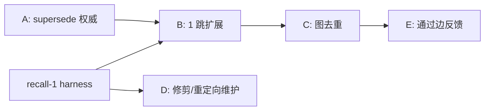

# 计划：让记忆图物有所值

> 状态：提案。与记忆架构.md 配套。目标：最佳召回准确率。

## 当前现实（已在代码中验证）

- **实时自动召回**（`memory_agent::process_context`）使用
  `find_similar_with_embedding` -> `score_and_filter`：对所有活跃记忆做平面余弦，阈值 0.5，间隔过滤，取前 10，然后逐候选做二值 sidecar 相关性判断，最多浮出 5 条。
- **图遍历**（`cascade_retrieve`，对 tags/clusters/RelatesTo 做 BFS）
  只被手动 `memory { action: search }` 工具调用
  （`tool/memory.rs:216`）。它对逐回合浮出**没有任何贡献**。
- 维护（`post_retrieval_maintenance`）每回合都**写入**图结构
  （RelatesTo 链接、自动聚类 + sidecar 命名、推断标签、置信度
  提升/衰减、修剪），但实时路径从不把其中大部分**读回**。

所以今天图的边/聚类/标签是写多读少。那些真正重要的部分（supersede/contradiction -> `active`、强化强度、门控活跃集的置信度）帮助数据卫生，而不是排序。

## 目标：在两种模式下都最大化召回准确率

两种模式都是一等目标。它们共享阶段 1（候选生成）
和图层，但在质量/判断阶段分叉。策略：把尽可能多的准确率推到**共享本地栈**（更好的 embedder、混合检索、查询构造、图重排、先验），让模式 1 自身变强，然后让模式 2 的 LLM 在已经很好的候选集上添加最终精度层，而不是补偿弱候选集。

### 共享本地栈（提升两种模式）
- recall-2 更好的 embedder + 非对称前缀
- recall-3 聚焦查询构造（当前意图，而不是 8k blob）
- recall-4 混合 dense + BM25 + RRF
- recall-6 分数中的新近度/置信度/强度/范围先验
- Phase A-C 图：supersede 权威、1 跳扩展、去重
- 本地交叉编码器重排器（小型、设备上）作为模式 1 的顶层

### 模式 1（无 LLM）- 让它尽可能接近模式 2
- 用以下流程替换原始余弦前 5：混合召回 -> 图扩展 -> 本地
  交叉编码器重排 -> 先验 -> 校准截断。这些都不需要 LLM；交叉编码器是在线可用的最大精度杠杆。
- 按模式调整校准截断（模式 1 可以承受略高的召回
  因为没有下游 LLM 过滤；依赖交叉编码器保精度）。
- 可选：廉价的本地查询扩展（同义词/标识符拆分），因为
  没有 LLM 做查询重写。

### 模式 2（LLM）- 添加精度，不重做召回
- 把**同一个强候选集**（混合 + 图 + 交叉编码器前约 15-20 条）
  喂入一个**列表式** LLM 重排，替换今天独立的二值调用
  （二值调用无法比较候选，浪费 LLM 的判断力）。
- 在阶段 0 用 LLM 做查询重写 / HyDE，修复本地栈够不到的重召回漏失。
- 让 LLM 作为矛盾和模糊相关性的最终仲裁者。

### 为什么这能收敛两者
模式 1 的天花板升到"最佳离线检索器 + 交叉编码器"（非常高）。
模式 2 从同一个天花板出发，加上 LLM 重写 + 列表式判断，
因此严格 >= 模式 1。harness（recall-1）每次变更都跟踪两列，确保两者都不退化。

## 两种运行模式（门：`agents.memory_sidecar_enabled`，env `JCODE_MEMORY_SIDECAR_ENABLED`，默认关闭）

系统以两种不同模式运行；召回行为差异显著。

### 模式 1 - Sidecar 关闭（仅嵌入，无 LLM）
- 浮出（`evaluate_candidates`）：跳过 LLM，按**原始
  余弦**取前候选（最多 5）。无相关性验证、无列表式判断。
- 提取：`extract_from_context` + 最终提取**被跳过**。记忆
  只通过显式 `memory` 工具创建，不自动学习。
- 聚类命名：回退到 `infer_candidate_tag`（启发式，无 LLM）。
- 净效果：完全本地、零 LLM 成本；精度最弱（无过滤）且无自动
  记忆增长。

### 模式 2 - Sidecar 开启（LLM 辅助）
- 浮出：sidecar LLM 逐候选做二值相关性检查（并行，最多 5）。
- 提取：主题变化时 + 每 12 回合 + 会话结束时自动提取，带
  LLM 去重/矛盾检查。
- 维护：LLM 命名聚类、矛盾检测。

### 对本计划的影响
- 每个召回改进都必须在两种模式下评估（recall-1 harness
  应报告两列）。
- Phase A-C（图作为重排器/去重/扩展）**纯本地**，对
  模式 1 收益最大，因为模式 1 目前除了余弦没有质量层。
- recall-5（重排）有两个实现：模式 1 的本地交叉编码器路径，
  以及模式 2 的列表式 LLM 重排（替换今天的二值调用）。
- Phase D 维护修剪主要影响模式 2 成本（聚类命名是
  LLM 开销项）；模式 1 已经用启发式回退。

## 边类型与各自的用途

| 边 | 事实来源 | 召回中的用途 |
|---------------|-----------------|----------------|
| `Supersedes` | 写入时的矛盾/去重 | 结果中只保留最新版本；降级/隐藏被取代的 |
| `Contradicts` | 写入时的 sidecar | 同时浮出 + 标记冲突；绝不静默二选一 |
| `RelatesTo` | 共同相关维护 | 1 跳扩展救回近失配 |
| `DerivedFrom` | 共同提取 | 1 跳扩展（程序 <-> 事实） |
| `HasTag` | 用户 + 推断 | 词汇/过滤信号、范围收窄 |
| `InCluster` | 自动聚类 | 最弱；最多做多样性/去重 |

## 设计原则

把图用作**结构重排器 / 召回救援层**，而**不是**主要检索器。嵌入（+ 未来混合检索）生成候选；图对它们重新打分和扩展。这是图在 RAG 中真正可靠帮助的地方：关联、去重和救援，而不是第一阶段召回。

## 目标实时流水线

```
Stage 1  候选生成（现有 + 未来混合）
          dense 余弦（以后加 BM25 + RRF），宽松 top-N（约 40）

Stage 2  图扩展（新，仅 1 跳）
          对每个种子，通过 Supersedes / RelatesTo / DerivedFrom 拉邻居
          score_neighbor = seed_score * edge_weight * depth_decay
          这救回嵌入单独漏掉的相关记忆

Stage 3  图感知去重/规范化（新）
          折叠 Supersedes 链 -> 只保留最新活跃
          对近重复聚类成员分组 -> 代表 + 计数

Stage 4  重排 + 先验（接入 recall-5 / recall-6）
          列表式重排，然后折叠置信度 / 强度 / 新近度 / 范围
          应用校准截断
```

## 分阶段计划

### Phase A - 让 supersede/contradiction 在实时召回中权威（廉价、高价值）
- 在 `score_and_filter` / `process_context` 中，通过图后过滤结果：
  ��弃任何设置了 `superseded_by` 或有活跃记忆的入向 `Supersedes` 边的记忆。
- 把 `Contradicts` 对与冲突标志一起浮出，而不是让
  原始余弦任意二选一。
- 可验证：用取代链做单元测试；断言只有最新的浮出。

### Phase B - 把 1 跳图扩展接入实时路径
- 给实时检索添加 `cascade=true` 模式（复用 `cascade_retrieve` 但
  限制 depth=1，并把边限制为 Supersedes/RelatesTo/DerivedFrom；排除
  InCluster/HasTag 扇出，它们会炸开候选数量）。
- 把扩展集喂入重排器，而不是直接输出。
- 可验证（需要 recall-1 harness）：有 vs 无扩展的 recall@5。

### Phase C - 浮出前做图感知去重
- 折叠 Supersedes/近重复聚类成员，这样 5 个浮出槽位
  不会被同一个事实的复述浪费。提高有效精度和召回。

### Phase D - 决定昂贵维护的命运
- 自动聚类 + sidecar 聚类命名 + 标签推断目前每周期花费 LLM
  调用 + 完整图保存，却不为实时召回提供任何输入。
- 选项：
  1. 把聚类重新用于 Phase C 去重/多样性（保留它们，去掉命名）。
  2. 完全砍掉聚类命名 + 标签推断，把预算转到 embedder
     升级 + 混合检索 + 重排（recall-2/4/5）。
- 建议：现在砍掉命名 + 标签推断；只有当 Phase C 使用聚类质心时才保留。
  保留置信度提升/衰减、supersede、强化。

### Phase E - 通过图闭环反馈
- 注入 + 实际使用后，强化浮出的记忆，加强共同使用记忆之间的
  RelatesTo 边（已经部分存在）。一旦 Phase B 读取这些边，
  这个反馈终于影响未来召回。

## 先要量化的成本（Phase D 决策前）
- 每个维护周期：# sidecar LLM 调用（聚类命名）、# 图加载+保存
  往返、重写字节数。添加计数器 / 日志，在真实的
  `~/.jcode/memory` 图上测量。

## 依赖 / 排序
- recall-1（评估 harness）门控 B/C/D 的测量。
- Phase A 独立，可以安全先做（纯正确性收益）。
- Phase B/C 应针对 harness 测量；否则我们在猜。


## 实施状态（2026-06-14）

基准（模式 1，私有 ~/jcode-memory-bench，Sonnet 评委）：
- 完成：harness `memory_recall_bench`（queries/pool/judge/metrics），已提交。
- 基线：生��� dense（0.5 阈值）= 0.0 recall@5；混合 = 0.53。

已交付到实时路径：
- 完成 recall-0 + recall-4：memory agent 使用 `find_similar_hybrid`
  （dense + BM25 + RRF，无余弦下限）。移除了扼杀召回的 0.5 阈值
  并添加词汇信号。已加单元测试。基准：0.0 -> 0.53 recall@5。

已评估、未交付：
- recall-6 先验：大致中性（+1.8pt r@5 / -1.8pt r@10）。暂缓；基准
  配置 `hybrid_priors` 保留用于 embedder 升级后重新评估。

接下来（高价值、较大变更）：
- recall-2：embedder 升级（dense 一半在 0.17 无阈值时很弱）。
- recall-3：聚焦查询构造（窗口拼接最多 12 条消息 +
  工具输出；约 19% 携带系统提醒样板）。
- recall-5：重排阶段。图 A-D：图利用。

## 更新 2026-06-14（重排突破，多智能体）

基准驱动结果（Sonnet 评委，28 个已判断查询，jcode self-dev 语料）：
| 配置 | recall@5 | recall@10 | precision@5 | MRR |
|--------------|----------|-----------|-------------|-------|
| baseline（prod dense，0.5 阈值） | 0.000 | 0.000 | 0.000 | 0.000 |
| hybrid（已交付） | 0.530 | 0.679 | 0.229 | 0.504 |
| ce_rerank（本地 CE，已否决） | 0.325 | 0.420 | 0.129 | 0.322 |
| llm_rerank（列表式 Sonnet） | 0.754 | 0.832 | 0.346 | 0.762 |
| oracle 天花板 | 0.990 | 1.000 | 0.443 | 1.000 |

- 混合（dense+BM25+RRF）已交付：0.0 -> 0.53 recall@5。
- 本地交叉编码器被否决（分布外，0.325）。
- 在混合前 50 上用聚焦查询做列表式 LLM 重排：0.53 -> 0.75
  recall@5，抓住了 oracle 的大部分余量。这是模式 2 路径。
- Embedder 升级降优先级（池召回已约 99%；bge 各向异性）。

实现分工（turtle + crocodile）：
- 共享：jcode-base/src/memory_rerank.rs（prompt + parse + rerank_candidates），
  bench 和 memory_agent 都用（单一事实来源）。
- memory_agent process_context：模式 2 在浮出前用聚焦
  查询重排混合候选；模式 1 不变（没有合适的本地重排器）。
- 聚焦查询构造器（focus_query_text）落在 memory_prompt.rs。

## 延后跟进（2026-06-14，重排流水线交付后）

两阶段流水线（混合检索 -> 聚焦查询列表式 LLM 重排 ->
top-5）已上线并提交；生产 recall@5 从 0.0 -> 0.53 -> 约 0.75。
这些仍是未来工作，各自被阻塞或有意降优先级：

1. **远程嵌入适配器**（低价值，先测量）。EmbeddingBackend
   trait + LocalOnnxBackend 脚手架已交付（embedding_backend.rs）。一个
   远程 openai/openai-compatible 适配器 + 按嵌入 key 自动选��� +
   重新嵌入迁移可以通过 `active_backend()` 接入。降优先级因为
   oracle 天花板分析显示 embedder 是一个*有上限的*杠杆（候选
   池已经包含约 99% 的相关记忆；瓶颈是池的排序，而不是召回）。
   只有当未来变更让基础 embedder 再次成为瓶颈时才重新审视，先在 bench 里 A/B 它。

2. **实时重载 + 模式 2 验证**（用户操作）。构建+重载到新
   二进制，确认重排在真实会话中触发（记忆日志应显示
   单个列表式重排而不是逐候选 sidecar 检查）。只是暂缓
   因为共享工作树目前有无关智能体的未提交变更；不是代码问题。

3. **GPT-5.5 评委重跑**（阻塞约 18 天）。OpenAI 账号配额
   重置后用 GPT-5.5（`--backend=openai --reasoning=none`）重跑 bench LLM 评委，
   并与当前 Claude-Sonnet 黄金标签比较评委一致性。基础设施已经就位（Sidecar::with_openai_model）。

## 分支评委 / KV 复用重排器（已验证设计，未来）

想法（用户，2026-06-14）：不为记忆重排做单独的微小 sidecar 调用，
复用主智能体温暖的转录 KV 缓存，把重排器作为它的分支运行，
这样评委的边际成本只是重排后缀。

基准发现（claude-sonnet-4-6，28 个已判断查询，见
~/jcode-memory-bench/results/BASELINE_SUMMARY.md）：
- 天真做法（完整转录作为重排查询）：质量退化。recall@5
  0.81 -> 0.58，precision@5 0.34 -> 0.25。噪音会稀释甚至前沿模型。
- prefix_suffix（完整转录作为前缀 + 聚焦意图作为带"focus on THIS"标记的后缀附加）：完全恢复质量。recall@5 0.811，
  precision@5 0.351，MRR 0.784（>= 已交付的聚焦查询重排）。

结论：
- 缓存友好结构（转录作为前缀用于 KV 复用）**不**牺牲准确率
  *如果*聚焦重排指令作为后缀附加。
- 自托管（vLLM/SGLang/Ollama）：可行且高质量。从智能体温暖的转录 KV 分支重排
  序列（SGLang fork / RadixAttention），
  附加聚焦重排后缀 + 候选列表，解码短排名列表。
  近乎免费、全模型质量的重排。是本地/高级记忆路径的好基础。
  需要暴露前缀共享/分支的服务器。
- Provider API（默认）：不是成本优势（约 50k token 转录前缀的缓存读取
  仍要花费约 10-20 倍约 1k 聚焦 sidecar prompt 的成本，因为大
  模型的每 token 费率占主导），但不再是质量退化。可以
  作为 opt-in 配置"用主模型 + prompt 缓存重排"暴露给
  优先重排质量且启用缓存的用户。默认保持廉价的聚焦
  查询 sidecar，它在 API 路径上成本和质量双赢。

基准复现：`memory_recall_bench metrics --config=llm_rerank
--query_view=focused|full|prefix_suffix --model=<model>`。
