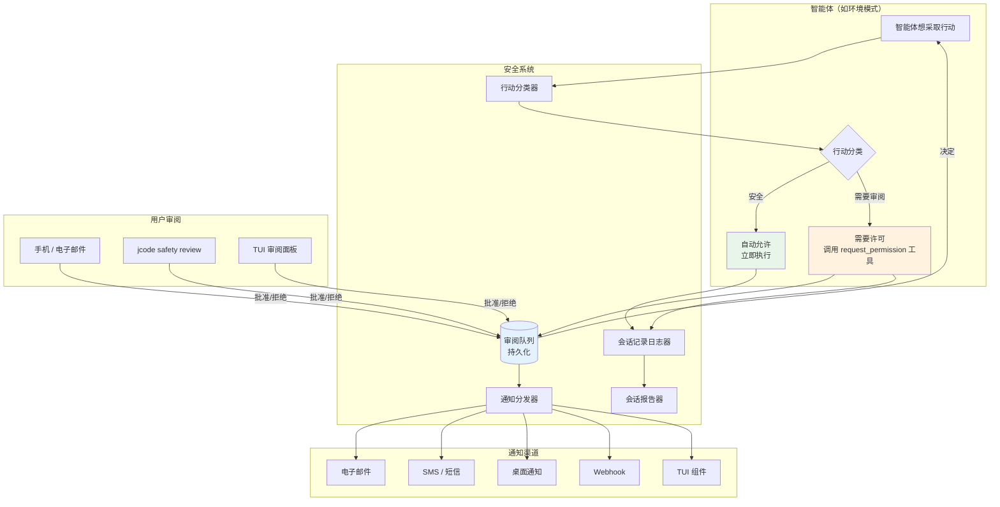
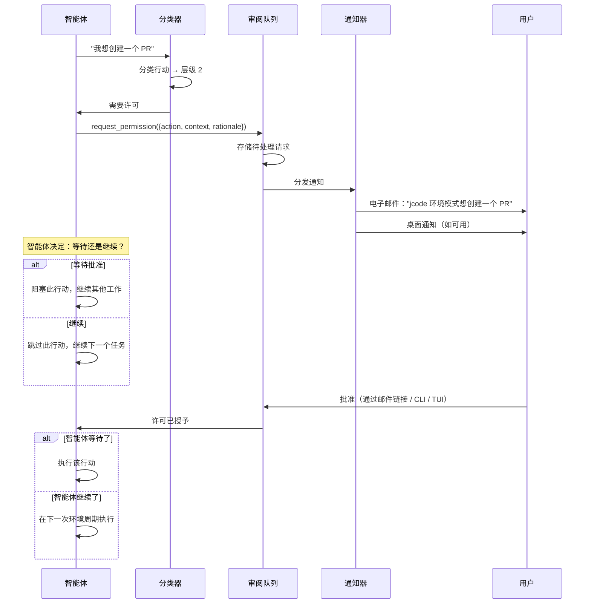
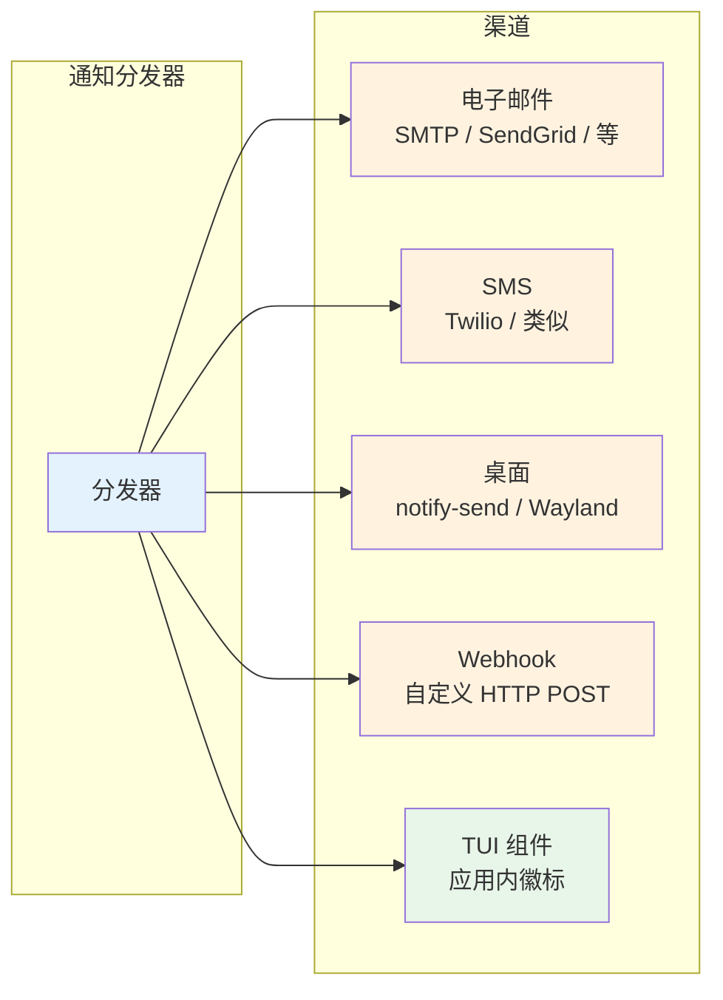

# 安全系统

> **状态：** 设计
> **更新日期：** 2026-02-08

面向无人监督智能体操作的人机协同安全层。设计为独立子系统，任何 jcode 功能都可接入。当前唯一的使用方是环境模式，但系统刻意解耦，便于未来功能复用。

## 概述

当智能体在没有用户直接监督的情况下运行（例如环境模式）时，它需要能够：

1. **不问就知道自己可以做什么**
2. **对需要人工批准的操作请求许可**
3. **通知用户有待处理的请求**
4. **在用户审阅期间等待或继续**
5. **每次会话结束后报告自己的行为**

安全系统提供了以上全部能力。只有两个层级：自动允许与需要许可。不存在"永远禁止"——如果用户明确批准，智能体就可以做。核心原则是：**任何与他人通信或在本地沙箱之外留下痕迹的行为都需要许可。**

---

## 架构



---

## 行动分类

智能体想采取的每个行动都会被归入两个层级之一。不存在"永远禁止"层级——如果用户批准，智能体就可以做。安全系统的职责是确保用户被询问，而不是完全阻止行动。

### 层级 1：自动允许（无需许可）

本地、可逆、且不影响项目沙箱之外任何内容的行动。

| 行动 | 理由 |
|--------|-----------|
| 读取项目内文件 | 只读，无副作用 |
| 读取 git 历史 / 状态 | 只读 |
| 运行测试（只读） | 验证，无变更 |
| 记忆操作（在每周期上限内） | 本地数据，可逆 |
| 创建本地分支 / git worktree | 仅本地，易于删除 |
| 写入环境模式自己的日志/状态文件 | 内部记账 |
| 嵌入 / 相似度搜索 | 仅计算 |
| 分析会话以提取内容 | 只读分析 |

### 层级 2：需要许可（询问用户）

在本地沙箱之外留下痕迹、影响共享状态、或难以撤销的行动。**一般规则：任何直接与他人通信的行为始终需要许可——没有例外。**

| 行动 | 理由 |
|--------|-----------|
| **与人通信（始终是层级 2）** | |
| 发送电子邮件 | 不可逆，他人可见 |
| 提交作业 | 学业后果 |
| 发布到 Slack / Discord / 聊天 | 他人可见 |
| 创建 GitHub issue / PR 评论 | 公开可见 |
| 任何形式的直接人际通信 | 无法撤回 |
| **代码修改** | |
| 修改仓库中的代码（必须使用 worktree + PR） | 合并前需要审阅 |
| 推送到远程 | 协作者可见 |
| 创建拉取请求 | 协作者可见 |
| 修改 CI/CD 流水线 | 影响共享基础设施 |
| **系统变更** | |
| 安装系统软件包 | 修改系统状态 |
| 修改 dotfiles / 系统配置 | 影响其他工具 |
| 启动网络服务 / 开放端口 | 安全隐患 |
| **部署** | |
| 部署到任何环境 | 影响用户/服务 |
| **数据** | |
| 删除项目沙箱之外的文件 | 可能无法恢复 |
| 删除数据库 / 清除非平凡缓存 | 数据丢失风险 |
| **财务 / 账号** | |
| 购买 / 计费变更 | 财务后果 |
| 修改密码 / API 密钥 / 认证 | 安全后果 |
| 撤销令牌 / 修改权限 | 访问后果 |

### 自定义规则

用户可以配置自定义分类规则来提升或降级行动：

```toml
[safety.rules]
# 提升：允许环境模式不经询问创建 PR
allow_without_permission = ["create_pull_request"]

# 降级：运行任何测试前总是询问（例如昂贵的集成测试）
require_permission = ["run_tests"]

# 覆盖：允许推送到特定远程
allow_push_to = ["origin"]
```

---

## 许可请求流程



### `request_permission` 工具

可供安全系统下运行的任何智能体使用：

```rust
// 工具：request_permission
{
    "action": "create_pull_request",
    "description": "为 ambient/fix-auth-tests 分支创建 PR，包含 3 个测试修复",
    "rationale": "在 auth 模块发现 3 个失败测试。已在 worktree 分支上修复。",
    "urgency": "low",           // "low" | "normal" | "high"
    "wait": false               // 智能体是否应阻塞直到获批？
}
```

**响应：**
```rust
// 如果 wait=true 且用户响应：
{ "approved": true, "message": "看起来不错" }

// 如果 wait=true 且超时：
{ "approved": false, "reason": "timeout", "timeout_minutes": 60 }

// 如果 wait=false：
{ "queued": true, "request_id": "req_abc123" }
```

### 等待期间的智能体行为

当智能体以 `wait: true` 请求许可时：
- 它不会阻塞整个周期——它会继续处理其他环境任务
- 用户批准后，行动进入下一个周期队列（若当前周期仍在运行则进入当前周期）
- 若用户在可配置超时内未响应，请求过期并被记录

当智能体以 `wait: false` 请求许可时：
- 请求进入用户审阅队列
- 智能体不带该行动继续运行
- 若之后获批，将在下一个环境周期拾取

---

## 通知系统

### 渠道



**渠道优先级：** 用户配置使用哪些渠道及其顺序。通知同时发送到所有启用的渠道。

**通知内容：**
- 智能体要做什么（行动 + 描述）
- 为什么想做（理由）
- 如何批准/拒绝（链接或说明）
- 紧急程度

### 配置

```toml
[safety.notifications]
# 启用/禁用渠道
email = true
sms = false
desktop = true
webhook = false

# 电子邮件设置
[safety.notifications.email]
to = "jeremy@example.com"
# 提供商："smtp"、"sendgrid"、"ses"
provider = "smtp"
smtp_host = "smtp.gmail.com"
smtp_port = 587

# SMS 设置（如启用）
[safety.notifications.sms]
to = "+1234567890"
provider = "twilio"

# Webhook（如启用）
[safety.notifications.webhook]
url = "https://example.com/jcode-safety"
secret = "..."

# 桌面通知（使用 notify-send 或类似）
[safety.notifications.desktop]
enabled = true

# 通知偏好
[safety.notifications.preferences]
# 仅通知这些紧急程度及以上的请求
min_urgency = "low"           # "low" | "normal" | "high"
# 批量通知（不刷屏）
batch_interval_seconds = 60   # 发送前收集 60 秒的通知
# 静默时段（除高紧急度外不通知）
quiet_start = "23:00"
quiet_end = "07:00"
```

---

## 会话记录与摘要

每次环境周期（或任何无人监督的智能体会话）结束后，安全系统都会生成报告。

### 会话记录

每个行动的完整日志，含上下文：

```json
{
    "session_id": "ambient-2026-02-08-143022",
    "started_at": "2026-02-08T14:30:22Z",
    "ended_at": "2026-02-08T14:35:18Z",
    "provider": "openai",
    "model": "5.2-codex-xhigh",
    "token_usage": { "input": 12400, "output": 3200 },
    "actions": [
        {
            "type": "memory_consolidation",
            "description": "合并了 2 条关于深色模式偏好的重复记忆",
            "tier": "auto_allowed",
            "details": { "merged": ["mem_abc", "mem_def"], "into": "mem_ghi" }
        },
        {
            "type": "memory_prune",
            "description": "停用 1 条置信度为 0.02 的记忆",
            "tier": "auto_allowed",
            "details": { "pruned": ["mem_xyz"] }
        },
        {
            "type": "permission_request",
            "description": "为 3 个 auth 测试修复创建 PR",
            "tier": "requires_permission",
            "status": "pending",
            "request_id": "req_abc123"
        }
    ],
    "pending_permissions": 1,
    "scheduled_next": "2026-02-08T15:05:00Z"
}
```

### 摘要

通过已配置的通知渠道发送的人读摘要：

```
环境周期完成（4 分 56 秒）

已完成：
- 合并 2 条重复记忆（深色模式偏好）
- 修剪 1 条过期记忆（置信度：0.02）
- 从崩溃会话 jcode-red-fox-1234 中提取 3 条记忆
- 对照代码库验证 5 条事实（全部仍然有效）

需要您审阅：
- [批准/拒绝] 为 auth 测试修复创建 PR（改动 3 个文件）

下一次周期：约 35 分钟后

预算：今日剩余 62%
```

### 投递

- **始终：** 写入 `~/.jcode/ambient/transcripts/YYYY-MM-DD-HHMMSS.json`
- **若启用电子邮件：** 每次周期后发送摘要（遵循批量间隔）
- **若 TUI 已打开：** 摘要显示在环境信息组件中
- **CLI：** `jcode ambient log` 查看最近的会话记录

---

## 审阅队列

### 存储

```
~/.jcode/safety/
├── queue.json              # 待处理的许可请求
├── history.json            # 过往决定（用于学习模式）
└── config.json             # 缓存的安全配置
```

### 审阅界面

**1. TUI（jcode 打开时）**

显示待处理请求的审阅面板：

```
╭─ 安全审阅（1 个待处理）──────────────────────╮
│                                               │
│ [高] 为 auth 测试修复创建 PR                   │
│ 分支：ambient/fix-auth-tests                   │
│ 文件：3 个改动（+42 -18）                      │
│ 理由：环境侦察期间在 auth 模块发现 3 个失败     │
│ 测试。                                        │
│                                               │
│ [a] 批准  [d] 拒绝  [v] 查看差异              │
╰───────────────────────────────────────────────╯
```

**2. CLI**

```bash
jcode safety review           # 交互式审阅待处理请求
jcode safety list             # 列出全部待处理请求
jcode safety approve <id>     # 批准特定请求
jcode safety deny <id>        # 拒绝特定请求
jcode safety log              # 查看决定历史
```

**3. 电子邮件 / 远程**

通知邮件包含批准/拒绝链接。这些链接命中本地 webhook（或使用中继服务）来记录决定。

### 决定历史

过往决定被存储，便于系统学习模式：

```json
{
    "request_id": "req_abc123",
    "action": "create_pull_request",
    "decision": "approved",
    "decided_at": "2026-02-08T14:42:00Z",
    "decided_via": "tui",
    "response_time_seconds": 420
}
```

这段历史最终可以反馈到更智能的分类——如果用户总是批准某类行动，可以建议将其提升为自动允许。

---

## 集成 API

安全系统为任何 jcode 功能暴露了简单 API：

```rust
pub struct SafetySystem {
    classifier: ActionClassifier,
    queue: ReviewQueue,
    notifier: NotificationDispatcher,
    logger: TranscriptLogger,
}

impl SafetySystem {
    /// 检查行动是否无需许可即被允许
    pub fn is_auto_allowed(&self, action: &Action) -> bool;

    /// 为行动请求许可
    /// wait=false 时立即返回，wait=true 时阻塞直到出决定
    pub async fn request_permission(&self, request: PermissionRequest) -> PermissionResult;

    /// 记录已采取的行动（用于会话记录）
    pub fn log_action(&self, action: &ActionLog);

    /// 生成会话摘要
    pub fn generate_summary(&self) -> SessionSummary;

    /// 获取待处理请求
    pub fn pending_requests(&self) -> Vec<PermissionRequest>;

    /// 记录决定（来自 TUI、CLI 或远程）
    pub fn record_decision(&self, request_id: &str, decision: Decision) -> Result<()>;
}

pub struct PermissionRequest {
    pub id: String,
    pub action: String,
    pub description: String,
    pub rationale: String,
    pub urgency: Urgency,
    pub wait: bool,
    pub context: Option<serde_json::Value>,
}

pub enum PermissionResult {
    Approved { message: Option<String> },
    Denied { reason: Option<String> },
    Queued { request_id: String },
    Timeout,
}

pub enum Urgency {
    Low,
    Normal,
    High,
}
```

---

## 实施阶段

### 阶段 1：基础
- [ ] 行动分类器（层级 1/2/3 查找）
- [ ] 审阅队列（持久化存储）
- [ ] 供智能体使用的 `request_permission` 工具
- [ ] 会话记录日志器
- [ ] 基础会话摘要生成

### 阶段 2：通知渠道
- [ ] 桌面通知（notify-send / Wayland）
- [ ] 电子邮件通知（SMTP）
- [ ] Webhook 支持
- [ ] 通知批处理与静默时段
- [ ] SMS（Twilio 或类似）

### 阶段 3：审阅界面
- [ ] TUI 审阅面板
- [ ] CLI 命令（`jcode safety review/list/approve/deny/log`）
- [ ] 电子邮件批准/拒绝链接（中继服务）

### 阶段 4：配置
- [ ] `[safety]` 配置段
- [ ] 自定义分类规则（提升/降级行动）
- [ ] 按项目覆盖
- [ ] 通知渠道配置

### 阶段 5：智能
- [ ] 决定历史跟踪
- [ ] 模式检测（自动建议提升）
- [ ] 从上下文推断紧急程度

---

*最后更新：2026-02-08*
