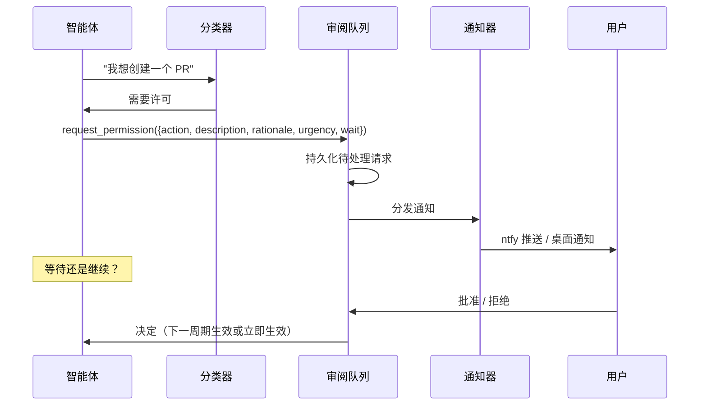

# 安全系统

面向无人监督智能体（当前主要使用方是[环境模式](环境模式.md)）的人机协同安全层：
智能体知道什么可以直接做、什么必须请求许可、如何在等待期间继续工作、以及如何事后汇报。

本文合并原「安全系统」与「依赖安全分类」两篇。**注意区分「已实现」与「设计意图」**：
下文标注了当前代码的实际状态。

## 一、核心原则

只有两个层级，**没有"永远禁止"**——如果用户明确批准，智能体就可以做：

- **层级 1 自动允许**：本地、可逆、不影响项目沙箱之外任何东西的行动。
- **层级 2 需要许可**：在沙箱之外留下痕迹、影响共享状态、或难以撤销的行动。

核心判据：**任何与他人通信、或在本地沙箱之外留下痕迹的行为都需要许可**（无例外）。

## 二、已实现的分级

分类器在 `crates/jcode-base/src/safety.rs`（`SafetySystem::classify`）。
当前**自动允许**清单是固定白名单（大小写不敏感）：

```
read  glob  grep  ls  memory  todo  todowrite  todoread  session_search  codesearch
```

**其余一切行动都归入「需要许可」**。这是刻意的保守默认：新增工具默认受门控，
要放进白名单必须改代码。

> 设计文档里更细的层级 1/2 行动清单（读文件、git 只读、本地分支、部署、
> 财务/账号操作等）记录的是**意图分类**，代码用的是上面的工具名白名单。
> `[safety.rules]`（`allow_without_permission` / `require_permission` / `allow_push_to`）
> 这类自定义分级规则**尚未实现**。

## 三、许可请求流程



### `request_permission` 工具

```rust
{
    "action": "create_pull_request",
    "description": "为 ambient/fix-auth-tests 分支创建 PR，包含 3 个测试修复",
    "rationale": "在 auth 模块发现 3 个失败测试。已在 worktree 分支上修复。",
    "urgency": "low",     // low | normal | high
    "wait": false         // 是否阻塞直到获批
}
```

返回值（`PermissionResult`）：`Approved{message}` / `Denied{reason}` /
`Queued{request_id}` / `Timeout`。

当前实现里 `request_permission` **总是返回 `Queued`** 并持久化请求、同时派发通知；
决定由用户通过审阅入口写入。

### 等待期间的行为

- `wait: true`：不阻塞整个周期，继续做其他环境任务；用户批准后行动进入下一次环境周期
  （若当前周期仍在运行则进入当前周期）；可配置超时内无响应则请求过期并记录。
- `wait: false`：请求进入审阅队列，智能体不带该行动继续运行；之后获批则在下一周期拾取。

## 四、审阅入口与存储

```
~/.jcode/safety/
├── queue.json      # 待处理的许可请求
└── history.json    # 过往决定
```

- **CLI**：`jcode permissions` —— 审阅并响应待处理的环境模式许可请求。
- **TUI**：环境模式的待处理请求会以通知与状态提示呈现。
- **会话记录**：写入 `~/.jcode/ambient/transcripts/`，`jcode ambient log` 查看最近记录。

决定历史（`Decision`：`request_id`、`approved`、`decided_at`、`decided_via`、`message`）
会持久化，供日后参考（"用户总是批准某类行动 → 建议提升为自动允许"属于设计意图，未实现）。

过期处理：当请求所属会话已不再活动时，`expire_dead_session_requests` 会将其标为过期
（避免永远挂在队列里）；也支持通过文件落盘决定（`record_permission_via_file`），
便于外部程序代为批准/拒绝。

## 五、通知渠道

**已实现**：ntfy.sh 推送（`ntfy_topic` / `ntfy_server`）与桌面通知（notify-send，
`desktop_notifications`，默认开启）。配置字段见 `crates/jcode-config-types/src/lib.rs`
的 `SafetyConfig`。

通知内容应包含：智能体要做什么（行动 + 描述）、为什么想做（理由）、如何批准/拒绝、紧急程度。

> 设计文档中的邮件（SMTP/SendGrid/SES）、SMS（Twilio）、自定义 Webhook 渠道
> **从未在本仓库实现**，相关配置示例已移除。`config.toml` 里仍有 Telegram / Discord /
> Jade 中继字段，但本仓库没有对应分发实现，配置它们不会产生通知。

## 六、会话记录与摘要

每次环境周期结束后生成报告，记录每个行动及其层级（`ActionLog`）与周期摘要：

```
环境周期完成（4 分 56 秒）
已完成：
- 合并 2 条重复记忆（深色模式偏好）
- 修剪 1 条过期记忆（confidence 0.02）
- 从崩溃会话中提取 3 条记忆
- 对照代码库验证 5 条事实（全部仍然有效）
需要您审阅：
- [批准/拒绝] 为 auth 测试修复创建 PR（改动 3 个文件）
下一次周期：约 35 分钟后
预算：今日剩余 62%
```

投递：始终写入 `~/.jcode/ambient/transcripts/YYYY-MM-DD-HHMMSS.json`；
TUI 打开时显示在环境信息组件中；`jcode ambient log` 查看最近记录。

## 七、集成 API

```rust
pub struct SafetySystem { /* queue / history / actions */ }

impl SafetySystem {
    pub fn new() -> Self;                                     // 从磁盘加载队列与历史
    pub fn classify(&self, action: &str) -> ActionTier;       // 分级
    pub fn request_permission(&self, req: PermissionRequest) -> PermissionResult;
    pub fn record_decision(&self, id: &str, decision: Decision, via: &str) -> Result<()>;
    pub fn pending_requests(&self) -> Vec<PermissionRequest>;
    pub fn expire_dead_session_requests(&self, via: &str) -> Result<Vec<String>>;
    pub fn log_action(&self, log: ActionLog);
    pub fn generate_summary(&self) -> String;
    pub fn save_transcript(&self, transcript: &AmbientTranscript) -> Result<()>;
}
```

通知通过**注册回调解耦**（`register_permission_notifier`），因此安全层不需要依赖通知实现。

## 八、待办（设计意图，未实现）

- `[safety]` 自定义分级规则（提升/降级行动、按项目覆盖）；
- 通知渠道扩展（邮件/SMS/Webhook）与批处理、静默时段；
- TUI 专用审阅面板、邮件批准链接；
- 决定历史驱动的模式检测（自动建议提升）。

---

# 附录：依赖安全分类

跟踪本仓库 `cargo audit` 的发现与修复路径，不是白名单，而是分类记录。
最后审核 2026-09-12。

> 本 fork 移除了 PDF、邮件通知（`lettre`/IMAP）、Gmail、Azure、桌面端等能力，
> 相关公告（`lopdf`/`pdf-extract`、`lettre`、`lexical-core`/`imap-proto`、`azure_core`、
> 经 `wayland-scanner` 的 `quick-xml`）已不适用于本仓库依赖图，因此不再列出。

## 当前公告

| 公告 | Crate | 依赖路径 | 受影响区域 | 分类与行动 |
|---|---|---|---|---|
| `RUSTSEC-2025-0141` | `bincode` | `syntect → bincode` | Markdown/代码高亮 | 未维护的传递依赖；跟踪 `syntect` 升级，长期不离开则替换 `syntect` |
| `RUSTSEC-2024-0436` | `paste` | `ratatui`、`tokenizers`、`tract-*` | 渲染、分词、嵌入 | 广泛传递；优先上游升级而非本地变通 |
| `RUSTSEC-2026-0002` | `lru` | `ratatui → lru` | TUI 渲染缓存 | UI 依赖的不安全警告；随 `ratatui` / `ratatui-image` 一起升级 |
| `RUSTSEC-2026-0097` | `rand` | `tungstenite`、`tract-*`、`ratatui-image` | websocket、嵌入、UI | 非健全性警告，jcode 不有意使用该模式；随上游升级到 `rand` 0.9 兼容栈 |
| `RUSTSEC-2026-0098` | `rustls-webpki` | `rustls` 栈 | TLS 证书验证 | 兼容版本可用时升级 |
| `RUSTSEC-2026-0099` | `rustls-webpki` | `rustls` 栈 | TLS 证书验证 | 同上 |
| `RUSTSEC-2026-0104` | `rustls-webpki` | `rustls` 栈 | CRL 解析可达 panic | 同上；本地已是 0.103.13 |
| `RUSTSEC-2026-0049` | `rustls-webpki` | `rustls` 栈 | CRL 权威性 | **已满足**：修复要求 `>= 0.103.10`，本地为 0.103.13，可从忽略列表移除后复验 |

修复优先级：① rustls 栈的 `rustls-webpki` → ② `ratatui` 的 `lru` → ③ `syntect` 的 `bincode`
→ ④ 广泛传递的 `paste` / `rand`。

## 已解决

- `RUSTSEC-2026-0217`（`tract-nnef` NNEF 张量解析器整数溢出）：2026-07-30 通过把
  `jcode-embedding` 移到 `tract` 0.23 系列解决（本地 `tract-onnx`/`tract-data` 0.23.4，
  `half` 2.7.1）。该解析器处理**运行时下载的模型**，因此不能轻率忽略。
- `RUSTSEC-2024-0320`（`yaml-rust`）：2026-03-05 通过把 `syntect` 特性修剪为内置语法/主题转储
  从依赖图移除（本地 `Cargo.lock` 已无 `yaml-rust`）。

## 忽略列表（`scripts/security_preflight.sh`）

预检脚本对已分类公告使用 `--ignore`，使 CI 保持可操作；新公告默认仍会让 CI 失败。

脚本当前忽略：`RUSTSEC-2026-0141`、`RUSTSEC-2026-0099`、`RUSTSEC-2026-0104`、
`RUSTSEC-2026-0098`、`RUSTSEC-2026-0049`、`RUSTSEC-2026-0194`、`RUSTSEC-2026-0195`。

其中三条**已过期**，应随下次维护清理（清理后重跑 `cargo audit` 确认）：

| 忽略项 | 过期原因 |
|---|---|
| `RUSTSEC-2026-0141`（`lettre`） | `lettre` 与 `jcode-notify-email` 已移除，依赖图中不存在 |
| `RUSTSEC-2026-0194` / `0195`（`quick-xml`） | 仅经 `wayland-scanner`（桌面端 winit 栈）到达，该栈已移除 |
| `RUSTSEC-2026-0049`（`rustls-webpki`） | 本地 0.103.13 已满足要求的 `>= 0.103.10` |

验证：

```bash
cargo check
cargo test -j 1
scripts/security_preflight.sh
```
