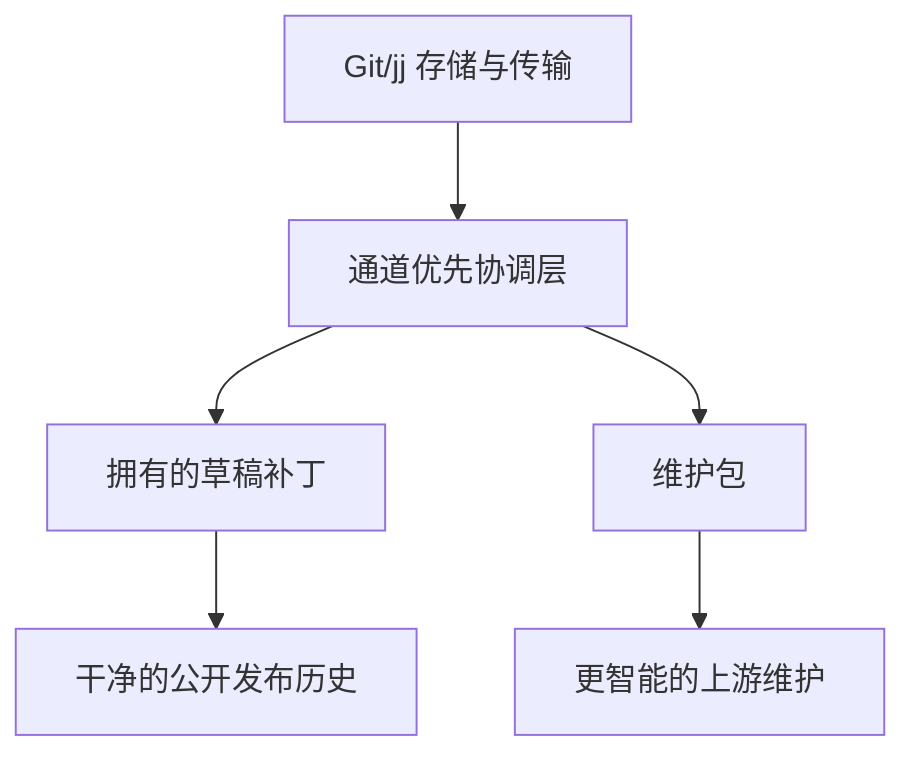
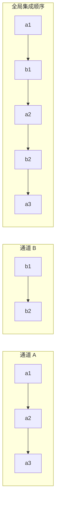
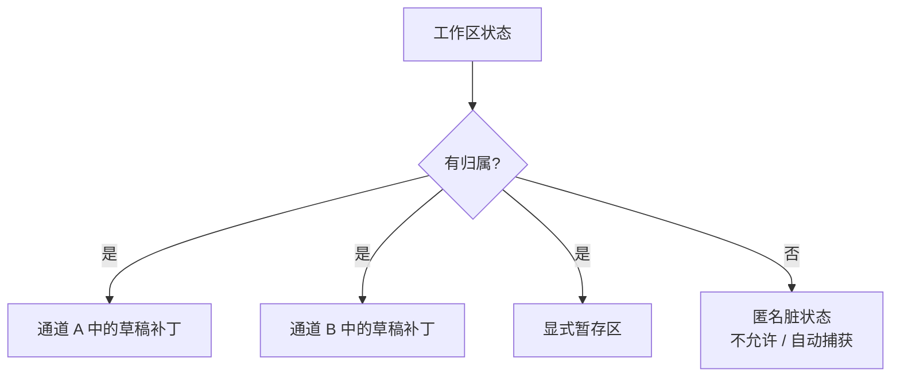
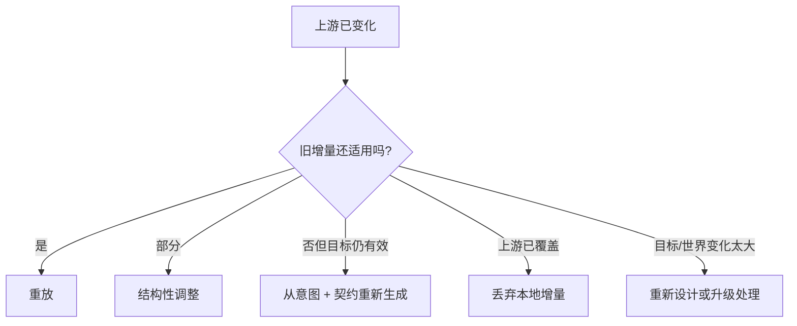
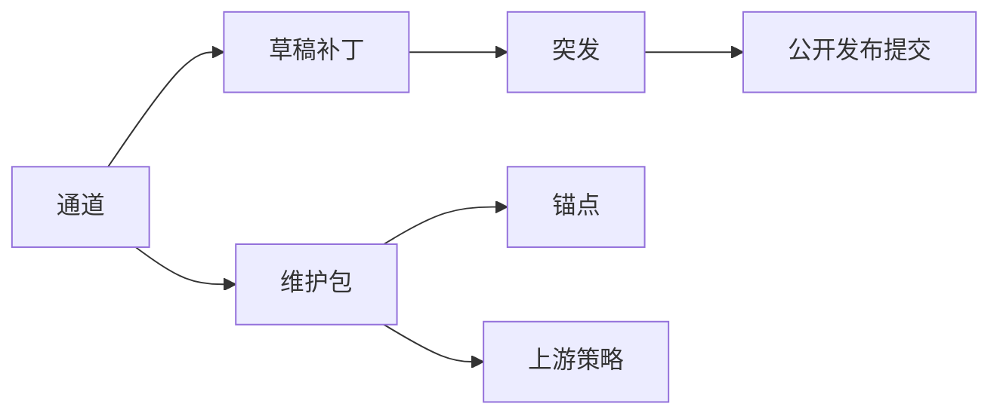

# 智能体原生 VCS：核心行为

## 状态
草案项目笔记，综合了本次会话的核心想法。

## 一句话论点
这个系统**主要不是一个更好的合并算法**。它是一个 Git/jj 层的 VCS，保留本地变更的**含义、所有权和维护上下文**，使智能体能够持续相互协调，并针对不断移动的上游重新维护本地增量。

## 核心框架
- Git 大体上是**分支优先**的。
- jj 大体上是**变更优先**的。
- 本系统应该是**通道优先**和**维护包优先**的。

底层存储和传输可以保持 Git 兼容。创新在于 VCS 使其成为一等公民的元数据、分组和工作流。

## 这个 VCS 在解决什么问题
有两个相关但不同的问题：

1. **一个代码库内的并行多智能体编辑**
   - 智能体以短促、连贯的编辑突发工作。
   - 它们的工作可能交错并可能冲突。
   - 匿名的脏状态导致犹豫和污染。

2. **上游变动之上长期存在的本地定制**
   - 用户将越来越多地维护开源项目的个性化下游变体。
   - 难点不是补丁应用，而是在上游变化时保留本地增量的**意图**。

## 设计目标
1. 使智能体工作自然地可表示。
2. 消除匿名脏状态。
3. 为未来智能体保留足够的上下文，以便针对上游维护本地变更。
4. 让机器历史保持丰富，同时让人面对的历史保持干净。
5. 与 Git 生态系统和远程托管保持兼容。

## 非目标
- 首先不尝试替换 Git 对象存储。
- 不承诺所有重大上游分叉都能自动解决。
- 不依赖原始推理轨迹作为理解的主要产物。

## 核心实体

### 1. 通道（Lane）
**通道**是在进行工作的主要单位。

一个通道通常由以下键标识：
- `目标`（goal）
- `智能体`（agent）

对于下游维护，一个通道也可以是长期存在的**定制通道**，代表一个持久的本地增量。

通道不只是标签。它拥有：
- 本地序列/顺序
- 拥有的草稿状态
- 来源/出处（provenance）
- 指向代码/上游的锚点
- 契约/不变量
- 维护策略

### 2. 草稿补丁（或微提交）
智能体产生的每一个有意义的编辑都应被捕获为一个拥有的、可重放的单位。

属性：
- 关联一个通道
- 可归因于一个智能体/模型/会话
- 基于特定修订
- 可回退且可重放
- 以后可以安全地压缩

这避免了共享脏工作树所有权不清的模型。

### 3. 突发（Burst）
智能体在追求一个子任务时常发出多个快速、连贯的编辑。
**突发**把这些时间上相邻的草稿补丁归组为一次操作工作片段。

### 4. 公开发布提交（Published commit）
人面对的提交可以由一个或多个草稿补丁或突发压缩而成。

这给出了两层模型：
- **操作历史**：用于并发和维护
- **公开发布历史**：用于人审阅和分享

### 5. 维护包（Maintenance packet）
每个本地增量都应携带一个足够丰富的上下文包，供未来维护使用。

维护包至少包含：
- 意图/目标
- 行为契约
- 语义锚点
- 假设
- 验证钩子
- 来源/出处
- 生命周期/上游策略
- 简明理由

### 6. 锚点（Anchor）
锚点记录一个通道或补丁附着在哪个上游概念上。
示例：
- 符号/函数/类型
- 端点
- 配置键
- UI 元素
- 文件区域
- 协议/schema 字段

对于长期维护，锚点比行级 diff 更强。

## 核心不变量

### 不变量 1：没有匿名脏状态
所有未提交的变更必须归属于某个东西：
- 一个通道
- 一个草稿补丁
- 一个拥有明确所有权的暂存区

系统应阻止或自动解决无归属的脏状态��

### 不变量 2：捕获与发布分离
智能体不应需要立即决定是否创建最终的、人面对的提交。

相反：
- 编辑被自动捕获到拥有的草稿单位中
- 发布/压缩稍后发生

### 不变量 3：本地含义比旧补丁形状更重要
对于上游维护，系统保留增量的**含义**，而不仅仅是其旧文本 diff。

### 不变量 4：交错是正常的
不同通道的提交可能在全局历史中交错，而每个通道保留自己的本地连贯性。

## 核心行为

### 1. 按通道分组工作，而不只是按分支
主要分组不是分支而是**通道**。

一个通道回答：
- 这服务于什么目标？
- 哪个智能体产生它？
- 它附着在什么代码/上游概念上？
- 以后应该如何维护它？

### 2. 尽可能早地把编辑视为拥有的草稿单位
当智能体编辑代码时，系统应尽快把这些编辑捕获为活动通道的草稿补丁。

这避免了：
- 提交污染
- 所有权不确定性
- 害怕丢失无关工作

### 3. 让脏状态显式且可归因
如果工作区不干净，状态应读作类似：
- 通道 A 的草稿变更
- 通道 B 的草稿变更
- 会话 X 拥有的暂存变更

而不只是"仓库脏"。

### 4. 支持交错的全局集成
通道可以在全局交错。这是可接受的。

示例：
- 通道 A：`a1 -> a2 -> a3`
- 通道 B：`b1 -> b2`
- 集成顺序：`a1 -> b1 -> a2 -> b2 -> a3`

系统应同时保留：
- 本地通道顺序
- 全局集成顺序

### 5. 为每个本地增量保留维护包
对每个通道/定制，存储：
- 它为什么存在
- 什么行为必须保持为真
- 它附着在上游的什么位置
- 它依赖什么假设
- 如何测试它
- 何时丢弃、调整或重新生成它

这是智能下游维护的核心使能器。

### 6. 维护是重放/调整/重新生成/丢弃——而不仅是合并
当上游变化时，系统应帮助智能体在以下选项中决策：
1. 重放增量
2. 结构性调整增量
3. 从目标 + 契约重新生成
4. 因为上游已包含它而丢弃
5. 因为上游改变世界太多而重新设计

### 7. 持续分类比盲目合并更重要
对相对于上游的每个通道，系统应帮助分类：
- 干净
- 漂移中
- 部分被包含
- 冲突
- 损坏
- 需要重新生成
- 应该丢弃
- 需要人/产品决策

### 8. 公开发布历史应保持干净
机器历史可以嘈杂且细粒度。
人历史应保持紧凑、可审阅、可理解。

## VCS 应鼓励的信息
对每个本地通道/定制，强烈鼓励或要求：

### 意图
- 这个变更为什么存在
- 用户/利益相关者需求
- 必须有 vs 偏好
- 非目标

### 行为契约
- 不变量
- 验收标准
- 相关测试
- 性能/安全/UX 约束

### 语义锚点
- 触及或依赖的符号/类型/API/配置键/端点/UI 元素

### 假设
- 顺序假设
- 环境假设
- 依赖假设
- 扩展点假设

### 来源/出处
- 智能体 id
- 模型 id
- 提示词/规格/任务引用
- 基于编写的修订
- 置信度/审阅状态

### 理由
- 所选路径的简明解释
- 被否决的重要替代方案
- 已知的不确定性

### 上游策略
- 覆盖上游 / 遵从上游 / 被包含则丢弃 / 候选上提

### 生命周期
- 永久 / 临时 / 实验 / 变通 / 过期条件

### 验证钩子
- 测试、命令、夹具、基准、快照、冒烟检查

## 这个 VCS 现实上能解决什么
它可以显著改进：
- 一个仓库中的智能体协调
- 未提交变更的归因
- 交错工作的结构化集成
- 上游更新期间本地增量含义的保留
- 智能体重新维护 fork 的能力

## 它不能承诺什么
当上游变更很激进时，它不能保证自动维护。

如果上游替换了子系统、改变了架构或使原始本地目标失效，正确的行动可能是重新生成或重新设计，而不是��并。

因此这个 VCS 应承诺：
> 保留足够的含义和结构，使智能体能够做出正确的维护决策。

## 核心承诺
给定一个带并行智能体和移动上游的本地代码库，这个 VCS 应使以下为真：

1. 每个本地变更都有所有权。
2. 每个重要的本地增量都保留其含义。
3. 脏状态显式且可归因。
4. 交错可表示而不丢失通道连贯性。
5. 未来的智能体不仅能理解**改变了什么**，还能理解**为什么改变**以及**如何让它存活**。

## 最小概念模型
至少，系统需要为一等公民支持：
- 通道（lanes）
- 草稿补丁（draft patches）
- 突发（bursts）
- 公开发布提交（published commits）
- 锚点（anchors）
- 维护包（maintenance packets）
- 上游维护策略

## 建议的下一步
把它转化为具体 schema：
- `lane`（通道）
- `draft_patch`（草稿补丁）
- `maintenance_packet`（维护包）
- `anchor`（锚点）
- `publish`（发布）
- `upstream_status`（上游状态）
