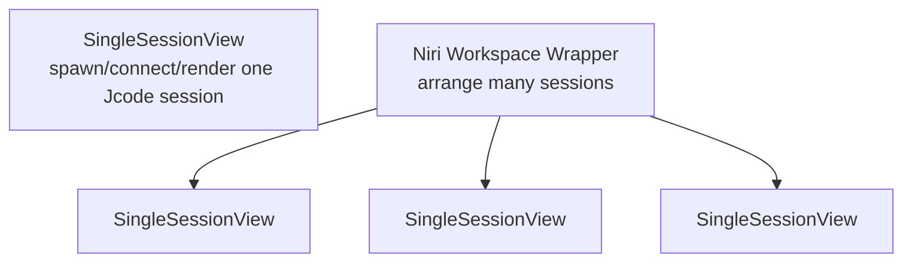

# 桌面端单会话设计

> 历史文档：本文描述的是已移除的旧版 `crates/jcode-desktop` 应用。当前的桌面应用是 `crates/jcode-desktop2`。

本文档描述默认 `jcode-desktop` 单会话模式的视觉目标。

## 分层

单会话视图是桌面表面的原语。Niri/工作区模式之后应组合多个单会话视图，而不是重新定义会话的样子。

## 字体排印

主要字体目标：

- 字体族：`JetBrainsMono Nerd Font`
- 字重：`Light`
- 首选 fontconfig 匹配：`JetBrainsMonoNerdFont-Light.ttf`
- 回退字体族：`JetBrainsMono Nerd Font Mono`，然后是 `JetBrains Mono`，最后是 `monospace`

理由：

- 等宽字体适合代码、记录、工具输出和终端。
- 细字重让密集的智能体会话看起来比当前块状位图原型更轻盈。
- Nerd Font 覆盖为以后添加细微图标/状态字形留出空间，无需切换字体。

## 字号梯度

单会话窗口的初始目标字号梯度：

| 角色 | 字号 | 字重 | 备注 |
| --- | ---: | --- | --- |
| 会话标题 | 18 px | Light | 左上角，保留原始大小写 |
| 消息正文 | 15 px | Light | 主要记录和助手文本 |
| 元数据/状态 | 12 px | Light | 弱化的状态、模型、cwd、token/调试提示 |
| 行内代码/工具输出 | 14 px | Light | 同一字体族，更紧凑的行高 |

行高目标：

- 正文：1.45
- 代码/工具输出：1.35
- 元数据：1.25

## 渲染说明

当前原型在 `render_helpers.rs` 中使用自定义的 5x7 位图文本路径。该路径仅适合布局探索。下一轮渲染应将单会话文本替换为真正的字体渲染器，它需要能够：

1. 从 fontconfig/系统字体路径加载 `JetBrainsMonoNerdFont-Light.ttf`。
2. 保留大小写和标点。
3. 对 UTF-8 文本进行字形整形/栅格化，包括 Nerd Font 字形。
4. 在现有 WGPU 表面上支持 alpha 文本。
5. 允许工作区包装器为每个组合的会话复用同一个文本渲染器。

## 首个视觉目标

默认的单会话窗口应该呈现为一场平静、专注的编码对话：

- 没有工作区泳道/状态条。
- 单内容列。
- 记录周围有大量留白。
- 每个文本元素都使用 JetBrains Mono Light Nerd。
- 在更最终的配色方案确定之前，使用柔和的石墨色文本叠加在现有柔和粉彩背景上。
