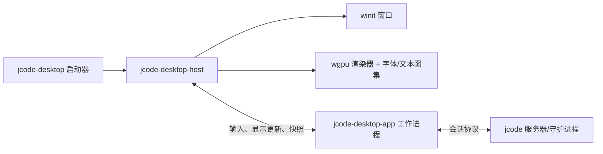

# 桌面端稳定宿主、热重载与快速启动计划

> 历史文档：本文描述已移除的旧版 `crates/jcode-desktop` 应用。当前桌面应用是 `crates/jcode-desktop2`。

状态：进行中
更新：2026-05-24

## 为什么存在

当前桌面端热重载路径会启动一个替换的 `jcode-desktop` 进程。替换进程创建一个新的 `winit` 窗口，在重载交接标记后等待，然后旧进程退出。这足以保持会话连续性，但不能可靠地保留物理 OS 窗口。

在 Wayland 上尤其如此：客户端不能指望恢复全局窗口位置，顶层窗口不能从一个进程转移到另一个进程。这意味着进程级桌面重载本质上被允许��闭/重开或移动窗口。

本计划的目标是让桌面架构支持：

- 热重载而不替换 OS 窗口
- 自研开发期间快速的暖重载
- 更好的感知冷启动
- 平台/窗口/渲染、应用逻辑、服务器/会话运行时之间干净的长期拆分

## 当前桌面所有权模型

今天 `crates/jcode-desktop/src/main.rs` 在一个进程中拥有几乎所有东西：

```text
jcode-desktop 进程
  run()
    winit EventLoop<DesktopUserEvent>
    winit Window
    Canvas
      wgpu Surface / Device / Queue
      glyphon FontSystem / text atlases / render caches
      primitive and text render caches
    DesktopApp
      SingleSessionApp or Workspace
      local UI state
      session handles / async event channels
    DesktopHotReloader
      watches binary mtime
      spawns replacement process
```

当前重载流程：

1. `DesktopHotReloader` 注意到二进制已改变或收到强制重载。
2. 它捕获 `window.outer_position()` 和 `window.inner_size()`。
3. 它带重载放置和交接标记环境变量派生替换进程。
4. 新进程创建隐藏窗口并初始化其画布。
5. 新进程写入 `ready` 标记。
6. 旧进程写入 `release` 标记并退出。
7. 新进程使其新窗口可见。

这在视觉上比立即退出更好，但它仍然是一个新的 OS 窗口。

## 当前启动关键路径

当前启动追踪标记这些里程碑：

```text
args parsed
winit event loop created
window created
app state initialized
font loader spawned
wgpu instance created
wgpu surface created
wgpu adapter selected
wgpu device ready
surface configured
canvas ready
first frame presented
first content frame presented
```

重要观察：

- 进程直到 `Canvas::new(...)` 完成后才进入事件循环。
- `Canvas::new(...)` 执行 WGPU instance/surface/adapter/device 设置。
- 字体加载已移到后台线程，但一旦绘制真实内容，文本渲染仍依赖宿主侧字体/文本渲染器。
- 工作区会话卡片加载在启动后异步进行，这很好。
- 服务器/会话重载已经通过 socket 重新连接而不关闭桌面窗口。有问题的重载是桌面 UI 二进制本身。

## 约束

### 窗口身份

持久窗口需要一个拥有该窗口的持久进程。TUI 可以 `exec()`，因为终端模拟器拥有 OS 窗口。桌面进程拥有自己的 OS 窗口，因此 `exec()` 或派生替换会销毁顶层窗口。

### Wayland

Wayland 不提供可靠的全局窗口���位或跨进程顶层窗口转移。任何依赖在新窗口上设置 `x,y` 的解决方案都只能是尽力而为。

### Rust 动态插件

把桌面 UI 代码作为 Rust 动态库加载可以让进程/窗口保持存活，但作为第一步风险很高：

- Rust 没有针对丰富内部类型的稳定插件 ABI。
- 带线程、静态量、分配器、GPU 句柄和 panic/运行时状态时安全卸载代码很困难。
- 编译器/版本不匹配可能崩溃而不是优雅失败。
- 边界无论如何都需要类似 C-ABI 或显式序列化。

动态插件以后可以重新考虑，但进程边界更安全、更易测试。

## 架构选项

| 选项 | UI 重载后窗口存活? | 冷启动收益 | 风险 | 备注 |
|---|---:|---:|---:|---|
| 保留当前进程交接 | 否 | 无 | 低 | 无法解决 Wayland 移动。 |
| 像 TUI 一样桌面 `exec()` | 否 | 无 | 低 | 进程映像改变，但 OS 窗口仍死。 |
| 动态库插件 | 是 | 中 | 高 | 理论上最快的重载，但 ABI/卸载有风险。 |
| 稳定宿主 + 可重载应用工作进程 + 显示列表协议 | 是 | 感知收益高 | 中 | 推荐。 |
| 稳定宿主 + 子进程离屏渲染像素 | 是 | 中 | 高 | 更多带宽/GPU 共享复杂性，灵活性更少。 |

## 推荐设计

引入一个小的稳定桌面宿主，拥有平台和渲染资源。可重载的桌面应用代码在协议边界之后运行。



### 稳定宿主职责

宿主应拥有 UI 重载期间绝不能消失的东西：

- OS 窗口和事件循环
- WGPU instance/device/queue/surface
- 字体系统和字形/文本图集
- 图像图集和图元缓冲
- 可行的剪贴板/平台适配器
- 应用工作进程生命周期和重启策略
- 重载交接的最近已知 UI 快照
- 即时启动/闪屏/错误 UI

宿主应有意识地小而稳定。大多数产品 UI 行为不应放在这里。

### 可重载应用工作进程职责

工作进程应拥有我们想快速迭代的产品逻辑：

- 工作区/单会话 reducer
- 命令处理
- 布局决策
- 逻辑层面的 markdown/记录成形决策
- 会话/服务器协议客户端
- 视图模型构建
- 表面局部 UI 状态，带快照导出/导入

工作进程**不**拥有 OS 窗口。如果它退出或被替换，宿主继续显示最后一个已提交帧、"正在重载 UI…"之类的覆盖层，或宿主渲染的回退。

### 宿主/工作进程协议

从 Unix 域 socket 或继承的 stdio 管道上的类型化、带版本号、仅本地的协议开始。第一个原型用 JSON 就够了，因为可调试性很重要；只有测量要求时才切换到 bincode/postcard。

最小消息族：

```text
Host -> Worker
  Init { protocol_version, window_size, scale_factor, restored_snapshot }
  Input { key/mouse/scroll/text/clipboard/drop }
  Window { resized, scale_factor_changed, focus_changed }
  Tick { now, animation_budget }
  Command { reload_requested, shutdown_requested }

Worker -> Host
  Ready { capabilities }
  Frame { display_list, title, cursor, animation_state }
  Patch { display_list_delta }
  Snapshot { opaque_versioned_state }
  Request { clipboard_read, clipboard_write, open_url, spawn_terminal }
  Log / Error / Panic
```

第一个实现可以发送完整帧。一旦知道帧大小再添加 diff。

### 显示列表边界

宿主应渲染语义显示列表而不是像素。

一个有用的初始显示列表可以包含：

- 矩形、圆角矩形、边框、规则线
- 带字体族、大小、颜色、换行宽度、选择范围的文本框
- 图像引用
- 裁剪/图层/变换
- 稍后加命中测试 ID/无障碍标签

这把 GPU、字形和图像缓存保留在持久宿主中，同时让工作进程代码改变布局和 UI 行为。文本整形可以留在宿主侧以复用缓存：工作进程说"在这个框里用这些样式画这段文本"，宿主整形/渲染它。

## 启动策略

如果宿主被视为快速外壳而不仅是重载包装器，同样的宿主架构可以改善启动。

### 从无运行进程冷启动

真正的冷启动仍必须支付进程启动和窗口创建。它**不应**必须把窗口可见性阻塞在 WGPU 设备初始化上。

宿主应有分阶段启动模型：

```text
WindowHost 阶段
  create event loop/window
  快速让 OS 窗口可见
  可选绘制原生/CPU/空白闪屏
  异步开始 WGPU 初始化
  异步开始应用工作进程/服务器/会话加载

GpuHost 阶段
  WGPU surface/device/queue 就绪
  换入真实渲染器
  绘制缓存快照或最新工作进程场景

LiveApp 阶段
  工作进程就绪
  服务器/会话状态追平
  正常显示列表渲染
```

这把当前耦合的三个不同指标分开：

- **到窗口可见的时间**：不应等待 WGPU
- **到首个宿主像素的时间**：如果值得，可以使用无 GPU/原生/CPU 回退
- **到首个真实 GPU 内容的时间**：仍取决于 WGPU 初始化

我们可以通过以下改进感知和测量的启动：

1. 保持宿主二进制小。
2. 在加载产品/会话状态之前创建并显示窗口。
3. 不在 `Canvas::new(...)` / WGPU 设置上阻塞宿主事件循环。
4. 并行开始 WGPU 初始化、应用工作进程启动、服务器连接、字体加载和会话卡片加载。
5. 一旦 WGPU surface 配置好，就绘制宿主拥有的 GPU 启动帧。
6. 实时数据追平时立即显示缓存的会话/工作区快照���
7. 首次真实使用时才惰性创建昂贵的文本/图像渲染器资源。
8. 避免在 UI 线程上同步磁盘扫描。

目标冷启动序列：

```text
宿主进程启动
  parse minimal host args
  create event loop/window
  立即显示窗口
  enter event loop
  异步启动工作进程
  异步启动/附加服务器
  异步开始 WGPU 初始化
  可选显示无 GPU/原生/CPU 闪屏
  WGPU 就绪 -> 绘制宿主 GPU 启动帧
  加载缓存 UI 快照
  接收工作进程 Ready/Frame
  用实时 UI 替换启动帧
```

### 无 GPU 启动阶段

宿主在拥有窗口之前不需要构造 WGPU。把 WGPU 视为可以稍后出现的渲染器后端。

实现形态：

```rust
enum HostRendererState {
    NoGpuBoot,
    GpuInitializing,
    GpuReady(Canvas),
    GpuFailed { message: String },
}
```

在 `NoGpuBoot` 中，宿主可以选择三种回退策略之一：

1. **空白可见窗口**：最快最简单，但可能看起来未完成。
2. **原生/平台闪屏**：可行时用平台 API。快，但可移植性差。
3. **CPU 帧缓冲闪屏**：用 `softbuffer` 之类的微小软件路径画基本纯色背景/logo/状态。比原生绘制更可移植，但增加另一个渲染后端。

第一个实现可能应该从空白或最小原生颜色可见窗口和指标开始。只有测量显示存在真正用户可见的差距值得覆盖时，才添加 CPU 闪屏。

重要规则是 WGPU 就绪应在原地升级渲染器；它不应重建 OS 窗口。

### 带常驻宿主的用户感知冷启动

为了最快的用户可见启动，添加可选的长驻/自启宿主：

- `jcode-desktop-host --daemon` 在登录或首次启动时开始。
- 它保持 WGPU 设备、字体 DB，也许还有最近工作区快照温暖。
- 打开应用请常驻宿主显示/创建窗口。
- 如果偏好低空闲资源使用，守护进程在空闲超时后退出。

这不是真正的机器冷启动改进，但它是常见的"我打开应用它就立即出现"路径。

### 暖重载

在应用工作进程重载时：

1. 宿主向旧工作进程要快照。
2. 宿主保持现有帧可见并叠加"正在重载 UI…"。
3. 宿主启动新工作进程二进制。
4. 新工作进程接收快照并重新连接服务器/会话。
5. 新工作进程发送 `Ready` 然后新 `Frame`。
6. 宿主换到新帧而不移动或隐藏 OS 窗口。

如果新工作进程失败，宿主保持旧帧或宿主渲染的错误 UI，并可以重试。

## 增量迁移计划

### 阶段 0：先测量

为以下添加或保留指标：

- 进程启动到窗口创建
- 进程启动到窗口可见 / 事件循环进入
- 进程启动到 WGPU 初始化开始
- 进程启动到 surface 配置 / WGPU 就绪
- 进程启动到首个无 GPU 宿主像素（如果存在回退渲染器）
- 进程启动到首个 GPU 宿主帧
- 进程启动到首个实时工作进程内容帧
- 重载黑屏时长
- 工作进程重启时长
- 每帧显示列表字节数
- 输入事件到呈现帧的延迟

现有 `--startup-log`、`--startup-benchmark` 和帧剖析器是好的基础。扩展它们而不是发明第二套测量系统。

### 阶段 1：进程内显示列表抽取

在添加 IPC 之前，让当前渲染器消费类似显示列表的结构，而不是到处直接读 `DesktopApp`。

预期结果：

```text
DesktopApp + layout code -> DesktopScene / DisplayList -> Canvas::render_scene(...)
```

这是最安全的首个重构，因为测试可以比较当前渲染行为，同时创建宿主/工作进程协议需要的边界。

### 阶段 2：进程内应用驱动 trait

引入类似这样的内部边界：

```rust
trait DesktopAppDriver {
    fn handle_input(&mut self, input: DesktopInputEvent) -> Vec<DesktopHostCommand>;
    fn handle_session_events(&mut self, events: Vec<DesktopSessionEvent>) -> Vec<DesktopHostCommand>;
    fn build_scene(&mut self, viewport: DesktopViewport) -> DesktopScene;
    fn snapshot(&self) -> DesktopUiSnapshot;
    fn restore(&mut self, snapshot: DesktopUiSnapshot);
}
```

最初，现有 `DesktopApp` 在同一进程中实现它。

### 阶段 3：宿主模式和工作进程模式

添加两种模式，可能先在同一个二进制中：

- `jcode-desktop --host`
- `jcode-desktop --app-worker --ipc <fd-or-socket>`

宿主拥有当前 `run()` 的窗口/事件循环/画布路径。工作进程拥有应用驱动和会话协议。用 socket/stdio 协议传递输入和显示列表帧。

### 阶段 4：工作进程热重载

改变 `DesktopHotReloader`，让宿主监视工作进程二进制并只重启工作进程。宿主进程和 OS 窗口保持存活。

宿主二进制重载可以保留当前进程交接路径，因为宿主变化应该更少。

### 阶段 5：拆分 crates/二进制

一旦协议真实存在，拆成更清晰的 crates/二进制：

```text
crates/jcode-desktop-protocol   # 宿主/工作进程消息和场景类型
crates/jcode-desktop-renderer   # Canvas/渲染/显示列表渲染器
crates/jcode-desktop-host       # 窗口/事件循环/工作进程生命周期
crates/jcode-desktop-app        # 产品 UI 工作进程
crates/jcode-desktop            # 启动器或兼容包装
```

这也支持冷启动优化，因为宿主可以保持小而稳定，而应用代码增长。

## 风险与缓解

### 显示列表大小和 IPC 开销

缓解：从完整帧开始并测量。只有在有真实数据后才添加场景哈希、保留节点和补丁。

### 重载时状态丢失

缓解：尽早定义 `DesktopUiSnapshot`。包含草稿文本、焦点、滚动偏移、所选会话/表面、工作区放置和待处理本地 UI 状态。保持带版本号和尽力而为，使不兼容快照优雅失败。

### 协议偏移

缓解：显式协议版本和能力。如果新工作进程不兼容，宿主显示清晰错误并提供重启整个桌面应用。

### 宿主中逻辑太多

缓解：宿主只拥有平台/渲染/生命周期。如果某个行为是产品特定的且重载安全，它属于工作进程。

### 启动守护进程资源使用

缓解：让常驻宿主可选、基于空闲超时且可测量。保持默认按需行为，直到数据显示守护进程值得。

## 推荐 MVP

最小有用 MVP 还不是独立进程。它是：

1. 定义 `DesktopScene` / 显示列表类型。
2. 把 `Canvas::render(&DesktopApp, ...)` 重构为 `Canvas::render_scene(&DesktopScene, ...)`，同时仍在进程内构建场景。
3. 围绕场景构建和首个宿主帧添加启动/重载指标。
4. 为需要保留的状态添加 `DesktopUiSnapshot` 类型。

之后，把场景构建器移进工作进程变成一个机械的宿主/工作进程传输问题，而不是一次巨大的 UI 重写。

## 底线

为了永不移动窗口的重载，我们需要稳定的窗口所有者。为了更快的启动，该稳定所有者也应该是一个小的快速外壳，能立即绘制、保持昂贵渲染器资源温暖、并异步加载产品/会话逻辑。

推荐路径是稳定的 `jcode-desktop-host` 加可重载的 `jcode-desktop-app` 工作进程，通过类型化显示列表协议通信。它避免 Wayland 窗口位置限制，避免 Rust 插件 ABI 风险，并为平滑热重载和更好的感知冷启动性能创造自然路径。

## 当前实现快照

截至 2026-05-24，第一个稳定宿主切片存在于当前 `jcode-desktop` 二进制中：

- WGPU/画布初始化在 `winit` 窗口创建后派生，因此事件循环可以在 GPU 设置完成前进入。
- `DesktopScene`、`DesktopUiSnapshot`、宿主/工作进程协议消息、JSON 行 IPC 分帧和协议版本验证都已就位���
- `--desktop-process-role stable-host` 拥有 OS 窗口和渲染器，并启动无头 `app-worker` 子进程。
- 稳定宿主重载使用 `DesktopReloadStrategy::AppWorkerRestart`，只杀死/重启应用工作进程，宿主窗口保持存活。
- 应用工作进程初始化真实 `DesktopAppRuntime`，恢复宿主快照，应用键/会话 IPC 事件，并把更新后的场景发回宿主。
- 宿主在可用时通过 `Canvas::render_scene(...)` 渲染工作进程产生的场景。

为该切片执行的验证：

- `cargo test -p jcode-desktop desktop_`
- `cargo check -p jcode-desktop`
- `selfdev build target=desktop`
- 运行时冒烟：`cargo run -p jcode-desktop --bin jcode-desktop -- --desktop-process-role stable-host --startup-benchmark --startup-log`

## Crate 拆分与冷启动评估

下一个拆分还不应是独立二进制。代码在功能上已拆分，但 `crates/jcode-desktop/src/main.rs` 仍是一个 1 万+ 行的大型编译单元，同时导入重型渲染器依赖（`wgpu`、`glyphon`）和应用/会话逻辑。在把更多代码移出 `main.rs` 之前拆分 crates 会增加构建系统复杂性，而不会实质减少冷启动工作。

推荐顺序：

1. **先在 `jcode-desktop` 内做模块拆分。** 把稳定宿主/窗口/重载代码、工作进程循环和画布/渲染代码从 `main.rs` 移进专注模块。这减少合并冲突，使 crate 边界明显，而不改变打包。
2. **把协议和场景类型提升为小 crate。** `desktop_protocol`、`desktop_scene` 和 IPC 分帧已经基本独立。未来的 `jcode-desktop-protocol` crate 可以快速编译，并被宿主和工作进程共享，而不拉入 WGPU。
3. **只在宿主模块不再依赖应用 reducer 后创建宿主二进制。** 宿主二进制应只依赖 `winit`、`wgpu`、`glyphon`、协议/场景类型和工作进程生命周期。除版本化快照和宿主回退/错误 UI 外，不应依赖会话 reducer。
4. **在产品 UI 状态位于 `DesktopAppDriver` 之后创建应用工作进程二进制。** 工作进程二进制应拥有 `SingleSessionApp`、`Workspace`、会话/服务器集成和场景构建。它不应链接 WGPU 或字形图集。
5. **添加常驻守护进程前先测量。** 常驻宿主可以让用户感知启动近乎瞬时，但它也增加空闲内存/GPU 成本。只有在有冷宿主进程、WGPU 就绪、工作进程就绪和首个实时场景的启动指标后才添加。

预期冷启动影响：

- **按需冷启动：** 拆分 crates/二进制主要通过保持宿主初始化小、让工作进程/应用加载并行来帮助。它不会消除首帧 GPU 像素的 WGPU 成本。
- **感知冷启动：** 稳定宿主可以立即显示窗口，并在 WGPU 和工作进程启动并行竞赛时保持启动/缓存帧可见。
- **暖/重载启动：** 这是架构已经赢的地方。宿主保持窗口和渲染器存活，只有工作进程重启。

当前建议：推迟物理 crate 拆分，直到宿主/工作进程模块更干净且 debug-socket E2E 重载测试就位。下一个最佳工程步骤是更强的端到端验证，而不是更多 crate 边界。
