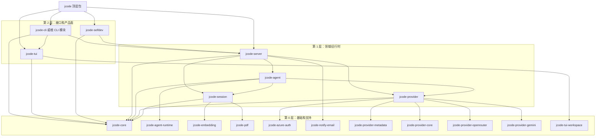

# 模块化架构 RFC

状态：草稿

本 RFC 描述与当前代码库匹配、保留现有产品模型，并为从今天基本单体的根 crate 安全迁移到分层工作区提供路径的 jcode 模块化目标架构。

它刻意与以下内容对齐：

- [重构路线图](重构路线图.md)
- [编译性能计划](plans/编译性能计划.md)
- [服务器架构](服务器架构.md)
- [多会话客户端架构](多会话客户端架构.md)

## 目标

- 记录今天存在的架构，而不是理想化版本。
- 定义改善可维护性和编译时间的分层 crate 目标架构。
- 建立防止工作区坍缩回单体的依赖规则。
- 提供契合重构路线图和编译性能计划的分阶段迁移方案。
- 保留运行时行为：一个共享服务器、重连客户端、会话级自研能力，以及稳定的工具/提供商流程。

## 非目标

- 大爆炸式重写。
- 立即重命名每个模块或 crate。
- 在边界准备好之前强制把每个子系统拆成独立 crate。
- 把核心产品架构从单服务器、多客户端改变。

## 执行摘要

今天，jcode 最好被描述为**带增长中工作区外壳的模块化单体**：

- 根 `jcode` crate 仍然拥有大多数运行时编排和产品行为。
- 几个重量级或相对自包含的子系统已经移入工作区 crate。
- 代码库在某些领域有很强的模块级分离，但几个宽泛的根模块仍然是架构瓶颈点。

目标架构是**分层工作区**：

1. **基础层**用于稳定的共享类型和运行时原语。
2. **领域/运行时层**用于会话、智能体、提供商和服务器逻辑。
3. **接口层**用于 CLI、TUI、自研和可选的重型集成。
4. **组合层**，顶层 `jcode` 包在此组装产品。

最重要的设计规则是：

> 高变更频率的编排代码必须依赖稳定的下层，而稳定的下层绝不能依赖回运行时/UI/产品专属代码。

这条规则同时服务架构质量和编译速度目标。

## 当前架构

### 当前运行时模型

在产品层面，运行时架构已经清晰：

- `jcode` 是**单服务器、多客户端**应用。
- 服务器拥有会话、集群状态、后台任务、提供商状态和共享服务。
- 客户端主要是挂接服务器拥有会话的 TUI 前端。
- 自研是共享服务器上的会话级能力，不是独立架构。

该模型应保持完好。

### 当前代码组织

> **注（2026-08-16）**：下列独立类型 crate 已随 feature-simplification 精简合并：`jcode-ambient-types` → `jcode-usage-types`；`jcode-gateway-types` → `jcode-base/src/gateway/types.rs`；`jcode-batch-types`、`jcode-side-panel-types` → `jcode-protocol`；`jcode-tui-tool-display` → `jcode-tui/src/tui/tool_display.rs`；`jcode-update-core` → `jcode-app-core/src/update_core.rs`。下方成员清单为历史快照，其余分组与依赖边界规则保持不变。

当前代码组织是混合的：

- **根 crate `jcode`** 仍然包含大多数产品逻辑。
- **工作区 crate** 已经隔离了几个重量级或稳定的接缝。
- **`src/` 下的子目录**日益反映领域边界，尤其是 `agent`、`cli`、`server`、`tool` 和 `tui`。

来自 `Cargo.toml` 的当前工作区成员大致分组如下：

- 根包：`jcode`
- 基础/运行时支持：`jcode-agent-runtime`、`jcode-core`、`jcode-storage`、`jcode-terminal-launch`、`jcode-tool-core`
- 数据契约 crate：`jcode-ambient-types`、`jcode-auth-types`、`jcode-background-types`、`jcode-batch-types`、`jcode-config-types`、`jcode-gateway-types`、`jcode-memory-types`、`jcode-message-types`、`jcode-selfdev-types`、`jcode-session-types`、`jcode-side-panel-types`、`jcode-task-types`、`jcode-tool-types`、`jcode-usage-types`
- 协议和规划：`jcode-protocol`、`jcode-plan`
- 重型或可选集成：`jcode-embedding`、`jcode-pdf`、`jcode-notify-email`
- 认证和提供商：`jcode-azure-auth`、`jcode-provider-core`、`jcode-provider-metadata`、`jcode-provider-openrouter`、`jcode-provider-gemini`
- TUI 提取接缝：`jcode-tui-core`、`jcode-tui-markdown`、`jcode-tui-mermaid`、`jcode-tui-render`、`jcode-tui-workspace`
- 主 TUI 二进制之外的产品面：`jcode-desktop`

### 根 crate 仍然拥有什么

根 crate 仍然直接拥有以下大部分关注点：

- CLI 解析和分发
- 服务器编排和套接字生命周期
- 会话状态和持久化
- 智能体回合执行和工具编排
- 提供商实现组合和运行时提供商接线；共享 `Provider` 特质现在位于 `jcode-provider-core`
- 协议/消息/配置类型
- 工具注册表和许多工具实现
- TUI 应用状态和渲染
- 认证、记忆、安全、环境模式和产品粘合

这就是根 crate 仍然是主要编译和架构热点的原因。

### 现有已提取的工作区接缝

这些拆分已经存在，应被视为真正的架构立足点，而不是临时意外：

| Crate | 当前角色 |
|---|---|
| `jcode-agent-runtime` | 共享中断和智能体执行的轻量运行时原语 |
| `jcode-ambient-types` | 环境/后台流程共享的用量和速率限制记录 |
| `jcode-auth-types` | 提供商中立的认证状态和凭据元数据 |
| `jcode-background-types` | 后台任务状态和进度 DTO |
| `jcode-batch-types` | 批处理工具进度 DTO，当前内部只依赖消息类型 |
| `jcode-config-types` | 稳定的配置数据契约 |
| `jcode-core` | 低级工具，如 ID、环境助手、文件系统助手、标准输入检测和格式化 |
| `jcode-gateway-types` | 面向网关的数据契约 |
| `jcode-memory-types` | 记忆子系统数据契约 |
| `jcode-message-types` | 消息内容和传输相邻数据契约 |
| `jcode-protocol` | 基于稳定类型 crate 和 provider-core 值构建的客户端/服务器协议面 |
| `jcode-plan` | 跨协调流程共享的计划/任务图数据模型 |
| `jcode-selfdev-types` | 自研请求/状态数据契约 |
| `jcode-session-types` | 会话 DTO，当前内部只依赖消息类型 |
| `jcode-side-panel-types` | 侧面板页面和更新数据契约 |
| `jcode-task-types` | 任务/工具调度数据契约 |
| `jcode-tool-core` | 运行时工具契约，如 `Tool` 特质和执行上下文 |
| `jcode-tool-types` | 稳定的工具输出/图像 DTO |
| `jcode-usage-types` | 用量核算数据契约 |
| `jcode-storage` | 叠加在 `jcode-core` 上的存储助手 |
| `jcode-embedding` | 基于 ONNX/分词器的嵌入实现和重型推理依赖 |
| `jcode-pdf` | PDF 文本提取 |
| `jcode-azure-auth` | Azure 承载令牌获取 |
| `jcode-notify-email` | SMTP/IMAP/邮件传输 |
| `jcode-provider-metadata` | 提供商/登录目录和配置元数据 |
| `jcode-provider-core` | 共享提供商契约（`Provider`/`EventStream`）、值类型、路由/成本/模型助手、共享 HTTP 客户端、模式助手 |
| `jcode-provider-openrouter` | OpenRouter 专属目录/缓存/支持助手 |
| `jcode-provider-gemini` | Gemini 模式/模型/支持助手 |
| `jcode-tui-core` | 不需要完整应用状态的低级终端 UI 原语 |
| `jcode-tui-markdown` | Markdown 换行/渲染，叠加在 mermaid/工作区支持上 |
| `jcode-tui-mermaid` | Mermaid 解析、渲染、缓存、视口和组件支持 |
| `jcode-tui-render` | 可复用的 TUI 布局/渲染助手 |
| `jcode-tui-workspace` | 工作区映射数据/模型/组件渲染 |
| `jcode-terminal-launch` | 终端进程启动助手 |
| `jcode-desktop` | 桌面应用面和会话/工作区渲染实验 |

这些已经与编译性能计划的策略对齐：先隔离重型依赖和稳定助手面。

### 当前瓶颈

根 crate 仍然有几个宽泛、高扇出的模块，使维护和增量编译都更困难。从树观察到的当前大小：

- `src/server.rs`：约 1731 行
- `src/provider/mod.rs`：约 2283 行
- `src/session.rs`：约 2730 行
- `src/protocol.rs`：约 1198 行
- `src/main.rs`：约 55 行

这支持当前计划方向：

- CLI 分解已经大体在进行中，应继续。
- 服务器、提供商、会话和 TUI 状态边界仍然是最重要的结构性工作。
- 顶层二进制入口点已经接近期望的薄组合形态。

### 当前架构一图

```mermaid
flowchart TD
  J[jcode 根 crate]

  J --> CLI[CLI 和启动]
  J --> Server[服务器编排]
  J --> Session[会话和持久化]
  J --> Agent[智能体回合循环和工具]
  J --> Provider[Provider 特质和运行时实现]
  J --> TUI[TUI 应用和渲染]
  J --> Coreish[协议、消息、配置、ID]
  J --> Product[认证、记忆、安全、环境、通知]

  J --> AR[jcode-agent-runtime]
  J --> Emb[jcode-embedding]
  J --> PDF[jcode-pdf]
  J --> Azure[jcode-azure-auth]
  J --> Mail[jcode-notify-email]
  J --> PMeta[jcode-provider-metadata]
  J --> PCore[jcode-provider-core]
  J --> POR[jcode-provider-openrouter]
  J --> PGem[jcode-provider-gemini]
  J --> TW[jcode-tui-workspace]
```



## 要解决的架构问题

### 1. 根 crate 既是产品又是平台

今天根 crate 同时扮演以下所有角色：

- 领域模型持有者
- 运行时编排器
- UI 宿主
- 提供商抽象层
- 集成外壳
- 无关编辑的编译边界

这使推理归属变得困难，容易产生意外耦合。

### 2. 稳定类型和高变更编排仍住在一起

广泛复用的类型，如协议结构、消息形式、ID、路由元数据和配置类型，应该比服务器、TUI 或提供商编排逻辑更稳定。今天许多仍然住在同一 crate，有时在同一个依赖扇出路径中。

### 3. 存在一些边界切片，但中心仍然太宽

现有工作区 crate 是好的第一步拆分，但它们大多隔离叶子。重心仍在根 crate 内部，尤其是在：

- 会话状态
- 提供商运行时行为和具体提供商组合
- 服务器生命周期
- 工具注册表接线
- TUI 应用状态和归约器

### 4. 编译速度和架构激励是同一个问题

编译性能计划是对的：crate 边界最重要。降低失效压力的同一批边界也改善归属和可测试性。

## 目标架构

### 分层模型

目标是带薄组合根的层化工作区。下面的箭头表示"依赖"。



确切的 crate 名称可以演变，但依赖方向不应。

## 最优的面向编译的工作区形态

最优 crate 结构不是"每个文件夹一个 crate"。目标应同时优化三种力量：

1. **失效边界：** 高变更编辑不应重建无关的稳定子系统。
2. **依赖重量边界：** 重型依赖应放在叶子 crate 或选择加入特性后面。
3. **归属边界：** 每个 crate 应有一个变更理由和小型公共 API。

当前根 crate 大小分布使主要机会清晰：`src/tui`、`src/server`、`src/tool`、`src/provider`、`src/cli` 和 `src/auth` 主导根 crate 行数。只拆分小型助手作为安全的分期策略是有用的，但长期赢点是把这些高变更领域移到稳定下层契约后面。

### 期望的最终 crate 家族

#### 1. 契约/类型 crate

这些 crate 应小、低依赖、慢变化。允许被广泛依赖。

现有示例：

- `jcode-message-types`
- `jcode-tool-types`
- `jcode-session-types`
- `jcode-config-types`
- `jcode-protocol`
- `jcode-provider-core`
- `jcode-plan`
- `jcode-*-types`

目标方向：

- 让这些 crate 保持枯燥且 DTO 密集。
- 只偏好 `serde`、`chrono` 和小型工具依赖。
- 避免 `tokio`、`reqwest`、`ratatui`、提供商 SDK、存储路径和产品编排。
- 如果类型需要服务句柄、任务运行时、通道发送器或文件系统布局，它可能不是纯契约类型。

编译时原因：

- 公共契约改变时这些 crate 会被重建，因此它们必须很少变化。
- 它们允许 `server`、`tui`、`agent` 和 `provider` crate 通信而不依赖根 crate。

#### 2. 领域/运行时 crate

这些拥有产品行为，但应只向下依赖契约/支持 crate。

目标 crate：

- `jcode-provider`：提供商组合、提供商路由、流契约适配器，以及叠加在 `jcode-provider-core` 特质上的具体运行时实现。
- `jcode-agent`：回合循环、压缩编排、提供商/工具交互、恢复逻辑。
- `jcode-session`：会话模型、状态转换、面向持久化的会话操作。
- `jcode-server`：守护进程生命周期、客户端挂接、集群/后台协调、服务注册表。
- `jcode-tools` 或更窄的 `jcode-tool-core` 加 `jcode-tool-impl`：工具注册表契约和工具实现。
- `jcode-auth`：提供商中立数据住在 `jcode-auth-types`、重型叶子 SDK 保持分离后的根认证编排。
- `jcode-memory`：其契约足够稳定后的记忆图谱/日志/搜索编排。

编译时原因：

- 这些是主要的根失效热点。
- 它们应变得足够独立，使 TUI 渲染的编辑不重建提供商实现，提供商路由的编辑不重建服务器套接字生命周期。

#### 3. 接口/产品 crate

这些是高变更的应用面，应位于运行时/领域 crate 之上。

目标 crate：

- `jcode-cli`：如果 CLI 继续增长，则负责解析和命令分发。
- `jcode-tui`：应用状态、归约器、按键处理、命令/输入处理、UI 编排。
- `jcode-desktop`：已经是独立面。
- `jcode-selfdev`：如果自研构建/重载/定制仍是不小的产品面。

编译时原因：

- UI 和 CLI 频繁编辑。它们的变更不应迫使稳定的服务器/提供商/会话内部重编译。
- TUI 应依赖协议/服务契约，而不是具体的服务器内部。

#### 4. 重型叶子适配器 crate

这些应保持隔离且常常特性门控。

现有示例：

- `jcode-embedding`
- `jcode-pdf`
- `jcode-azure-auth`
- `jcode-notify-email`
- `jcode-tui-mermaid`
- 提供商支持 crate，如 `jcode-provider-openrouter` 和 `jcode-provider-gemini`

目标方向：

- 让重型依赖远离根 crate 和广泛共享的契约。
- 产品能优雅降级时偏好选择加入特性。
- 运行时集成仍属于更高层时，保持薄根/领域门面。

编译时原因：

- 重型 crate 在缓存时没问题，但被拖入无关重建时很糟糕。
- 特性门控的叶子使本地内环更便宜，而不移除完整产品构建。

#### 5. 组合包

顶层 `jcode` 包应最终变得主要是：

- 二进制入口点
- 特性默认值
- 运行时图组装
- 迁移期间兼容性的再导出/门面
- 产品配置和打包默认值

它不应是大型实现模块的长期家园。

### 推荐的依赖方向

健康的最终图应像这样：

```text
jcode 二进制/组合
  -> jcode-cli、jcode-tui、jcode-server、jcode-selfdev

jcode-cli / jcode-tui
  -> jcode-protocol、jcode-*-types、jcode-server-client 契约

jcode-server
  -> jcode-agent、jcode-session、jcode-provider、jcode-tools、jcode-storage

jcode-agent
  -> jcode-provider、jcode-tools、jcode-session、jcode-agent-runtime

jcode-provider
  -> jcode-provider-core、jcode-provider-* 叶子、jcode-auth-types

jcode-session
  -> jcode-session-types、jcode-message-types、jcode-storage、可选叶子适配器

契约/类型 crate
  -> 仅 serde 和小型支持 crate
```

禁止方向同样重要：

- 契约 crate 不得依赖运行时/领域 crate
- 提供商 crate 不得依赖 TUI 或服务器 crate
- 协议/客户端契约足够时，TUI crate 不得依赖具体服务器内部
- 叶子适配器 crate 不得成为回根 crate 的后门
- 工作区同级不应需要根 crate，迁移期间临时除外

### 拆分就绪检查清单

满足以下大部分条件时，根模块准备好成为 crate：

- 其公共 API 能用不到一页描述。
- 它不需要回调任意根模块。
- 其依赖要么是下层契约，要么是刻意拥有的叶子适配器。
- 测试可以在 crate 级别运行，无需启动完整产品。
- 触碰文件基准显示它在有意义的失效路径上。
- 它在根 crate 中有迁移期间兼容的稳定门面。

如果这些还不成立，先在内部继续分解。

### 不要做什么

避免这些诱人但有害的结构：

- **一个巨型 `jcode-common` crate。** 它成为新根 crate 并使一切失效。
- **每个源目录一个 crate。** 这制造嘈杂的 API 和依赖循环，没有编译收益。
- **过早移动高变更特质。** 稳定不佳的特质 crate 可能变得比单体更糟糕
- **把 UI 相邻状态移入 core。** 这用 `ratatui`/终端概念污染下层。
- **提供商叶子 crate 依赖根。** 这阻止根永远成为组合外壳。
- **只按依赖重量拆分。** 重型叶子隔离是好的，但归属和 API 稳定性同样重要。

### 当前树中 ROI 最高的下一个 crate 接缝

基于当前根大小和现有立足点，最好的下一步工作可能是：

1. **提供商契约：** 持续缩小 `src/provider/mod.rs`，直到 `jcode-provider` 特质/运行时 crate 可以只依赖 `jcode-message-types`、`jcode-provider-core` 和小型运行时原语。
2. **服务器核心：** 提取 `src/server/` 中与协议无关的部分，如客户端生命周期状态机、集群/后台协调 DTO，以及重载/更新策略，放在服务器本地契约后面。
3. **TUI 归约器/状态核心：** 在移动整个 TUI crate 前，从 `src/tui/app/*` 提取非渲染应用状态转换。
4. **工具契约和注册表形态：** 将工具定义、模式、执行上下文和注册表元数据与单个工具实现分离。
5. **会话领域：** 将会话状态转换和面向持久化的操作与服务器/TUI/提供商编排隔离。
6. **认证门面：** 把提供商中立认证数据放在 `jcode-auth-types`，重型 SDK 放在叶子 crate，并仅在提供商契约稳定后移动根认证编排。

有用的近期策略：每次触碰大型根文件时，问是否有纯表、DTO、解析器、归约器、分类器或状态转换可以在不拖带运行时依赖的情况下向下移入现有支持 crate。

### 编译时成功指标

每个结构阶段至少应记录：

- 编辑热点后的触碰文件 `cargo check`
- 编辑热点后的触碰文件自研构建
- `cargo tree -p jcode --edges normal --depth 1` 前后对比以发现依赖意外
- 新提取 crate 的 crate 级测试覆盖

拆分成功如果它：

- 降低常见编辑的暖触碰文件时间，或
- 阻止根变化时无关重型 crate 重建，或
- 使下一个更大提取实质更安全。

拆分如果增加公共 API 变更、制造循环，或需要掩盖实际依赖方向的广泛根再导出，则应重新考虑。

## 目标 crate 职责

### `jcode-core`

用途：最小依赖的稳定共享类型和工具。

应包含：

- ID 和命名原语
- 非服务器实现专属的协议 DTO
- 跨运行时层共享的消息/内容/工具定义类型
- 不需要运行时服务的配置原语和枚举
- 高复用的小型共享工具类型

不应包含：

- TUI 代码
- 服务器生命周期代码
- 提供商网络代码
- tokio 任务编排（除非真正不可避免）
- 产品专属接线

说明：

- 这是最重要的未来提取，因为它使其余成为可能。
- `src/protocol.rs`、`src/id.rs` 以及 `config.rs` 和 `message.rs` 中精心挑选的部分是可能的首批供应者。

### `jcode-session`

用途：会话领域模型、持久化和状态转换。

应包含：

- 会话模型和持久化元数据
- 会话存储/加载/快照逻辑
- 会话拥有数据的归约器式状态转换
- 属于会话领域关注点的记忆提取钩子

不应包含：

- 套接字处理
- TUI 状态
- 提供商 HTTP 细节
- 直接服务器守护进程生命周期逻辑

说明：

- 当前编译性能计划没有显式命名此 crate，但 `src/session.rs` 的当前大小和扇出使会话提取成为自然的稳定化举措。
- 如果觉得引入 `jcode-session` 太早，仍应先在内部建立同一边界，稍后提取。

### `jcode-provider`

用途：提供商契约和面向运行时的提供商编排。

应包含：

- 一旦只依赖下层类型的 `Provider` 特质
- 提供商路由抽象
- 面向运行时的提供商组合
- 提供商结果的共享流抽象

不应包含：

- 已经很好地住在叶子 crate 中的提供商专属重型目录和模式助手
- 服务器或 TUI 逻辑

说明：

- 现有 crate `jcode-provider-core`、`jcode-provider-metadata`、`jcode-provider-openrouter` 和 `jcode-provider-gemini` 在此层下仍然有用。
- 关键迁移步骤是缩小 `Provider` 特质的依赖面，使其不再依赖根 crate 专属的消息/运行时类型。

### `jcode-agent`

用途：智能体回合引擎和工具编排。

应包含：

- 回合循环引擎
- 流处理和响应恢复
- 工具执行编排
- 压缩集成
- 属于智能体领域关注点的提示词组装输入

不应包含：

- 服务器套接字生命周期
- TUI 状态
- 提供商专属叶子实现

说明：

- 这与重构路线图的"智能体回合循环统一"阶段直接对齐。
- `jcode-agent-runtime` 保持其下方的低级运行时原语 crate。

### `jcode-server`

用途：守护进程生命周期和多客户端协调。

应包含：

- 套接字监听器和调试套接字处理
- 客户端挂接/分离生命周期
- 集群协调
- 重载/更新服务器行为
- 服务器拥有的注册表和共享服务接线

不应包含：

- TUI 渲染
- 超出服务接口的提供商实现细节
- 属于 `jcode-session` 的会话持久化内部

说明：

- 当前 `src/server/` 子模块树已经是这次提取的正确形态。
- `src/server.rs` 应继续缩小为门面/组合模块。

### `jcode-tui`

用途：客户端 UI 状态、归约器和渲染。

应包含：

- 应用状态和归约器
- 远程客户端行为和重连逻辑
- 渲染器/组件编排
- TUI 专属命令/输入处理

不应包含：

- 服务器守护进程代码
- 会话持久化内部
- 提供商网络逻辑

说明：

- 这与重构路线图的"TUI 状态/归约器拆分"阶段直接对齐。
- `jcode-tui-workspace` 可以保持叶子 crate，或成为 `jcode-tui` 的子依赖。

### `jcode-selfdev`

用途：自研工作流、定制记录、重载/构建产品化。

应包含：

- 自研状态和工具策略
- 自研工作流专属的构建/重载编排
- 定制记录和迁移逻辑（落地后）

不应包含：

- 非自研专属的通用服务器生命周期
- 一般 TUI 渲染

说明：

- 这与编译性能计划的 issue-#32 方向以及已经统一的共享服务器模型对齐。

### `jcode` 顶层包

用途：组合根和发货产品包。

最终应负责：

- 二进制入口点
- 特性/默认值选择
- 组装运行时图
- 打包和产品默认值

它不应长期保留大多数实现逻辑。

## 依赖规则

这些规则是 RFC 的核心。

### 规则 1：依赖只向下流动

高层可以依赖低层。低层不能依赖高层。

- 基础不能依赖领域/运行时、接口或产品 crate
- 领域/运行时不能依赖 TUI 或自研 UI/产品层
- 叶子适配器不得把 UI 或服务器关注点向下拖带

### 规则 2：接口层之下没有 TUI 类型

- `ratatui`、`crossterm`、渲染器状态、视口状态、组件模型以及剪贴板/图像/UI 助手类型必须远离服务器、智能体、提供商和核心 crate
- 服务器到客户端数据通过协议/事件类型跨界，而不是 TUI 结构体

### 规则 3：核心或提供商支持 crate 中没有服务器守护进程类型

- 套接字/会话挂接状态、扇出发送器、调试套接字助手和守护进程生命周期代码不得出现在 `jcode-core`、`jcode-provider-core` 或提供商叶子 crate 中

### 规则 4：提供商实现 crate 依赖契约，而不是服务器或 TUI

- 提供商叶子 crate 可以依赖 `jcode-core`、`jcode-provider` 和 `jcode-provider-core`
- 它们不得依赖 `jcode-server` 或 `jcode-tui`

### 规则 5：异步/网络重型依赖不属于 `jcode-core`

`jcode-core` 应保持编译便宜且高度可复用。

除非绝对必要，避免把以下放在那里：

- `reqwest`
- 提供商 SDK
- UI crate
- ONNX/分词器栈
- 邮件/PDF 依赖

### 规则 6：稳定契约应比编排变化更慢

提取 crate 前，先缩小并稳定其公共面。

示例：

- 先移动纯数据类型，再移动有状态运行时代码
- 先移动纯辅助函数，再移动集成外壳
- 转换期间如果门面减少变更，就在根 crate 中保留门面

### 规则 7：避免横切的 "utils" crate

不要创建倾倒场 crate。

如果代码有清晰属主，它属于那个属主：

- 协议/数据类型 -> `jcode-core`
- 会话持久化 -> `jcode-session`
- 提供商路由/模式助手 -> 提供商 crate
- 渲染助手 -> `jcode-tui`

### 规则 8：根包可以组合许多 crate，但同级 crate 应保持窄

顶层 `jcode` 包可以组装多个领域。当更低级契约可以做到时，同级 crate 不应随便互相横向依赖。

### 规则 9：新 crate 边界应同时遵循归属和失效逻辑

当 crate 拆分实质上改善以下至少一项（理想情况下两者）时值得做：

- 更清晰的归属和可测试性
- 常见编辑的更低编译失效

### 规则 10：迁移期间用门面保留行为

迁移期间，根 crate 保留临时门面模块再导出或转发到提取的 crate 是可以接受的。这比冒险的行为变化更可取。

## 从今天代码的推荐目标映射

这是从当前树的推荐方向，不是一次性移动清单。

| 当前区域 | 可能目标 |
|---|---|
| `src/id.rs`、协议/消息/配置原语 | `jcode-core` |
| `src/session.rs`、`storage` 的部分、重启快照关注点 | `jcode-session` |
| `src/agent/*`、`compaction` 的部分、工具编排接缝 | `jcode-agent` |
| `src/server/` + 缩小的 `src/server.rs` 门面 | `jcode-server` |
| `src/provider/mod.rs` 特质/契约加上提供商组合接缝 | `jcode-provider` |
| 现有提供商助手 crate | 保持叶子/提供商支持 crate |
| `src/tui/*` + `jcode-tui-workspace` | `jcode-tui` + 叶子工作区组件 crate |
| `src/cli/*` | 初始留在根中，合理时稍后成为 `jcode-cli` |
| `src/tool/selfdev/*`、自研工作流/产品化 | `jcode-selfdev` |

## 分阶段迁移计划

此迁移刻意增量并与现有文档对齐。

### 阶段 0：现在就固化架构

交付物：

- 本 RFC
- 来自重构和编译性能文档的交叉链接
- 更多拆分落地前记录依赖规则

为什么现在：

- 仓库已有足够工作区结构，未记录的漂移成本越来越高

### 阶段 1：完成根 crate 的内部模块分解

与[重构路线图](重构路线图.md)阶段 2 至 6 对齐。

重点领域：

- 继续 CLI 分解，直到 `main()` 只做解析 + 运行时引导
- 继续把 `src/server.rs` 缩小为 `src/server/*` 之上的薄门面
- 把智能体回合循环变体统一到单一引擎后面
- 继续 TUI 状态/归约器分离
- 继续提供商状态隔离和纯助手提取

退出标准：

- 根模块按归属组织，而不是按便利
- 候选提取接缝明显且风险更低

### 阶段 2：提取 `jcode-core`

这是最高杠杆的共享边界。

第一步应窄而稳：

- ID
- 小型协议 DTO
- 广泛共享的工具定义和消息内容形式
- 不需要运行时服务的配置枚举/原语

避免过早移动不稳定的编排 API。

退出标准：

- 服务器、智能体、提供商和 TUI 代码都可以依赖相同的低级共享类型，而不依赖根 crate

### 阶段 3：提取运行时/领域 crate

主要目标：

1. `jcode-provider`
2. `jcode-agent`
3. `jcode-server`
4. `jcode-session`

推荐顺序：

- 从阶段 1 后内部模块化程度最高的边界开始
- 实践中，提供商和服务器看起来是最强的当前候选，因为它们已有有意义的子模块树和叶子支持 crate
- 如果会话的公共面仍然太纠缠，可以内部多留一会

退出标准：

- 根 crate 不再直接定义主要提供商、服务器和智能体契约

### 阶段 4：提取 `jcode-tui`

重点：

- 一旦协议和运行时服务边界稳定，把客户端应用/归约器/渲染代码移出根 crate
- 用协议类型保持服务器事件和客户端视图状态关注点分离

此阶段应在提取足够的共享契约后发生，以避免 TUI 依赖回根实现细节。

退出标准：

- TUI 可以快速演进，而不拖带广泛的服务器/提供商重编译

### 阶段 5：提取 `jcode-selfdev`

重点：

- 隔离自研工作流代码和未来的定制/产品化工作
- 保持共享服务器运行时行为完好
- 当 issue-#32 式无重建定制逻辑变得具体时移到这里

退出标准：

- 自研产品行为显式，不再散布在服务器/CLI/工具粘合中

### 阶段 6：把根包缩小为组合外壳

期望的最终状态：

- `src/main.rs` 保持薄
- `jcode::run()` 主要是接线
- 顶层包主要组装运行时服务和默认产品配置

### 跨所有阶段的持续工作

这些应在整个迁移期间继续：

- 在边界安全处持续把重型叶子依赖雕刻进工作区 crate
- 结构变更后测量触碰文件编译时间
- 用门面、测试和重构验证脚本保护行为
- 在 issue #32 适用处偏好数据驱动定制而非源码编辑

## 迁移优先级

如果必须排序，用这个顺序：

1. 稳定并提取共享低级类型
2. 继续在内部缩小服务器/提供商/会话/智能体热点
3. 提取运行时契约和编排 crate
4. 提取 TUI
5. 提取自研产品化

此顺序在架构安全和编译速度收益之间给出最佳重叠。

## 验收标准

当以下大部分成立时，我们认为此 RFC 已实质实施：

- 根包主要是组合外壳
- 共享横切类型住在更底层 crate 而不是根 crate
- 服务器、智能体、提供商和 TUI 有清晰的归属边界
- 提供商支持 crate 不再需要根 crate 专属类型
- TUI 依赖协议/服务契约而不是运行时内部
- 常见自研编辑尽可能避免重编译无关的重型子系统
- 架构文档匹配实际 crate 图

## 未来变更的实用指导

决定新代码去处时：

1. 问谁拥有该行为。
2. 问哪些层应被允许知道它。
3. 问把它放在根 crate 是否会增加无关编辑的失效。
4. 偏好不制造人为抽象的最窄稳定属主。

简版：

- 如果是共享数据，向下推
- 如果是编排，保持它在稳定契约之上
- 如果是 UI，让它远离运行时 crate
- 如果它重且隔离，做成叶子 crate

## 开放问题

这些不阻塞 RFC，但迁移进行时应重新审视：

- `jcode-session` 应成为显式 crate，还是稍后仍是内部边界？
- CLI 应永久留在顶层包，还是最终成为 `jcode-cli`？
- `message` 和 `protocol` 应保持在 `jcode-core` 中，还是在演变速率不同时拆成独立契约 crate？
- `jcode-tui-workspace` 应长期保持独立叶子 crate，还是在更大的 TUI 提取落地后并入 `jcode-tui`？

## 建议

采用本 RFC 作为重构和 crate 拆分的架构北极星。

实践中这意味着：

- 继续遵循当前重构路线图
- 继续使用编译性能计划的可测量、crate 边界优先策略
- 把每次新提取视为一个分层架构的一部分，而不是孤立的清理
