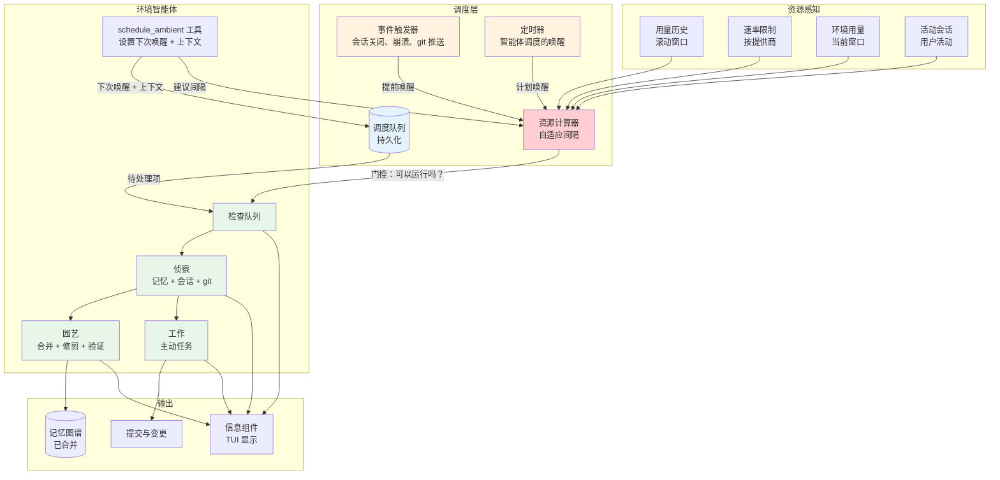
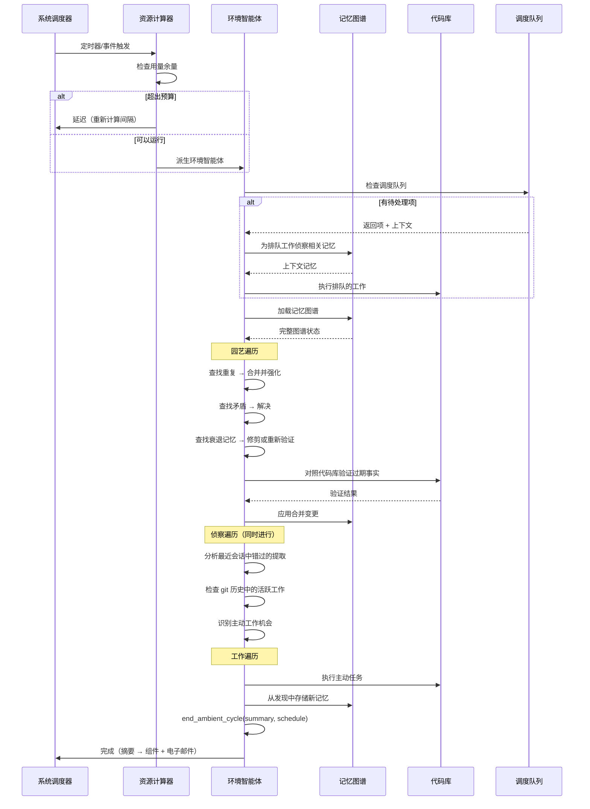
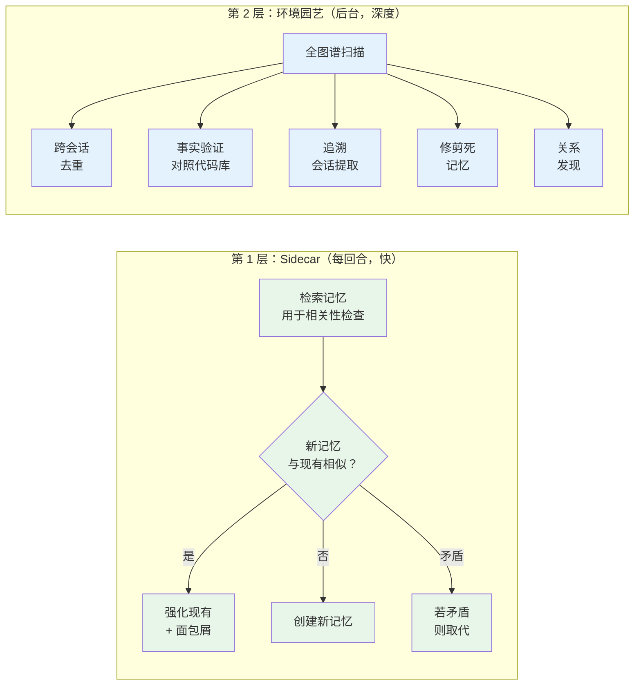
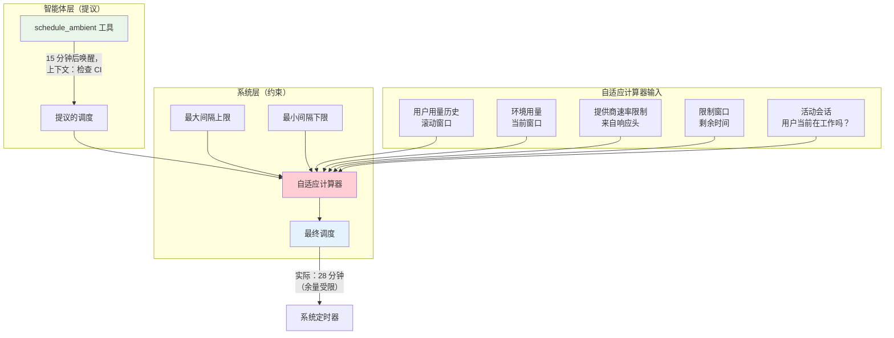
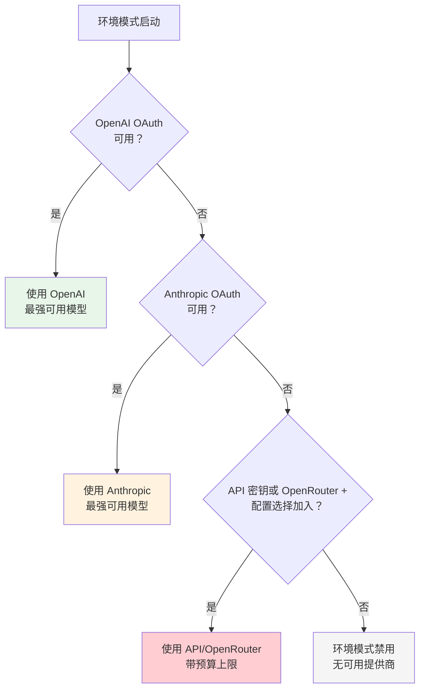
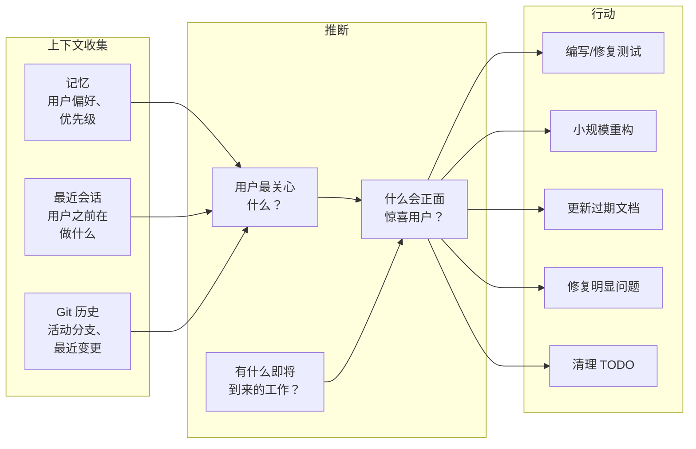
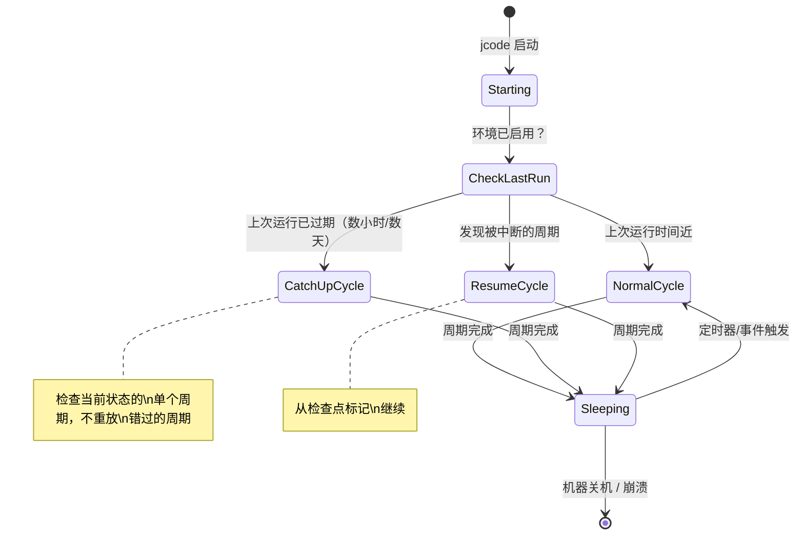

# 环境模式

> **状态：** 设计
> **更新日期：** 2026-02-08

一种主动、常驻的智能体模式，无需用户提示即可自主工作。就像大脑在睡眠时巩固记忆一样，环境模式照料记忆图谱、识别有用工作、并代表用户行动——同时始终保持在资源限制之内。

## 概述

环境模式作为后台循环运行，它：

1. **园艺**——合并、修剪并强化记忆图谱
2. **侦察**——分析最近的会话、git 历史和记忆，理解用户关心什么
3. **工作**——主动完成用户会乐意看到惊喜的任务

这些不是独立的阶段。智能体在一次遍历中完成全部三项——查看记忆时自然会同时发现维护工作和主动机会。

**关键设计决策：**
1. **同时只有一个智能体**——任何时候只运行一个环境实例，无并行
2. **订阅优先**——默认使用 OAuth（OpenAI/Anthropic），除非显式配置否则绝不使用 API 密钥
3. **用户优先**——交互式会话始终优先于环境工作
4. **强模型**——使用所选提供商最强可用的模型，以便智能体能良好判断什么真正有用
5. **自我调度**——智能体决定下次何时唤醒，受自适应资源限制约束

---

## 架构



---

## 环境周期

每个环境周期遵循单一流程。智能体不会在"模式"之间切换——它自然地在一次遍历中处理园艺、侦察和工作。



---

## 环境智能体工具

环境智能体可以访问 jcode 工具的子集以及环境专属工具。

### `end_ambient_cycle`（必需）

每个环境周期**必须**以此工具调用结束。系统使用摘要生成通知邮件和信息组件。

```rust
// 工具：end_ambient_cycle
{
    "summary": "合并了 3 条重复记忆，修剪了 2 条过期事实，
                从崩溃会话 jcode-red-fox-1234 提取了记忆",
    "memories_modified": 8,
    "compactions": 2,
    "proactive_work": null,
    "next_schedule": {
        "wake_in_minutes": 25,
        "context": "验证剩余 4 条过期事实"
    }
}
```

| 字段 | 必需 | 描述 |
|-------|----------|-------------|
| `summary` | 是 | 已完成工作的可读摘要（进入邮件/组件） |
| `memories_modified` | 是 | 创建/合并/修剪/更新的记忆数量 |
| `compactions` | 是 | 本周期内的上下文压缩次数 |
| `proactive_work` | 否 | 主动代码变更的描述（如有） |
| `next_schedule` | 否 | 下次唤醒时间 + 上下文（省略时回退到系统默认） |

### `schedule_ambient`

也可以在周期中途调用以排队未来工作：

```rust
// 工具：schedule_ambient
{
    "wake_in_minutes": 15,
    "context": "检查 auth 重构 PR 的 CI 是否通过",
    "priority": "normal"
}
```

### `todos`

智能体应使用 todos 工具规划其周期。这提供：
- 智能体计划了什么 vs 实际做了什么的可视性
- 如果周期被中断，我们知道还剩什么
- 智能体推理的结构

### `request_permission`

来自[安全系统](安全系统.md)。用于任何层级 2 行动。

---

## 处理意外停止

模型可能意外停止（输出长度限制、API 错误、随机停止）。系统这样处理：

```mermaid
stateDiagram-v2
    [*] --> Running: 周期开始

    Running --> Stopped: 模型输出结束

    Stopped --> CheckTool{调用了 end_ambient_cycle？}

    CheckTool --> Complete: 是 → 正常完成
    CheckTool --> Continuation: 否 → 发送续接消息

    Continuation --> Running: 模型继续工作
    Continuation --> Stopped: 模型再次停止

    Stopped --> ForcedEnd: 未调用 end_ambient_cycle 的第二次停止
    ForcedEnd --> Incomplete: 生成部分会话记录，\n调度默认唤醒

    Complete --> [*]
    Incomplete --> [*]
```

**续接消息**（作为用户消息注入）：

```
你未调用 end_ambient_cycle 就意外停止了。
如果你已完成工作，请调用 end_ambient_cycle，
附上你所完成工作的摘要并调度下次唤醒。
如果你还没完成，请继续你正在做的事。
```

**如果两次尝试后仍未调用 `end_ambient_cycle`：**
- 系统生成标记为 `incomplete` 的部分会话记录
- 压缩计数取自系统指标
- 调度默认唤醒间隔
- 记录警告日志供调试

**如果 `end_ambient_cycle` 中没有 `schedule_ambient` 或 `next_schedule`：**
- 系统按配置中的 `max_interval_minutes` 调度默认唤醒
- 记录警告——智能体应始终调度下次唤醒

---

## 系统提示词

环境智能体的系统提示词每个周期都用真实数据动态构建。提示词给智能体提供用于推理的信息，而不是僵化的思考指令。

```
你是 jcode 的环境智能体。你在没有用户提示的情况下自主运行。
你的工作是维护和改进用户的开发环境。

## 当前状态
- 上次环境周期：{timestamp}（{time_ago}）
- 机器自 {timestamp} 起关机/空闲：{如适用}
- 活动用户会话：{count，或"无"}
- 周期预算：约 {estimated_max_tokens} 个令牌

## 调度队列
{带上下文的排队项，或"为空——做常规环境工作"}

## 最近会话（自上次周期以来）
{每个会话：
  - id、状态（已关闭/已崩溃/活动）、时长、主题摘要
  - 提取状态（已提取/错过/部分）
}

## 记忆图谱健康
- 记忆总数：{count}（{active} 条活动，{inactive} 条非活动）
- 置信度 < 0.1 的记忆：{count}
- 未解决的矛盾：{count}
- 没有嵌入的记忆：{count}
- 重复候选（相似度 > 0.95）：{count}
- 上次合并：{timestamp}

## 用户反馈历史
{关于环境批准/拒绝模式的近期记忆}

## 资源预算
- 提供商：{name}
- 窗口内剩余令牌：{count}
- 窗口重置：{timestamp}
- 用户使用率：{tokens/min 平均}
- 本周期预算：保持在 {limit} 个令牌以内

## 指令

首先使用 todos 工具规划你本周期要做的事。

优先级顺序：
1. 先执行任何调度队列项。
2. 园艺记忆图谱——合并重复项、解决矛盾、
   修剪死记忆、验证过期事实、从错过的会话提取。
3. 侦察主动工作（仅当启用且过了冷启动期）——
   查看最近的会话和 git 历史以识别用户
   会感激的有用工作。

园艺：优先做价值最高的维护。先处理重复
和矛盾，再修剪。只有预算有余时才验证过期事实。

主动工作：要保守。糟糕的惊喜比没有惊喜更糟。
检查用户反馈记忆——如果他们以前拒绝过类似工作，
就不要做。代码变更必须放在 worktree 分支上，
并通过 request_permission 创建 PR。

完成后，你必须调用 end_ambient_cycle，附上你
所做一切的摘要，包括压缩计数。始终用你计划
接下来做什么的上下文调度你的下次唤醒时间。
```

---

## 用量计算

### 跟踪

每个 API 调用（用户或环境）都被记录：

```rust
struct UsageRecord {
    timestamp: DateTime<Utc>,
    source: UsageSource,      // User | Ambient
    tokens_input: u32,
    tokens_output: u32,
    provider: String,
}
```

### 速率限制发现

速率限制从提供商响应头学习：

```
x-ratelimit-limit-requests: 50
x-ratelimit-remaining-requests: 42
x-ratelimit-limit-tokens: 100000
x-ratelimit-remaining-tokens: 85000
x-ratelimit-reset-requests: 2026-02-08T15:00:00Z
```

当响应头不可用时，回退到保守默认值，并根据是否发生速率限制错误进行调整。

### 自适应间隔算法

```
# 从响应头或默认值得知
window_remaining = reset_time - now
tokens_remaining = ratelimit_remaining_tokens
requests_remaining = ratelimit_remaining_requests

# 从滚动历史估算用户消耗
user_rate = rolling_average(
    usage_log.filter(source=User, last_hour),
    per_minute
)

# 推算窗口剩余时间的用户用量
user_projected = user_rate * window_remaining

# 预留 20% 缓冲，让用户永远感觉不到被限流
ambient_budget = (tokens_remaining - user_projected) * 0.8

# 从最近周期估算每个环境周期的成本
tokens_per_cycle = rolling_average(
    recent_ambient_cycles.last(5).tokens_used
)

# 剩余预算还能跑几个周期？
cycles_available = ambient_budget / tokens_per_cycle

# 在剩余窗口内均匀分布
if cycles_available > 0:
    interval = window_remaining / cycles_available
else:
    interval = window_remaining  # 等待重置

# 限制在配置边界内
interval = clamp(interval, min_interval, max_interval)
```

### 行为规则

| 条件 | 行为 |
|-----------|----------|
| 用户正在会话中活跃 | 暂停环境（或将间隔乘以 3-5 倍） |
| 用户已空闲数小时 | 更频繁地运行周期 |
| 命中速率限制 | 指数退避（每次间隔翻倍） |
| 连续 N 个周期无速率限制错误 | 逐渐缩短间隔 |
| 无响应头可用 | 从 30 分钟间隔开始，根据错误调整 |
| 接近窗口结束且预算有余 | 挤入额外周期 |
| 预算消耗超过 80% | 回退到 max_interval |

---

## 记忆合并

### 两层架构

记忆合并在两个层级进行，镜像大脑白天编码、睡眠时巩固的方式。



### 第 1 层：Sidecar 合并

每回合后运行，仅作用于已为相关性检查检索的记忆。零额外延迟——在结果返回给主智能体后运行。

**操作：**
- **重复检测**——如果 sidecar 即将创建的记忆与刚检索到的记忆语义相同，则强化现有的那条
- **矛盾检测**——如果新记忆与检索集中的现有记忆矛盾，则取代旧记忆
- **强化**——对持续出现的相关记忆提高强度

**成本：** 接近零。只操作已在手中的记忆。

### 第 2 层：环境园艺

环境周期中运行的深度合并。可访问完整记忆图谱和代码库。

**操作：**

| 操作 | 描述 | 触发条件 |
|-----------|-------------|---------|
| **全图谱去重** | 在整个图谱中查找语义相似的记忆 | 嵌入相似度 > 0.95 |
| **矛盾解决** | 通过检查当前状态解决 `Contradicts` 边 | 存在 Contradicts 边 |
| **事实验证** | 对照代码库检查事实性记忆 | 事实超过置信度半衰期 |
| **追溯提取** | 分析缺少记忆提取的近期会话 | 状态为 Crashed、Closed 且未提取的会话 |
| **修剪** | 移除近乎零置信度且强度低的记忆 | confidence < 0.05 且 strength <= 1 |
| **关系发现** | 在记忆之间发现新连接 | 会话中共现、语义相似 |
| **嵌入回填** | 为缺少嵌入的记忆生成嵌入 | embedding 为 None |
| **集群细化** | 对更新后的嵌入重新运行聚类 | 每 N 个环境周期 |

### 强化来源

当记忆被强化（由 sidecar 或环境）时，系统记录面包屑以支持追溯：

```rust
pub struct Reinforcement {
    pub session_id: String,
    pub message_index: usize,
    pub timestamp: DateTime<Utc>,
}

pub struct MemoryEntry {
    // ... 现有字段 ...
    pub reinforcements: Vec<Reinforcement>,
}

impl MemoryEntry {
    pub fn reinforce(&mut self, session_id: &str, message_index: usize) {
        self.strength += 1;
        self.updated_at = Utc::now();
        self.reinforcements.push(Reinforcement {
            session_id: session_id.to_string(),
            message_index,
            timestamp: Utc::now(),
        });
    }
}
```

合并智能体之后可以通过强化记录追溯，理解记忆*为什么*有当前强度，以及这些强化是否仍然成立。

---

## 调度

### 两层调度



### 智能体发起的调度

环境智能体有 `schedule_ambient` 工具来请求下次唤醒：

```rust
// 工具：schedule_ambient
{
    "wake_in_minutes": 15,           // 或 "wake_at": "2026-02-08T15:30:00Z"
    "context": "检查 auth 重构 PR 的 CI 是否通过",
    "priority": "normal"             // "low" | "normal" | "high"
}
```

上下文存储在调度队列中，因此智能体醒来时知道它计划做什么。

### 自适应资源计算

系统根据用量模式计算安全间隔：

```
headroom = rate_limit - (user_usage_rate + ambient_usage_rate)
safe_interval = max(min_interval, target_budget_fraction / headroom)
```

**输入：**
- **用户用量率**——来自交互式会话的每小时令牌/请求滚动平均
- **环境用量率**——当前窗口内环境消耗的令牌/请求
- **速率限制**——已知的按提供商限制（来自响应头或配置）
- **窗口时间**——速率限制窗口还剩多少
- **活动会话**——如果用户当前正在会话中，环境暂停或大幅节流

**行为：**
- 智能体说"10 分钟后唤醒"但系统算出"30 分钟前不安全" → 推迟到 30 分钟
- 智能体说"6 小时后唤醒"但系统看到未使用预算 → 提前到最大间隔
- 用户开始交互式会话 → 环境暂停，用户空闲后恢复
- 接近速率限制 → 环境指数退避

### 事件触发器

某些事件可以提前唤醒环境（仍受资源门控约束）：

| 事件 | 优先级 | 理由 |
|-------|----------|-----------|
| 会话崩溃 | 高 | 可能错过了记忆提取 |
| 会话关闭 | 普通 | 可能有未提取的记忆 |
| Git 推送 | 低 | 代码库已变更，事实可能过期 |
| 用户空闲 > 阈值 | 低 | 做环境工作的好时机 |
| 显式 `/ambient` 命令 | 立即 | 用户请求 |

### 调度队列

持久化的环境任务调度队列：

```rust
pub struct ScheduledItem {
    pub id: String,
    pub scheduled_for: DateTime<Utc>,
    pub context: String,
    pub priority: Priority,
    pub created_by_session: String,     // 哪个环境周期创建了它
    pub created_at: DateTime<Utc>,
}

pub enum Priority {
    Low,
    Normal,
    High,
}
```

**队列规则：**
- 环境唤醒时首先检查
- 项按优先级、再按调度时间排序
- 过期的项（超过 scheduled_for）仍会执行
- 系统可在预算超限时延迟项，但不会丢弃
- 同一时间只有一个环境智能体——如果有一个在运行，新触发器排队等待

---

## 提供商与模型选择

### 默认优先级



**理由：**
- **OpenAI 优先**——与 Anthropic 有独立的速率限制池，环境不会与交互式会话竞争
- **Anthropic 第二**——同样是订阅制（OAuth），无按令牌成本
- **OpenRouter/API 密钥最后**——按令牌付费；仅通过配置选择加入，避免静默烧钱
- **强模型**——环境需要良好判断什么工作有价值。弱模型会做错误的主动工作而惹恼用户。

### 模型选择

| 提供商 | 默认模型 | 理由 |
|----------|--------------|-----------|
| OpenAI OAuth | 最强可用（如 `5.2-codex-xhigh`） | 判断决策的最佳推理 |
| Anthropic OAuth | 最强可用（如 `claude-opus-4-6`） | Anthropic 上最强可用 |
| OpenRouter（选择加入） | 最强可用 | 按令牌付费，需要配置选择加入 |
| API 密钥（选择加入） | 可配置 | 用户选择成本/能力权衡 |

### 资源规则

1. **订阅（OAuth——OpenAI/Anthropic）：** 允许环境使用，受自适应速率限制约束
2. **按令牌付费（API 密钥、OpenRouter）：** 默认关闭。可在配置中启用并带可选的每日预算上限
3. **用户活跃：** 用户有活动会话时环境暂停或降至最低
4. **速率受限：** 如果环境命中速率限制，积极退避（指数退避）
5. **分离池：** 交互使用 Anthropic 时环境优先用 OpenAI（反之亦然）

---

## 主动工作

### 环境做什么

智能体使用记忆、最近会话和 git 历史来识别有用工作：



### 安全

环境模式在[安全系统](安全系统.md)下运行——一个对行动分类、为任何有风险的操作请求许可、并通过电子邮件/SMS/桌面通知用户的人机协同层。

环境的关键约束：
- **所有行动都分类**——自动允许（读取、本地分支、记忆操作）、需要许可（PR、推送、通信），或永远禁止（强推、删除远程分支）
- **提交到独立分支**——绝不直接推送到 main/master
- **代码变更需要 worktree + PR**——修改始终经过审阅
- **小而聚焦的变更**——未经用户请求不做大型重构
- **会话记录**——每个行动的完整日志，每次周期后作为摘要发送
- **尊重 .gitignore 和敏感文件**——与交互式模式相同的安全规则
- **可以被审阅**——用户在 TUI 中看到环境工作及待处理的许可请求

---

## 信息组件

TUI 在现有组件（记忆、令牌等）旁显示环境模式状态。

### 组件内容

```
╭─ 环境 ─────────────────────────────╮
│ ● 运行中（园艺 + 侦察）            │
│ 队列：2 项（下一项：检查 CI）      │
│ 上次：12 分钟前——修剪 3、合并 1    │
│ 下次：约 18 分钟（自适应）          │
│ 预算：██████░░░░ 剩余 58%          │
╰───────────────────────────────────╯
```

**字段：**

| 字段 | 描述 |
|-------|-------------|
| **状态** | `idle` / `running (detail)` / `scheduled` / `paused (rate limited)` |
| **队列** | 调度项数量 + 下一项上下文的预览 |
| **上次周期** | 距上次运行的时间 + 它所做工作的摘要 |
| **下次唤醒** | 距下次周期的预计时间（来自自适应计算器） |
| **预算** | 显示用量的可视化条：用户 + 环境 + 剩余余量 |

### 预算分解

预算条显示三个分段：

```
用户用量       环境用量      剩余
████████████   ████          ░░░░░░░░░░
   45%           12%            43%
```

这给用户即时的可见性：环境是否过于激进。

---

## 配置

```toml
[ambient]
# 启用环境模式（默认：false，直到稳定）
enabled = false

# 提供商覆盖（默认：按优先级链自动选择）
# provider = "openai"

# 模型覆盖（默认：提供商最强模型）
# model = "5.2-codex-xhigh"

# 允许使用 API 密钥（默认：false，仅 OAuth）
allow_api_keys = false

# 使用 API 密钥时的每日令牌预算（OAuth 忽略）
# api_daily_budget = 100000

# 周期之间的最小间隔（分钟）（默认：5）
min_interval_minutes = 5

# 周期之间的最大间隔（分钟）（默认：120）
max_interval_minutes = 120

# 用户有活动会话时暂停环境（默认：true）
pause_on_active_session = true

# 启用主动工作（vs 仅园艺模式）（默认：true）
proactive_work = true

# 主动工作分支前缀（默认："ambient/"）
work_branch_prefix = "ambient/"
```

---

## 存储

```
~/.jcode/ambient/
├── state.json              # 当前环境状态（状态、上次运行等）
├── queue.json              # 调度队列（重启后持久）
├── usage.json              # 用于自适应计算的用量历史
└── logs/
    └── ambient-YYYY-MM-DD.log  # 每日环境活动日志
```

---

## 上下文窗口管理

环境模式使用与交互式会话相同的压缩策略：**上下文窗口使用率达到 80% 时压缩。** 无需特殊处理——如果环境周期正在分析大型记忆图谱或多个会话，它会压缩并继续。

---

## 通过记忆进行用户反馈

环境通过记忆系统本身从用户的批准/拒绝决定中学习。无需单独的反馈机制。

- **用户拒绝主动变更** → 环境存储记忆：*"用户拒绝了环境重构 auth 测试的 PR——偏好不让测试被自动修改"*
- **用户批准** → 记忆：*"用户批准了环境修复文档中的错别字"*
- **模式浮现** → 这些记忆随时间被强化，自然地影响环境优先做什么

这之所以有效，是因为环境在决定做什么之前已经侦察记忆。它自己的批准/拒绝历史成为它推理的上下文的一部分，这些记忆像图谱中的其他一切一样合并、衰退和强化。

---

## 崩溃安全与恢复

环境必须假设进程随时可能死亡（电池耗尽、崩溃、OOM 等），并设计得不会丢失或损坏任何东西。

### 原则

- **原子写入**——记忆图谱和状态文件先写入临时文件，再原子重命名。写入中途崩溃不会损坏现有数据。
- **增量检查点**——如果环境在园艺 50 条记忆的中途崩溃，不应重做已完成的部分。"最后处理"标记跟踪周期内的进度。
- **持久队列在崩溃中存活**——调度队列和许可请求在磁盘上，而非内存中。它们在重启后存活。
- **中断的会话记录**——如果周期未完成，会话记录标记为 `interrupted` 而非 `completed`，让用户知道它没有完成。

### 重启后的恢复

环境在意外关机后启动时：

1. **不重放错过的周期**——不要试图运行机器关机期间调度到的每个周期。只运行一个检查当前状态的周期。
2. **检查距上次运行的时间**——如果间隔很大（数小时/数天），可能有待提取的崩溃会话积压、待验证的过期记忆等。智能体自然处理这些，因为它总是检查当前状态，而不是与上次运行做差异。
3. **过期的调度项**——仍然执行它们。智能体存储的上下文仍然有效，工作只是晚了。
4. **恢复而非重启**——如果周期中途被中断，检查检查点并从断点继续，而不是重新开始。

### 状态图



---

## 冷启动

环境第一次运行时，没有用量历史、没有模式、没有反馈记忆。引导策略：

- **从保守开始**——仅园艺（记忆维护），在环境有足够上下文前不做主动工作
- **建立用量基线**——最初几个周期只观察并跟踪用量模式，供自适应调度器使用
- **主动工作逐步解锁**——在 N 个成功且结果获批的园艺周期后，环境可以开始侦察主动工作
- **或用户立即选择加入**——配置选项，如果用户信任它可跳过预热

---

## 按项目配置

某些项目可能需要不同的环境行为（例如敏感的工作项目、偏好不同的个人仓库）：

```toml
# 在项目级 .jcode/config.toml 中
[ambient]
# 对该项目完全禁用环境
enabled = false

# 或限制为仅园艺（无主动代码变更）
proactive_work = false
```

---

## 多机器（推迟）

当环境在多台机器上运行（例如笔记本 + 台式机）时，共享状态可能冲突：重复处理会话、冲突的记忆编辑、重叠的主动工作。

这是一个分布式系统问题，将在环境在单机上稳定后处理。潜在方案：
- 记忆写入时带机器 ID 用于冲突解决
- 独占操作使用锁文件或领导者选举
- Git worktree 已经隔离，因此主动工作天然无冲突

---

## 实施阶段

### 阶段 1：基础
- [ ] 环境智能体循环（派生、运行、休眠）
- [ ] 单实例守卫
- [ ] 基础调度（固定间隔带最大上限）
- [ ] 提供商选择链（OpenAI OAuth → Anthropic OAuth → 按令牌付费选择加入 → 禁用）
- [ ] 配置（config 中的 `[ambient]` 段）
- [ ] 存储布局

### 阶段 2：记忆合并——园艺
- [ ] 全图谱去重扫描
- [ ] 对照代码库的事实验证
- [ ] 追溯会话提取（崩溃/错过的会话）
- [ ] 修剪死记忆（低置信度 + 低强度）
- [ ] 跨会话关系发现
- [ ] 嵌入回填
- [ ] 矛盾解决

### 阶段 3：调度
- [ ] 智能体自我调度的 `schedule_ambient` 工具
- [ ] 调度队列（持久化，带上下文）
- [ ] 自适应资源计算器
- [ ] 用量历史跟踪
- [ ] 速率限制感知（来自提供商响应头）
- [ ] 事件触发器（会话关闭、崩溃、git 推送）
- [ ] 活动会话检测 → 暂停/节流

### 阶段 4：主动工作
- [ ] 侦察：分析最近会话 + git 历史
- [ ] 从记忆推断用户优先级
- [ ] 识别可执行的工作
- [ ] 在独立分支上执行
- [ ] 报告结果

### 阶段 5：信息组件
- [ ] TUI 中的环境状态显示
- [ ] 队列预览
- [ ] 上次周期摘要
- [ ] 下次唤醒估计
- [ ] 预算条（用户 vs 环境 vs 剩余）

---

*最后更新：2026-02-08*
