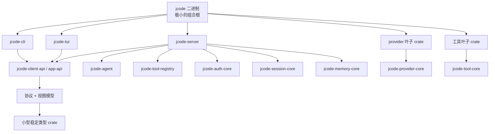

# 编译期隔离重构

这是让全功能 debug/selfdev 构建更快、同时不把功能从开发者二进制中移除的现行迁移计划。

## 目标

保持普通 debug/selfdev 二进制的生产级特性，包括 PDF、嵌入、provider、更新/selfdev 工具及其他集成，同时减少常见编辑后必须重新编译的 Rust 代码量。

目标不只是"更多 crate"。目标是更宽的依赖 DAG，带更小的串行前端单元和更干净的失效边界。

## 当前诊断

工作区已经有很多 crate，但关键路径由少数线性堆叠的大 crate 主导：


根据用 `scripts/compile_time_probe.sh --skip-build` 解析的最新 Cargo 计时报告：

- Cargo 计时墙钟：**16.00s**
- 已知 jcode 串行栈跨度：**14.72s**
- 已知 jcode 串行栈单元时间总和：**17.36s**
- 已知 jcode 串行栈前端时间：**11.99s**

该计时报告中最慢的单元：

| 单元 | 总时间 | 前端 | 代码生成 |
|---|---:|---:|---:|
| `jcode-app-core` | 4.73s | 3.82s | 0.91s |
| `jcode-base` | 4.34s | 3.63s | 0.71s |
| `jcode-tui` | 4.18s | 3.14s | 1.04s |
| `jcode` bin | 2.34s | n/a | n/a |
| `jcode` lib | 1.77s | 1.40s | 0.37s |

这意味着主要瓶颈是几个巨型 crate 中的 rustc 前端串行化，而不是链接器选择或第三方冷编译。

## 测量

每个阶段使用聚焦计时探针：

```bash
scripts/compile_time_probe.sh --json target/compile-time-probe.json
scripts/compile_time_probe.sh --touch crates/jcode-tui/src/tui/app/input.rs
scripts/compile_time_probe.sh --touch crates/jcode-app-core/src/server.rs
scripts/compile_time_probe.sh --touch crates/jcode-base/src/provider/mod.rs
```

对于更广泛的重复测量，继续使用：

```bash
scripts/bench_compile.sh selfdev-jcode --runs 3 --touch <path> --json
scripts/bench_selfdev_checkpoints.sh --skip-cold --touch <path> --runs 1
```

至少跟踪：

1. 全功能 selfdev 构建墙钟时间。
2. Cargo 计时墙钟时间。
3. `jcode-base -> jcode-app-core -> jcode-tui -> jcode lib -> jcode bin` 栈跨度。
4. 串行栈中的前端时间总和。
5. 触碰代表性高变动文件后的增量重建。
6. 来自 `scripts/compile_isolation_report.py` 的静态报告漂移：LOC、内联测试、`async_trait` 和目标状态依赖建议。

## 目标架构



规则：

- TUI 和 CLI 依赖客户端 API、协议、视图模型和小型类型 crate，而不是完整的 server/provider/工具实现。
- Provider 实现是叶子 crate。AWS/Bedrock 依赖只存在于 Bedrock provider crate 中。
- 工具实现是叶子 crate。PDF/浏览器/Gmail/搜索等重型工具隔离在 tool-core 接口之后。
- 共享底层 crate 小而稳定。避免把高变动行为放进协议/类型 crate。
- 最终架构中避免宽泛的 `pub use whole_crate::*` 兼容梯子。

## 迁移顺序

### 阶段 0：测量与护栏

状态：已开始。

交付物：

- `scripts/compile_time_probe.sh`
- `scripts/compile_isolation_report.py`
- 本文档
- 依赖边界检查/建议报告

成功标准：

- 每个结构性阶段都有前后计时。
- 计时报告使串行栈可见。

### 阶段 1：加宽神级 crate 的关键路径

把三个长杆 crate 拆成兄弟领域 crate。优先加宽图，而不是抽取更多微型类型 crate。

可能的首批拆分：

- 从 `jcode-base` 拆出：
  - `jcode-auth-core`
  - `jcode-session-core`
  - `jcode-memory-core`
  - provider 实现 crate，特别是把 Bedrock/AWS 作为叶子
- 从 `jcode-app-core` 拆出：
  - `jcode-server`
  - `jcode-agent`
  - `jcode-tool-registry`
  - 按需为后台/集群/更新/selfdev 拆出服务 crate
- 从 `jcode-tui` 拆出：
  - 先拆 `jcode-client-api` / 视图模型边界
  - 然后仅在真正形成并行单元时，把可复用的客户端状态逻辑移出终端渲染 crate

成功标准：

- 触碰常见 TUI 代码不再重新编译 app-core/provider/server 实现 crate。
- 触碰某个 provider 实现不再重新编译 TUI 或宽泛 base 代码。
- Cargo 计时显示多个中等大小的 Jcode crate 并行运行，而不是一个 4 层深的巨型 crate 梯子。

### 阶段 2：消灭 glob 再导出梯子

当前兼容分层保留了旧单体形态：

```rust
pub use jcode_base::*;
pub use jcode_app_core::*;
pub use jcode_tui::*;
```

迁移方法：

1. 移动代码期间暂时保留兼容再导出。
2. 把高变动模块转换为从叶子 crate 的显式导入。
3. 一旦下游导入显式化，移除 glob 再导出。

成功标准：

- 新代码不依赖整层 prelude 风格的再导出。
- 依赖方向在导入和 Cargo manifest 中可见。

### 阶段 3：把内联测试移出热 crate

问题：

- 内联 `#[cfg(test)]` 模块使 `cargo test` 把大型生产 crate 加大型测试体编译为单个 rustc 单元。

目标：

- 针对广泛行为测试，使用集成测试或专用 `*-test-support` crate。
- 仅当小型单元测试真正局部且廉价时保留内联。

成功标准：

- 定向测试不再需要为无关领域构建单体测试 cfg。

### 阶段 4：减少前端宏开销

目标：

- 在 trait 不用作 `dyn` 的地方，用原生 `async fn` 替换 `async_trait`。
- 只在对象安全的插件/接口边界（有意的 boxed future）保留 `async_trait`。
- 避免向广泛共享 crate 添加重型 derive 类型，除非该类型稳定且必要。

成功标准：

- 热 crate 中的 proc-macro 展开更少。
- 无对象安全回退。

## 反目标

- 不要让快速 debug 构建默认不完整。
- 不要把代码拆成微型 crate，除非拆分形成了真正的失效或并行边界。
- 不要把高变动行为移进底层类型/协议 crate。
- 不要做一次性巨量重写。每个阶段都应可构建、可测量。

## 每阶段验证清单

提交一个阶段之前：

```bash
scripts/compile_time_probe.sh --skip-build
scripts/compile_isolation_report.py
scripts/check_dependency_boundaries.py
cargo check --profile selfdev -p jcode --bin jcode
```

对于移动代码的阶段，还运行被移动领域的相关定向测试，并在可行时��过协调的 selfdev 路径做一次完整 selfdev 构建：

```bash
selfdev build target=tui
```
