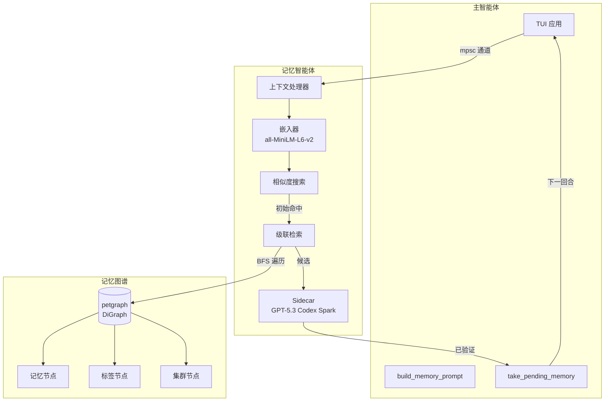
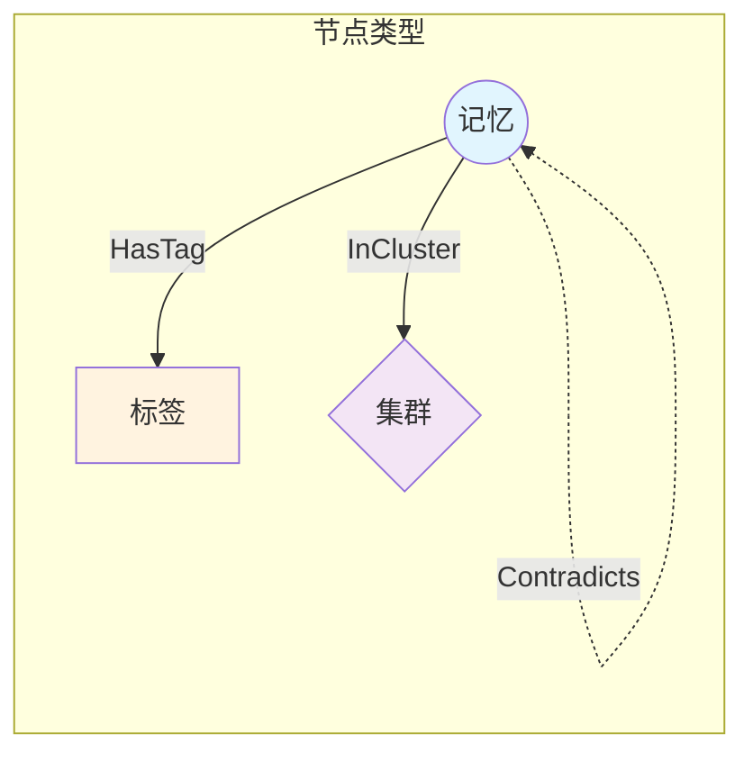
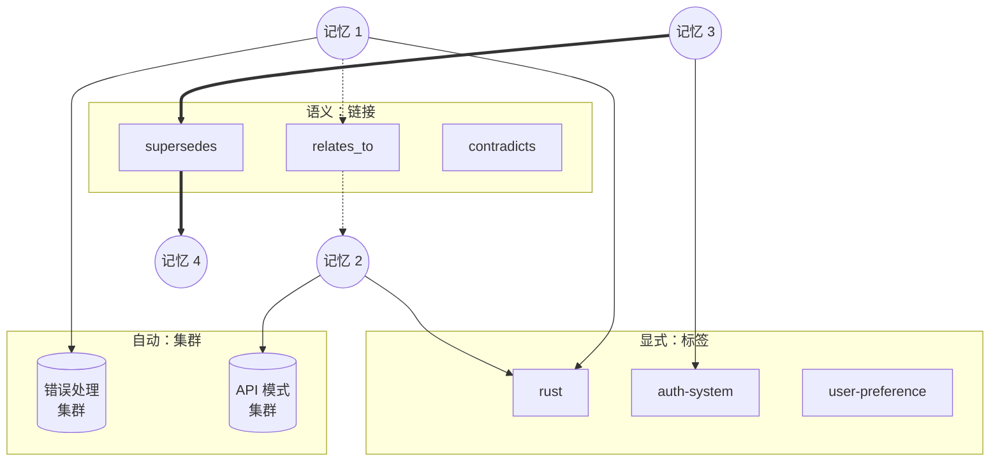
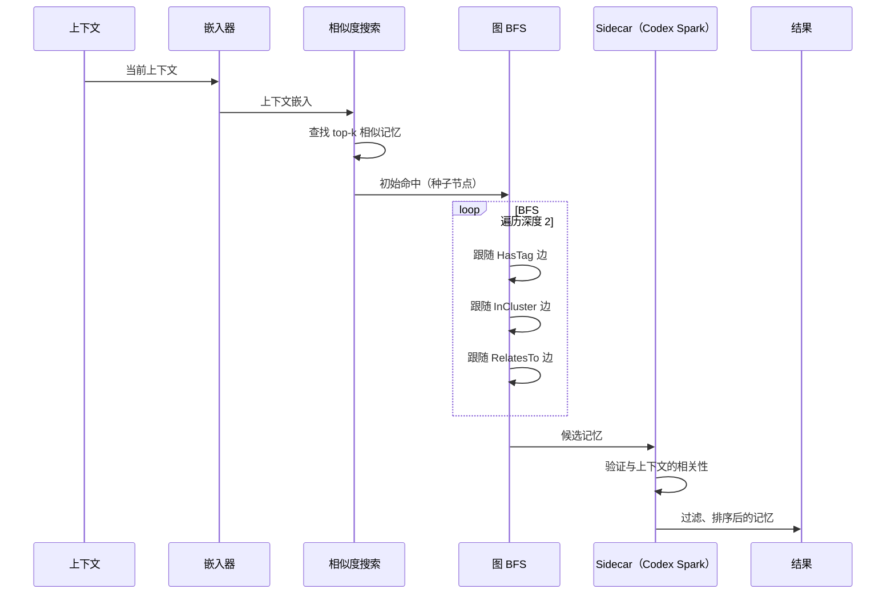
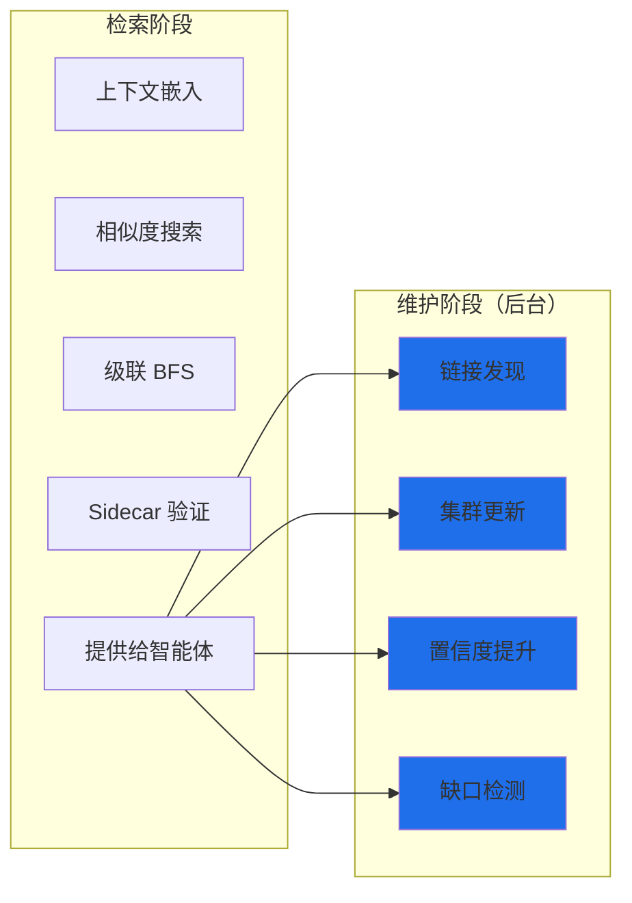
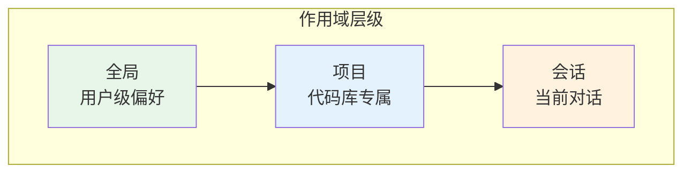
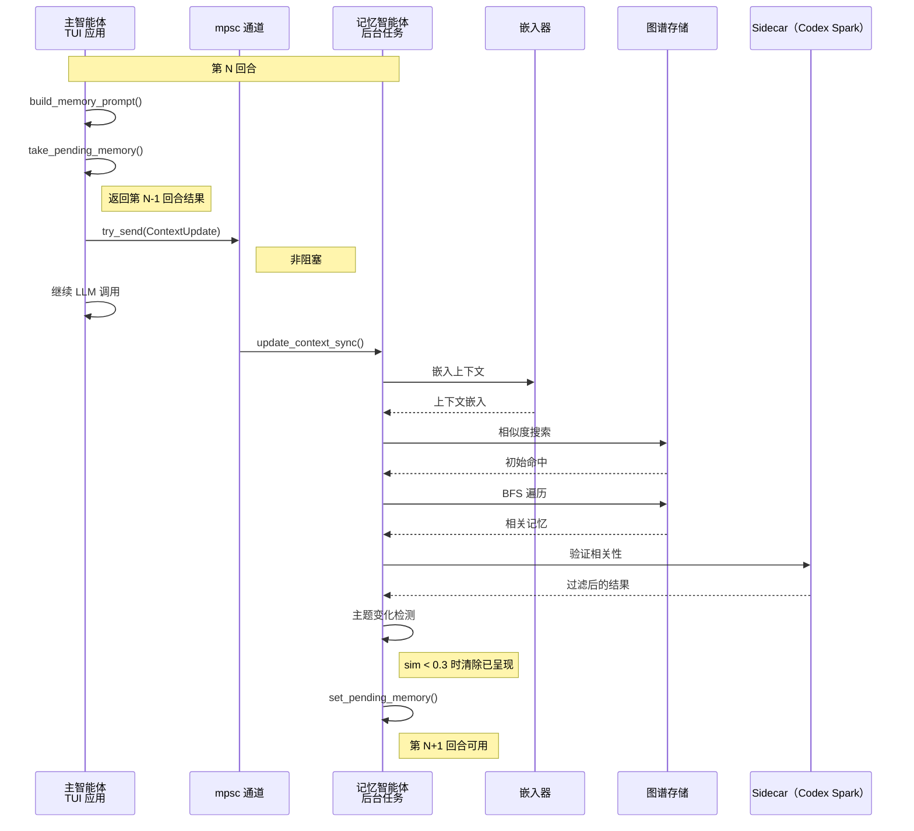
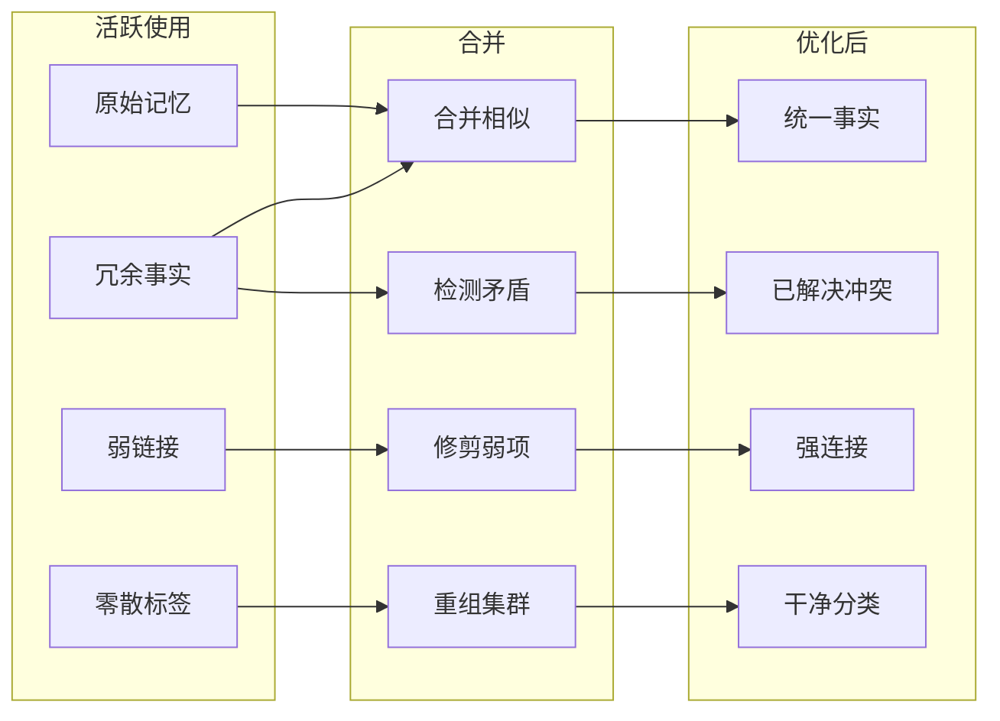

# 记忆架构设计

> **状态：** 已实现（核心），已规划（基于图的中混合）
> **更新日期：** 2026-01-27

本地嵌入 + 轻量级 sidecar（GPT-5.3 Codex Spark）已实现并在生产中运行。本文档描述当前实现和已规划的基于图的混合架构。

## 概述

另见：[记忆回归预算](记忆回归预算.md) 了解当前可测量的护栏和审阅预期。

一个用于跨会话学习的多层记忆系统，模仿人类记忆的工作方式——相关记忆在被上下文触发时"浮现"，而不是需要显式回忆。

**关键设计决策：**
1. **完全异步且非阻塞**——主智能体从不等待记忆；第 N 回合的结果在第 N+1 回合可用
2. **基于图的组织**——记忆通过标签、集群和语义链接形成连接图
3. **级联检索**——嵌入命中触发 BFS 遍历以查找相关记忆
4. **混合分组**——结合显式标签、自动集群和语义链接

---

## 架构概述



---

## 基于图的数据模型

### 节点类型



| 节点类型 | 描述 | 存储 |
|-----------|-------------|---------|
| **记忆** | 核心记忆条目（事实、偏好、流程） | 内容、元数据、嵌入 |
| **标签** | 显式标签（用户定义或推断） | 名称、描述、计数 |
| **集群** | 通过嵌入相似度自动分组 | 质心嵌入、成员数 |

### 边类型

| 边类型 | 从 → 到 | 描述 |
|-----------|-----------|-------------|
| `HasTag` | 记忆 → 标签 | 记忆有此显式标签 |
| `InCluster` | 记忆 → 集群 | 记忆属于自动发现的集群 |
| `RelatesTo` | 记忆 → 记忆 | 语义关系（带权重） |
| `Supersedes` | 记忆 → 记忆 | 较新的记忆取代较旧的 |
| `Contradicts` | 记忆 → 记忆 | 冲突信息 |
| `DerivedFrom` | 记忆 → 记忆 | 从事实派生的程序性知识 |

### Rust 实现

```rust
use petgraph::graph::DiGraph;

/// 记忆图谱中的节点
#[derive(Debug, Clone)]
pub enum MemoryNode {
    Memory(MemoryEntry),
    Tag(TagEntry),
    Cluster(ClusterEntry),
}

/// 边关系
#[derive(Debug, Clone)]
pub enum EdgeKind {
    HasTag,
    InCluster,
    RelatesTo { weight: f32 },
    Supersedes,
    Contradicts,
    DerivedFrom,
}

/// 记忆图谱
pub struct MemoryGraph {
    graph: DiGraph<MemoryNode, EdgeKind>,
    // 用于快速查找的索引
    memory_index: HashMap<String, NodeIndex>,
    tag_index: HashMap<String, NodeIndex>,
    cluster_index: HashMap<String, NodeIndex>,
}
```

---

## 混合分组系统

记忆系统使用三种互补的组织方法：



### 1. 标签（显式）

用户定义或自动推断的标签。

**来源：**
- 用户显式打标签：`memory { action: "remember", tags: ["rust", "auth"] }`
- 从上下文推断（文件路径、主题、实体）
- sidecar 在会话结束处理期间提取

**示例：**
- `#project:jcode` - 项目专属
- `#rust`、`#python` - 语言专属
- `#auth`、`#database` - 领域专属
- `#preference`、`#correction` - 类别标签

### 2. 集群（自动）

基于嵌入相似度自动发现的分组。

**算法：**
1. 定期对记忆嵌入运行 HDBSCAN
2. 为密集区域创建/更新集群节点
3. 为附近记忆分配 `InCluster` 边
4. 跟踪集群质心以便快速查找

**好处：**
- 发现用户没有显式打标签的隐藏模式
- 即使没有共享标签也能对相关记忆分组
- 支持"查找相似"查询

### 3. 链接（语义关系）

记忆之间的显式关系。

**类型：**
- **RelatesTo**：一般语义连接（权重 0.0-1.0）
- **Supersedes**：较新信息取代较旧信息
- **Contradicts**：冲突信息（两者都保留，标记）
- **DerivedFrom**：从事实派生的程序性知识

**发现：**
- 写入时的矛盾检测
- sidecar 在验证期间识别关系
- 用户可以显式链接记忆

---

## 级联检索

当上下文触发记忆搜索时，级联检索通过图遍历查找相关记忆。



### 算法

```rust
pub fn cascade_retrieve(
    &self,
    context_embedding: &[f32],
    max_depth: usize,
    max_results: usize,
) -> Vec<(MemoryEntry, f32)> {
    // 步骤 1：嵌入相似度搜索
    let initial_hits = self.similarity_search(context_embedding, 10);

    // 步骤 2：从命中节点 BFS 遍历
    let mut visited: HashSet<NodeIndex> = HashSet::new();
    let mut candidates: Vec<(NodeIndex, f32, usize)> = Vec::new();
    let mut queue: VecDeque<(NodeIndex, usize)> = VecDeque::new();

    for (node, score) in initial_hits {
        queue.push_back((node, 0));
        candidates.push((node, score, 0));
    }

    while let Some((node, depth)) = queue.pop_front() {
        if depth >= max_depth || visited.contains(&node) {
            continue;
        }
        visited.insert(node);

        // 遍历边
        for edge in self.graph.edges(node) {
            let neighbor = edge.target();
            if visited.contains(&neighbor) {
                continue;
            }

            let edge_weight = match edge.weight() {
                EdgeKind::HasTag => 0.8,        // 强信号
                EdgeKind::InCluster => 0.6,     // 中等信号
                EdgeKind::RelatesTo { weight } => *weight,
                EdgeKind::Supersedes => 0.9,    // 非常相关
                _ => 0.3,
            };

            // 按深度衰减分数
            let decayed_score = edge_weight * (0.7_f32).powi(depth as i32 + 1);

            if let MemoryNode::Memory(_) = &self.graph[neighbor] {
                candidates.push((neighbor, decayed_score, depth + 1));
            }

            queue.push_back((neighbor, depth + 1));
        }
    }

    // 步骤 3：去重、排序并返回顶部结果
    candidates.sort_by(|a, b| b.1.partial_cmp(&a.1).unwrap());
    candidates.into_iter()
        .filter_map(|(node, score, _)| {
            if let MemoryNode::Memory(entry) = &self.graph[node] {
                Some((entry.clone(), score))
            } else {
                None
            }
        })
        .take(max_results)
        .collect()
}
```

### 检索参数

| 参数 | 默认值 | 描述 |
|-----------|---------|-------------|
| `similarity_threshold` | 0.4 | 初始命中的最小嵌入相似度 |
| `max_initial_hits` | 10 | 嵌入搜索结果数 |
| `max_depth` | 2 | BFS 遍历深度限制 |
| `max_results` | 10 | 最终返回的结果数 |
| `edge_decay` | 0.7 | 每步遍历的分数衰减 |

---

## 记忆条目模式

```rust
#[derive(Debug, Clone, Serialize, Deserialize)]
pub struct MemoryEntry {
    // 身份
    pub id: String,
    pub content: String,
    pub category: MemoryCategory,

    // 分类
    pub memory_type: MemoryType,  // Fact、Preference、Procedure、Correction
    pub scope: MemoryScope,       // Global、Project、Session

    // 来源跟踪
    pub session_id: Option<String>,
    pub message_range: Option<(u32, u32)>,
    pub file_paths: Vec<String>,
    pub provenance: Provenance,   // UserStated、Observed、Inferred

    // 生命周期
    pub created_at: DateTime<Utc>,
    pub updated_at: DateTime<Utc>,
    pub last_accessed: DateTime<Utc>,
    pub access_count: u32,
    pub strength: u32,            // 合并计数

    // 信任与状态
    pub confidence: f32,          // 0.0-1.0，随时间衰减
    pub trust_score: f32,         // 基于来源的信任
    pub active: bool,
    pub superseded_by: Option<String>,

    // 嵌入
    pub embedding: Option<Vec<f32>>,
}

#[derive(Debug, Clone, Serialize, Deserialize)]
pub enum MemoryType {
    Fact,        // "此项目使用 PostgreSQL"
    Preference,  // "用户偏好 4 空格缩进"
    Procedure,   // "要部署：运行 make deploy"
    Correction,  // "不要使用已弃用的 API"
    Negative,    // "绝不提交 .env 文件"
}

#[derive(Debug, Clone, Serialize, Deserialize)]
pub enum Provenance {
    UserStated,     // 用户显式陈述
    UserCorrected,  // 用户纠正了智能体行为
    Observed,       // 智能体从行为中观察
    Inferred,       // 智能体从上下文推断
    Extracted,      // 从会话摘要中提取
}
```

---

## 高级特性

### 1. 时间感知

记忆有时间上下文：

```rust
pub struct TemporalContext {
    pub session_scope: bool,      // 仅在会话中相关
    pub recency_weight: f32,      // 近期访问加成
    pub seasonal: Option<String>, // "冲刺结束"、"发布周"
}
```

**近期加成公式：**
```
boost = 1.0 + (0.5 * e^(-hours_since_access / 24))
```

### 2. 置信度衰减

置信度基于记忆类型随时间衰减：

| 记忆类型 | 半衰期 | 理由 |
|-------------|-----------|-----------|
| Correction | 365 天 | 用户纠错价值高 |
| Preference | 90 天 | 偏好可能演变 |
| Fact | 30 天 | 代码库事实可能过期 |
| Procedure | 60 天 | 流程变化较少 |
| Inferred | 7 天 | 低置信度推断 |

**衰减公式：**
```
confidence = initial_confidence * e^(-age_days / half_life)
           * (1 + 0.1 * log(access_count + 1))
           * trust_weight
```

### 3. 负面记忆

智能体应避免做的事：

```rust
MemoryEntry {
    content: "生产代码中绝不用 println! 做日志",
    memory_type: MemoryType::Negative,
    trigger_patterns: vec!["println!", "print!", "dbg!"],
    ...
}
```

**呈现：** 当触发模式匹配当前上下文时呈现负面记忆。

### 4. 程序性记忆

带结构化步骤的"如何做"知识：

```rust
pub struct Procedure {
    pub name: String,
    pub trigger: String,        // "deploy to production"
    pub steps: Vec<String>,
    pub prerequisites: Vec<String>,
    pub warnings: Vec<String>,
}
```

### 5. 来源跟踪

每条记忆跟踪其来源：

```rust
pub struct ProvenanceChain {
    pub source: Provenance,
    pub session_id: String,
    pub timestamp: DateTime<Utc>,
    pub context_snippet: String,  // 当时在讨论什么
    pub confidence_reason: String, // 为什么是这个置信度
}
```

### 6. 反馈循环

记忆根据使用情况增强或减弱：

```rust
impl MemoryEntry {
    pub fn on_used(&mut self, helpful: bool) {
        self.access_count += 1;
        self.last_accessed = Utc::now();

        if helpful {
            self.strength = self.strength.saturating_add(1);
            self.confidence = (self.confidence + 0.05).min(1.0);
        } else {
            self.confidence = (self.confidence - 0.1).max(0.0);
        }
    }
}
```

### 7. 检索后维护

在向主智能体提供记忆后，记忆智能体拥有可用于后台维护的宝贵上下文。这种"机会性维护"异步进行，不阻塞。



**可用上下文：**
- 当前上下文嵌入
- 所有被检索的记忆（初始命中 + BFS 扩展）
- 哪些记忆通过了 sidecar 验证（实际相关）
- 哪些被拒绝（检索到但无关）
- 共现模式（一起出现的记忆）

**维护任务：**

| 任务 | 触发条件 | 行动 |
|------|---------|--------|
| **链接发现** | 2+ 条记忆验证相关 | 在共相关记忆之间创建/强化 `RelatesTo` 边 |
| **集群细化** | 检索到的记忆跨越集群 | 更新集群质心，考虑合并相邻集群 |
| **置信度提升** | 记忆验证相关 | 增加访问计数，提升置信度 |
| **置信度衰减** | 记忆被检索但被拒绝 | 略微衰减置信度（可能已过期） |
| **缺口检测** | 上下文无相关记忆 | 记录潜在记忆缺口供稍后提取 |
| **标签推断** | 多条记忆共享上下文 | 若不存在则从上下文推断公共标签 |

**实现：**

```rust
impl MemoryAgent {
    /// 在提供记忆后调用，后台运行维护
    async fn post_retrieval_maintenance(&self, ctx: RetrievalContext) {
        // 不阻塞 - 派生维护任务
        tokio::spawn(async move {
            // 1. 强化共相关记忆之间的链接
            if ctx.verified_memories.len() >= 2 {
                self.discover_links(&ctx.verified_memories, &ctx.embedding).await;
            }

            // 2. 提升已验证记忆的置信度
            for mem_id in &ctx.verified_memories {
                self.boost_confidence(mem_id).await;
            }

            // 3. 衰减被拒绝记忆的置信度
            for mem_id in &ctx.rejected_memories {
                self.decay_confidence(mem_id, 0.02).await;  // 温和衰减
            }

            // 4. 检测缺口（上下文无相关记忆）
            if ctx.verified_memories.is_empty() && ctx.initial_hits > 0 {
                self.log_memory_gap(&ctx.embedding, &ctx.context_snippet).await;
            }

            // 5. 定期集群更新（每 N 次检索）
            if self.retrieval_count.fetch_add(1, Ordering::Relaxed) % 50 == 0 {
                self.update_clusters().await;
            }
        });
    }
}
```

**面向未来学习的缺口检测：**

当检索没有找到相关记忆但上下文似乎重要时，记录它：

```rust
struct MemoryGap {
    context_embedding: Vec<f32>,
    context_snippet: String,
    timestamp: DateTime<Utc>,
    session_id: String,
}
```

这些缺口可以在会话结束提取时审阅，为系统不知道的主题创建新记忆。

### 8. 作用域级别

记忆存在于不同的作用域：



| 作用域 | 生命周期 | 示例 |
|-------|----------|----------|
| 全局 | 永久 | "用户偏好 vim 键位绑定" |
| 项目 | 直到被删除 | "此项目使用 async/await" |
| 会话 | 当前会话 | "正在做 auth 重构" |

---

## 异步处理流水线



**关键点：**
- 记忆智能体是**单例**（OnceCell）——任何时候只运行一个实例
- 通信通过 mpsc 通道上的 `try_send()` **非阻塞**
- 结果**晚一个回合**到达（后台处理）
- **主题变化检测**在对话转换时重置已呈现集合
- **级联检索**遍历图谱查找相关记忆

---

## 存储布局

```
~/.jcode/memory/
├── graph.json                    # 序列化的 petgraph
├── projects/
│   └── <project_hash>.json       # 按目录的记忆
├── global.json                   # 用户级记忆
├── embeddings/
│   └── <memory_id>.vec           # 嵌入向量
├── clusters/
│   └── cluster_metadata.json     # 集群质心和元数据
└── tags/
    └── tag_index.json            # 标签 → 记忆映射
```

---

## 记忆工具

可供主智能体使用：

```
memory { action: "remember", content: "...", category: "fact|preference|correction",
         scope: "project|global", tags: ["tag1", "tag2"] }
memory { action: "recall" }                    # 获取相关记忆作为上下文
memory { action: "search", query: "..." }      # 语义搜索
memory { action: "list", tag: "..." }          # 按标签列出
memory { action: "forget", id: "..." }         # 停用记忆
memory { action: "link", from: "id1", to: "id2", relation: "relates_to" }
memory { action: "tag", id: "...", tags: ["new", "tags"] }
```

---

## 实现状态

### 阶段 1：基础记忆工具 ✅
- [x] 带文件持久化的记忆存储
- [x] 基础记忆工具
- [x] 与智能体集成

### 阶段 2：嵌入搜索 ✅
- [x] 通过 tract-onnx 的本地 all-MiniLM-L6-v2
- [x] 后台嵌入进程
- [x] 余弦距离相似度搜索

### 阶段 3：记忆智能体 ✅
- [x] 异步通道通信
- [x] 用于相关性验证的轻量级 sidecar（当前为 GPT-5.3 Codex Spark）
- [x] 主题变化检测
- [x] 已呈现记忆跟踪

### 阶段 4：基于图的架构 ✅
- [x] 基于 HashMap 的图结构（对 JSON 序列化比 petgraph 更简单）
- [x] 标签节点和 HasTag 边
- [x] 集群发现和 InCluster 边
- [x] 语义链接边（RelatesTo）
- [x] 带 BFS 遍历的级联检索算法

### 阶段 5：检索后维护 ✅
- [x] 链接发现（共相关记忆）
- [x] 检索时的置信度提升/衰减
- [x] 缺失知识的缺口检测
- [x] 定期集群细化
- [x] 从上下文推断标签

### 阶段 6：高级特性 ✅
- [x] 置信度衰减系统（基于时间，带类别专属半衰期）
- [ ] 负面记忆和触发模式
- [ ] 程序性记忆支持
- [x] 来源跟踪
- [x] 反馈循环（使用提升、拒绝衰减）
- [ ] 时间感知

### 阶段 7：完整集成 ✅
- [x] 会话结束提取
- [x] 写入时 sidecar 合并（见下文）
- [x] 用户控制 CLI（`jcode memory` 命令）
- [x] 记忆导出/导入

### 阶段 7.5：Sidecar 合并（内联、每回合） ✅

在记忆 sidecar 向主智能体返回结果后运行的轻量级合并。只操作已检索的记忆——无额外查找，零增加延迟。

`extract_from_context()` 现在执行内联写入时合并：

- [x] **写入时重复检测**——语义相似的记忆被强化而不是重复。
- [x] **写入时矛盾检测**——矛盾记忆在增量提取期间被取代。
- [x] **强化来源**——`MemoryEntry` 跟踪 `Vec<Reinforcement>` 面包屑（`session_id`、`message_index`、`timestamp`）。

### 阶段 8：深度记忆合并（环境园艺）📋

在环境模式后台周期中运行的完整全图谱合并。参见[环境模式](环境模式.md)了解环境模式设计。

- [ ] 基于相似度的全图谱记忆合并
- [ ] 冗余检测和去重（超越 sidecar 的本地范围）
- [ ] 矛盾解决（跨完整图谱，而不仅是检索集）
- [ ] 对照代码库的事实验证（检查事实性记忆是否仍然为真）
- [ ] 追溯会话提取（崩溃/错过的会话）
- [ ] 集群重组
- [ ] 弱记忆修剪（confidence < 0.05 且 strength <= 1）
- [ ] 跨会话关系发现
- [ ] 为缺少嵌入的记忆回填嵌入
- [ ] 知识图谱优化

---

## 隐私与安全

### 不记住
- API 密钥、机密、凭据
- 密码或令牌
- 个人身份信息
- 标记为敏感的文件内容

### 过滤
存储任何记忆前，扫描：
- 机密的正则模式（API 密钥、密码）
- `.gitignore` 或 `.secretsignore` 中的文件
- `.env` 文件的内容

### 用户控制
- 所有记忆以人类可读的 JSON 存储
- 用于查看/编辑/删除的 CLI
- 完全禁用记忆的选项
- 用于备份的导出/导入

---

## 未来：记忆合并（类睡眠处理）

> **状态：** 待办 - 设计待定

类似于人类在睡眠中巩固记忆，jcode 可以运行后台合并来优化记忆图谱：

### 概念



### 潜在特性

| 特性 | 描述 |
|---------|-------------|
| **相似度合并** | 合并嵌入相似度 >0.95 的记忆 |
| **冗余检测** | 查找以不同方式表达同一事实的记忆 |
| **矛盾解决** | 呈现冲突记忆供用户决策 |
| **弱项修剪** | 移除低置信度 + 低访问的记忆 |
| **集群优化** | 重新运行聚类，合并小集群 |
| **链接强化** | 提高频繁共访问对的权重 |
| **标签清理** | 合并相似标签，移除孤儿 |

### 架构选项（待定）

1. **定期守护进程** - 每 N 小时运行合并
2. **空闲触发** - 无活动会话达 M 分钟时运行
3. **基于容量** - 记忆数超过阈值时运行
4. **手动命令** - 用户通过 `/consolidate` 触发

### 合并的开放问题

- 如何处理破坏性合并的用户确认？
- 合并应该可逆吗？
- 正确的频率/触发是什么？
- 如何平衡"完美组织"和"保留一切"？

---

## 开放问题

1. **多机器同步：** 记忆应通过加密备份跨设备同步吗？
2. **团队共享：** 某些记忆应可在团队内共享吗？
3. **集群算法：** HDBSCAN vs k-means vs 层次聚类？
4. **图谱持久化：** 大型图谱用 JSON 序列化还是 SQLite？

---

*最后更新：2026-01-27*
