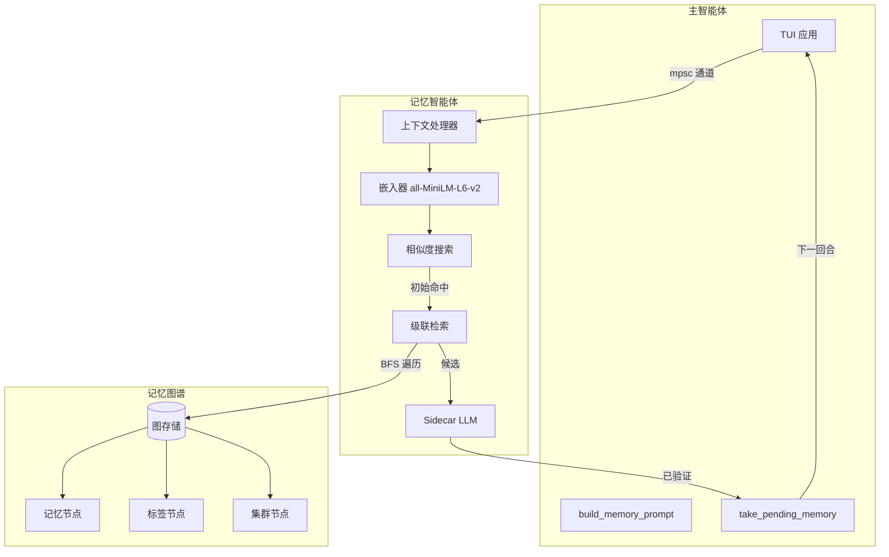

# 记忆系统

跨会话学习的多层记忆：相关记忆在上下文触发时**自动浮现**，而不是等显式回忆。
设计上完全异步非阻塞——主智能体从不等待记忆，第 N 回合的结果在第 N+1 回合可用。

本文合并了原「记忆架构」「记忆回归预算」「记忆事件处理手册」「记忆图计划」四篇。

## 一、总体结构



关键设计决策：**完全异步非阻塞**、**基于图的组织**（标签 + 集群 + 语义链接）、
**级联检索**（嵌入命中 + BFS 扩展）、**混合分组**。

运行要点（`crates/jcode-app-core` 记忆智能体）：

- 记忆智能体是**单例**（`OnceCell`），同一时刻只运行一个实例；
- 主智能体 → 记忆智能体走 mpsc 通道的 `try_send()`，**非阻塞**；
- 结果**晚一回合**到达；
- **主题变化检测**：上下文相似度 < 0.3 时清空「已呈现」集合，允许重新浮现；
- 通信与维护都在后台任务里，不进主回合延迟。

## 二、两种运行模式

由 `agents.memory_sidecar_enabled`（env `JCODE_MEMORY_SIDECAR_ENABLED`）控制，**默认关闭**。

| | 模式 1：sidecar 关闭 | 模式 2：sidecar 开启 |
|---|---|---|
| 浮现 | 跳过 LLM，按原始余弦取前若干条（最多 5），无相关性验证 | LLM 逐候选二值相关性判断（并行，最多 5） |
| 提取 | `extract_from_context` 与最终提取被跳过，只能用显式 `memory` 工具写入 | 主题变化时 + 每 12 回合 + 会话结束时自动提取，带 LLM 去重/矛盾检查 |
| 聚类命名 | 启发式 `infer_candidate_tag` | LLM 命名，矛盾检测 |
| 成本/精度 | 完全本地、零 LLM 成本、精度最弱 | 有 LLM 成本，精度与自动增长最好 |

任何召回改进都应在**两种模式**下评估；纯本地的图改进（扩展/去重/重排）对模式 1 收益最大。

## 三、数据模型

### 节点与边

| 节点 | 含义 | 内容 |
|---|---|---|
| 记忆 | 事实 / 偏好 / 流程条目 | 内容、元数据、嵌入 |
| 标签 | 显式标签（用户定义或推断） | 名称、描述、计数 |
| 集群 | 嵌入相似度自动分组 | 质心嵌入、成员数 |

| 边 | 从 → 到 | 召回中的用途 |
|---|---|---|
| `HasTag` | 记忆 → 标签 | 词汇/过滤信号、范围收窄 |
| `InCluster` | 记忆 → 集群 | 最弱，用于多样性/去重 |
| `RelatesTo` | 记忆 → 记忆（带权重） | 1 跳扩展，救回近失配 |
| `Supersedes` | 记忆 → 记忆 | 只保留最新版本，隐藏被取代的 |
| `Contradicts` | 记忆 → 记忆 | 同时浮现并标记冲突，绝不静默二选一 |
| `DerivedFrom` | 记忆 → 记忆 | 程序性知识 ↔ 事实的 1 跳扩展 |

当前实现用 **HashMap 结构**而非 petgraph（JSON 序列化更简单）。

### 记忆条目

字段分四组：

- **身份与分类**：`id`、`content`、`category`、`memory_type`
  （`Fact` / `Preference` / `Procedure` / `Correction` / `Negative`）、
  `scope`（`Global` / `Project` / `Session`）；
- **来源**：`session_id`、`message_range`、`file_paths`、`provenance`
  （`UserStated` / `UserCorrected` / `Observed` / `Inferred` / `Extracted`）、
  以及强化面包屑 `Vec<Reinforcement>`；
- **生命周期**：`created_at`、`updated_at`、`last_accessed`、`access_count`、`strength`；
- **信任与状态**：`confidence`、`trust_score`、`active`、`superseded_by`、`embedding`。

### 置信度衰减

```
confidence = initial_confidence * e^(-age_days / half_life)
           * (1 + 0.1 * log(access_count + 1)) * trust_weight
```

| 类型 | 半衰期 | 理由 |
|---|---:|---|
| Correction | 365 天 | 用户纠错价值高 |
| Procedure | 60 天 | 流程变化较少 |
| Preference | 90 天 | 偏好会演变 |
| Fact | 30 天 | 代码库事实会过期 |
| Inferred | 7 天 | 低置信度推断 |

近期访问加成：`boost = 1.0 + 0.5 * e^(-hours_since_access / 24)`。

### 反馈循环

被使用且有用 → `strength +1`、`confidence +0.05`（上限 1.0）；
被检索但判定无关 → `confidence -0.02`（温和衰减）。

## 四、检索

### 当前实现（已核对）

- **自动召回**（`memory_agent::process_context`）走
  `find_similar_with_embedding` → `score_and_filter`：对所有活跃记忆做**平面余弦**，
  阈值 0.5，间隔过滤取前 10，然后逐候选做二值 sidecar 判断（模式 2），最多浮现 5 条。
- **图 BFS 级联检索**（`cascade_retrieve`，遍历 tags / clusters / RelatesTo）
  目前**只服务手动** `memory { action: "search" }`，不参与逐回合浮现。
- 维护写图很勤（链接、聚类、标签、置信度），但实时路径读回很少——
  即图目前是「写多读少」，主要帮助数据卫生而非排序。

### 级联检索参数（手动 search 路径）

| 参数 | 默认 | 含义 |
|---|---:|---|
| `similarity_threshold` | 0.4 | 初始命中的最小相似度 |
| `max_initial_hits` | 10 | 嵌入搜索条数 |
| `max_depth` | 2 | BFS 深度限制 |
| `max_results` | 10 | 最终返回条数 |
| `edge_decay` | 0.7 | 每步分数衰减 |

边权：`HasTag` 0.8、`InCluster` 0.6、`RelatesTo` 取权重、`Supersedes` 0.9、其他 0.3。

### 目标实时流水线（改进方向，未全部落地）

```
Stage 1 候选生成    dense 余弦（后续加 BM25 + RRF），宽松 top-N（约 40）
Stage 2 图扩展      仅 1 跳，沿 Supersedes / RelatesTo / DerivedFrom 拉邻居
                    score_neighbor = seed_score * edge_weight * depth_decay
Stage 3 图感知去重   折叠 Supersedes 链只留最新；近重复聚类取代表 + 计数
Stage 4 重排 + 先验  列表式重排，再折入置信度/强度/近期性/范围，校准截断
```

设计原则：**把图当作结构重排器 / 召回救援层，而不是主要检索器**——
嵌入（及未来混合检索）负责候选生成，图负责重新打分、去重与扩展。

分阶段推进（Phase A 起）：A 让 supersede/contradiction 在实时召回中生效（廉价高价值）→
B 接入 1 跳图扩展 → C 浮现前做图感知去重 → D 决定昂贵维护的去留 → E 用图闭环反馈。

## 五、维护

### 检索后维护（每回合，异步）

提供记忆后，记忆智能体利用手上的上下文做「机会性维护」，不阻塞主流程：

| 任务 | 触发 | 动作 |
|---|---|---|
| 链接发现 | 2+ 条记忆验证相关 | 创建/强化 `RelatesTo` 边 |
| 集群细化 | 检索结果跨集群 | 更新质心，考虑合并相邻集群 |
| 置信度提升 | 记忆验证相关 | 增加访问计数、提升置信度 |
| 置信度衰减 | 检索到但被拒绝 | 轻微衰减 |
| 缺口检测 | 上下文无相关记忆 | 记录潜在记忆缺口，供后续提取 |
| 标签推断 | 多条记忆共享上下文 | 从上下文推断公共标签 |

### 写入时合并（内联，零额外延迟）

`extract_from_context` 在写入时执行：语义相似记忆**强化而非重复**；
矛盾记忆被**取代**；`MemoryEntry` 记录 `Vec<Reinforcement>` 面包屑。

### 深度合并（环境园艺，规划中）

在环境模式后台周期里做全图谱合并：相似合并、冗余去重、跨图谱矛盾解决、
对照代码库的事实验证、追溯会话提取、集群重组、弱记忆修剪（`confidence < 0.05 && strength <= 1`）、
跨会话关系发现、嵌入回填。触发方式（优先级未定）：定期守护、空闲触发、容量触发、
或手动 `jcode ambient trigger`。

## 六、存储与工具

```
~/.jcode/memory/
├── graph.json                  # 序列化的图
├── projects/<project_hash>.json# 按目录的记忆
├── global.json                 # 用户级记忆
├── embeddings/<memory_id>.vec  # 嵌入向量
├── clusters/cluster_metadata.json
└── tags/tag_index.json
```

智能体工具：

```
memory { action: "remember", content, category, scope, tags }
memory { action: "recall" }                 # 取相关记忆作为上下文
memory { action: "search", query }          # 语义搜索（走级联检索）
memory { action: "list", tag }
memory { action: "forget", id }
memory { action: "link", from, to, relation }
memory { action: "tag", id, tags }
```

CLI：`jcode memory list|search|export|import|stats|clear-test`。

## 七、回归预算与护栏

预算绑到代码里已有的计数器与上限，而不是猜 RSS。

### 硬上限

| 指标 | 上限 | 来源 |
|---|---:|---|
| Markdown 高亮缓存条目 | 256（`HIGHLIGHT_CACHE_LIMIT`） | `crates/jcode-tui/src/tui/markdown.rs` |
| Mermaid 渲染缓存条目 | 64（`RENDER_CACHE_MAX`） | `crates/jcode-tui-mermaid` |
| Mermaid 协议图像状态条目 | 12（`IMAGE_STATE_MAX`） | 同上 |
| Mermaid 解码源缓存条目 | 8（`SOURCE_CACHE_MAX`） | 同上 |
| Mermaid 活动图 | 128（`ACTIVE_DIAGRAMS_MAX`） | 同上 |
| Mermaid 磁盘 PNG 缓存 | 50 MiB / 最长 3 天 | 同上 |

改动上限必须在同一提交里更新本文件。

### 棘轮期望

| 关系 | 期望 |
|---|---|
| `provider_messages_cache.count` vs `messages.count` | 同一数量级，与记录紧密跟随 |
| `session_provider_cache_json_bytes` vs `canonical_transcript_json_bytes` | 正常聊天流程保持可比，不独立爆炸 |
| `transient_provider_materialization_json_bytes` | 重路径之外回到零或接近零 |
| `display_large_tool_output_bytes` | 大值需解释（通常意味着原始工具输出被过度保留） |

### 指标采集

```bash
jcode debug 'server:memory-incident'        # 快速分类，亚秒且非阻塞
jcode debug 'server:memory'                 # 完整按智能体归因（昂贵）
python scripts/analyze_runtime_memory_log.py --days 1
python scripts/analyze_runtime_memory_log.py --days 1 --list-instances
python scripts/analyze_runtime_memory_log.py --days 1 --instance <id>
```

TUI 内：`:debug memory`、`:debug memory-history`、`:debug markdown:memory`、
`:debug mermaid:memory`、`agent:memory`。

日志默认开启，按日写 JSONL 到 `~/.jcode/logs/memory/`；分析器默认只取最新服务器与客户端
实例（跨重载比较 PSS 会产生虚假峰值），取证时才用 `--all-instances`。

## 八、故障处置

### 一条命令起步

```bash
jcode debug 'server:memory-incident'
```

报告包含 RSS/PSS/匿名 PSS/分配器活动字节、15 分钟 PSS 增长、活动/无头/分离/已连接会话数、
常驻会话状态计数、常驻智能体最多的集群、严重程度与主因分类、按序行动建议。
**改动状态前先把 JSON 留档。**

### 严重程度阈值

| 信号 | 警告 | 严重 |
|---|---:|---:|
| PSS | 1 GiB | 2 GiB |
| 15 分钟 PSS 增长 | 256 MiB | 1 GiB |
| 常驻智能体会话 | 128 | 512 |

阈值只授权「开始调查」，不授权破坏性清理。

### 按主因处理

| 分类 | 证据 | 行动 |
|---|---|---|
| `runaway_live_session_population` | 活动智能体数高或快升；无头/分离会话远超已连接客户端；分配器活动字节随会话上升 | 限制创建方 → `swarm:list` 看最大集群 → 由所属协调器 `swarm cleanup` → 先确认工作可丢弃 → 复测；仅当释放后仍高才 `allocator:purge`（它无法释放活动运行时） |
| `allocator_retention` | 留存-常驻 ≥256 MiB 且占 PSS ≥25%；活动字节明显低于匿名 PSS | `server:memory-incident` → `allocator:purge` → 复测；反复回升就查分配抖动与衰减，而不是抬预算 |
| `session_payload_growth` | 会话记录/提供商缓存/工具/Blob ≥ 活动内存一半 | `server:memory` 全量归因 → 压缩/摘要/截断/移出热路径 → 在抬高稳态前补硬上限 |
| `unattributed_live_heap` | 活动字节 >1 GiB 且归因覆盖率 <50% | 补计数器；仍不清就用 `jemalloc-prof` 构建 `allocator:profile:on` / `allocator:profile:dump`（普通分配器构建产生不了堆栈分析，别只凭 RSS 声称归属） |
| `non_heap_or_mapping_growth` | PSS 高但活动字节不高；映射在涨 | `smaps_rollup`、`pmap -x`、`ps -T` 查模型映射/共享内存/线程栈 |

### 升级阶梯（先用最便宜可靠的证据）

1. `server:memory-incident`（亚秒、非阻塞）
2. 运行时 JSONL 分析器
3. `server:memory`（昂贵）
4. 分配器清理 A/B
5. jemalloc 堆分析（仅无法解释的活动堆）
6. OS 映射 + CPU profiler 关联

### 事件记录与解决标准

必须留档：服务器 id / 版本 / git 哈希 / 运行时长、PSS 与分配器字节、会话计数、
顶部集群与状态计数、15 分钟增长、所选行动及前后测量、活动工作是否被保留。

**解决**需满足其一：识别出活动属主并随之下降 PSS；证明是留存且修复了复发机制；
映射增长已识别并受限；堆分析定位属主并补了回归测试/上限；高稳态被证明为有意并有显式预算。
**不要因为「重启后内存下降」就结案**——重启抹掉证据且不解释原因。

## 九、隐私

- **绝不记忆**：API 密钥/机密/凭据、密码与令牌、个人身份信息、标记为敏感的文件内容。
- **写入前过滤**：密钥正则、`.gitignore` / `.secretsignore` 中的文件、`.env` 内容。
- **用户可控**：全部记忆是人类可读 JSON；有 CLI 可查/改/删；可完全禁用；支持导出/导入备份。

## 十、开放问题

- 记忆是否应通过加密备份跨设备同步？团队共享（部分记忆）是否要做？
- 聚类算法选型（HDBSCAN / k-means / 层次聚类）？大图谱持久化用 JSON 还是 SQLite？
- 破坏性合并是否需要用户确认？合并是否可逆？合并频率与触发条件？
