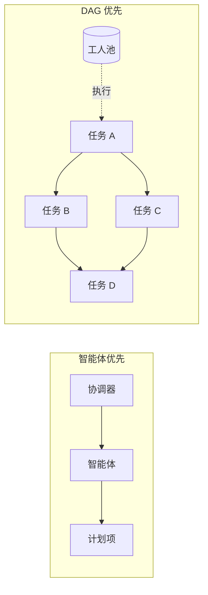

# 集群（Swarm）

集群让多个 jcode 智能体在同一仓库里并行工作，由服务器统一管理协作：当 A 改动了 B 读过的
文件，服务器通知 B，B 可以忽略或查看 diff 确认冲突。智能体之间可以私聊、沿子树广播、
或由协调器统一规划。

本文合并原「集群架构」与「集群任务图」两篇：前者描述角色与协作模型，
后者描述把集群重构为**任务 DAG**（DAG 优先）的设计与实现状态。

**当前状态**：DAG 引擎、深度/轻量两种模式、批判/验证门、增长机制、
通信迁移步骤 1–2（工件数据流、子树作用域广播）已上线；通用频道/共享上下文的弃用（步骤 3–4）待定。

## 一、两种模式

同一引擎、两套预设——**轻量模式等于「关掉结构性压力 + 小上限」的深度模式**，
不要分叉调度器或数据流。

| 维度 | 深度（全面） | 轻量（扇出） |
|---|---|---|
| 目标 | 绝不留下未探索的角落 | 为并行速度/适度质量提升 |
| 形态 | 递归、自我加深的树 | 基本扁平，单级扇出 |
| 分解 | 强制（探索节点默认复合） | 可选，由智能体决定 |
| 批判/验证门 | 节点关闭前必需 | 关闭（或最多一个可选终检） |
| 递归 | 鼓励，深度无界 | 禁用（只有根可派生） |
| 交接工件 | 完整类型化模式，含 `what_i_did_not_check` | 轻量，自由格式 |
| 成员/并发上限 | 硬上限 `MAX_SWARM_MEMBERS` = 1000 个活动成员；`run_plan` 默认并发取 `agents.swarm_max_concurrent_agents`（默认 32，设 0 则不限，只留硬上限） | 硬上限同为 1000；`run_plan` 默认并发 `LIGHT_MODE_DEFAULT_CONCURRENCY` = 4 |
| 成本/延迟 | 高，刻意使用 | 低，快速 |

两种模式共享：DAG 数据模型、调度器、边上数据流、成员上限机制（只有上限不同）。

## 二、任务 DAG 模型

### 为什么从「智能体优先」转向 DAG 优先

旧模型是智能体优先：派生智能体、和它对话（DM/频道/角色），旁边挂一个 `VersionedPlan`。
依赖图已存在于底层（`blocked_by`、`summarize_plan_graph`、`next_runnable_item_ids`、
`run_plan`/`fill_slots`），但只是实现细节，覆盖度取决于驱动它的人。

DAG 优先把任务图变成主要抽象：

- 声明带依赖边与按节点规格的任务图；
- 调度器遍历 DAG：依赖完成后节点变为可运行，分配给工人（复用或派生），完成时自动解除下游阻塞；
- 智能体是工人池里取出的可互换工人，而不是需要微观管理的实体；
- 协调器 / worktree 管理器降级为**调度器策略**，不再是面向用户的概念。



### 属主树 + 依赖图

「所有人编辑同一个共享图」的问题是只有一个共享 `VersionedPlan`，并发自由编辑会让它不连贯。
解法不是加锁，而是改变**变更的单位**：

- 变更是**扩展你拥有的节点**，绝不编辑任意节点；
- 写入按属主分区，两个属主从不写同一区域——不加锁也消除了协调器瓶颈；
- 图仍是服务器拥有的、带版本的事实来源，但变更变成**追加式操作**（加节点、加边、完成节点），
  服务器端验证无环与属主，而不是后写胜出的 Blob；
- 新边只能指向已存在的上游节点，从构造上保持无环。

### 节点种类

节点在运行时决定成为原子还是复合（无需预先声明）：

- **原子**：工人直接执行并写交接工件。
- **复合**：被分配的智能体认为任务太大，不直接执行，而是把节点**分解**成自己拥有的子 DAG；
  原节点成为**汇聚/综合点**，等子节点全部完成后属主重新唤醒，读取子工件并写综合输出。
  复合节点属主**只做规划 + 集成**（map-reduce），不做叶子工作。

按终止行动分类（DAG 与任务类型无关，只有工件类型与"完成"契约不同）：

| 种类 | 工件 | 完成契约 |
|---|---|---|
| `explore` | 发现 | 通过批判门 |
| `implement` | diff / 提交引用 + 变更说明 | 通过验证门 |
| `verify` | 通过/失败 + 具体失败点 | 已执行检查 |
| `fix` | 补丁 | 重新验证通过 |

失败的验证会派生修复节点（更多图），与批判派生缺口节点同理。
最终 `synthesize` 节点是可选的：纯探索任务里它就是交付物，实现任务里交付物是已合并验证的代码。

### 数据流：边就是数据通道

- 完成时每个节点把结构化**交接工件**附加到节点上；
- 下游全部依赖完成后，调度器**组装其输入** = 自身提示词 + 所有依赖工件的合并，注入工人起始上下文；
  扇出与扇入自然出现；
- 工件默认**按引用不按值**（例如"我在 `crates/<crate>/src/api.rs` 建了 API，类型 X/Y，提交 abc123"）——
  仓库 + git 是共享介质，只有不在仓库里的东西（决定、设计、分析）才按值嵌入；
- 复合节点的交接是**先分解后综合**（map-reduce）：父节点产出干净摘要，而不是拼接子节点噪声。

## 三、全面性作为结构属性

目标：完成应全面到极不可能遗漏任何角落。三重压力都由引擎强制，而不是写在提示词里。

### 1）强制分解（广度）

探索型节点默认复合：智能体第一个动作不是回答，而是把问题**枚举**成子节点，
覆盖度因此在图谱中可见可审计。

### 2）批判/验证门（对抗性找缺口）

父节点关闭前会获得自动插入的**批判**（explore）或**验证**（代码）依赖者：

- 门是对抗性的（"遗漏了哪个角落？"／"它真的能用吗？"）；
- 发现缺口或失败 → 发**新子节点**回图中（递归），父节点在这些节点排空前不能关闭。

### 3）类型化交接工件（让单薄可见）

`findings`、`evidence`（文件:行 或提交引用，不是裸断言）、`edge_cases_considered`、
`validation`、`open_questions`、`confidence`、`what_i_did_not_check`。

`what_i_did_not_check` 是关键：强迫模型列出**没有**探索的内容，把未探索角落暴露给批判/调度器，
进而转化为新节点；复杂任务上空的 `open_questions` / `what_i_did_not_check` 本身就是要查的信号。

### 已实现的强制规则（`jcode-plan` 的 `dag` 模块）

| 规则 | 内容 |
|---|---|
| 根门（计划级审计） | 每个深度模式 seed 自动插入无父门，依赖所有根级节点；全部原子执行的扁平 seed 也无法跳过最终对抗性遍历，该遍历可 `inject_gap` 新的顶层节点；重新播种会扩大根门范围并在其已通过时重新打开 |
| 枚举的门覆盖 | 通过的门工件必须按 id 处理审计范围内每个 DONE 节点（上限 20；超限时仅高置信度节点可放宽），"一切正常无缺口"在结构上被拒绝（`UncoveredSiblings`）；过期范围被拒（`StaleGateScope`） |
| 工件或无为回合结束 | 深度模式没有自动完成：回合结束时节点仍在运行的工人会被重新排队一次（`no_artifact_requeues`），重复则失败；节点只能通过 `expand_node` 或 `complete_node` 关闭 |
| 增长核算 | 每个节点记录来源（`seed`/`expand`/`gap`/`gate`）；`PlanGraphStatus` 带 `seeded_count`/`grown_count`，`status`/`run_plan` 打印增长行，未超出种子的深度计划会明显暴露探索不足 |

## 四、偏见预算：什么固定、什么涌现

- **第一个智能体决定**（刻意很小）：根任务框架、第一级分解。即使第一级分解也是临时的——
  子节点可重新分解，门可注入种子之外的兄弟节点。它设置*种子*，不是*形状*。
- **系统固定**（结构性）：门纪律（每个复合节点都必须被审计）、交接契约、递归权
  （任何后代都能扩展自己的节点）、缺口/失败 → 新节点。
- **最终形状**大多涌现：第一版草稿通常只是最终节点数的一小部分。

因此全面性**不依赖第一个智能体是否聪明**。要保护的不变量：**不要把领域假设泄漏进结构层**——
门必须与领域无关（批判问"按该任务自己声明的范围与工件，什么未探索"，
验证跑"该任务声明的验收检查"）。对彻底性的偏见是有意的，对具体内容的偏见应接近零。

## 五、接口：强制图 API

选项对比：**A** 图操作工具（服务器拥有图，每次变更强制不变量）；
**B** 智能体写脚本（无法表达运行时生长的图，门可绕过）；
**C** 工具原语 + 可选声明式语法糖。

**决定：A 为基础 + C 的语法糖。** 智能体在*决定*图时有完全自由（任意推理/工具），
在*执行*图时零自由跳过结构门。

工具面（`swarm` 的演进）：

```
swarm task_graph {nodes, edges}        # 播种初始 DAG（批量形式，同样验证）
swarm expand_node {node_id, children, edges}   # 运行时分解（属主 + 无环检查）
swarm complete_node {node_id, artifact{findings, evidence[], validation,
                     edge_cases_considered[], open_questions[], confidence,
                     what_i_did_not_check[]}}  # 门检查的类型化交接
swarm run / assign_task / assign_next / task_control / approve_plan / reject_plan
spawn / dm / broadcast                 # 低层逃生通道
```

工件字段定义见 `crates/jcode-plan/src/dag/mod.rs` 的 `HandoffArtifact`。

## 六、通信：数据流优先，聊天其次

现状给了智能体丰富的人类聊天面（DM、集群广播、主题频道、共享键值上下文，
加上 `notify`/`interrupt`/`wake` 投递与 `await_members`），对 DAG 模型来说既太多、形状也不对。
改造是**做减法**：

- **第 1 层（主要）结构性数据流**：边上的类型化交接工件，完成时自动流向下游并水合其输入。
  它取代了今天 DM 的大部分用途，且是类型化、持久、按引用、重载后仍存活的。
- **第 2 层（例外渠道）**：只保留 **DM + 子树作用域广播**——用于冲突解决
  （"我们都在改 `foo.rs`"）和沿属主树向上提问。

被降级/移除的部分：

- **共享上下文键值存储**：与「仓库 + 类型化工件」冗余，属于第二个事实来源，应去掉；
- **集群广播**：替换为**子树作用域广播**（只到达自己派生的后代），避免在 1000 成员上限下
  形成广播风暴；整集群广播降为罕见的协调器专用逃生通道；
- **通用主题频道**：一旦数据流是结构性的就不需要；频道是*人类*组织临时协作的方式。

分阶段迁移：①工件数据流 ✅ → ②广播作用域到子树 ✅ → ③把现有流程迁离频道/共享上下文 →
④弃用并移除冗余聊天原语。

## 七、角色、生命周期与协作

### 角色

| 角色 | 职责 |
|---|---|
| 协调器 | 拥有共享集群计划（创建、分配范围、批准更新）；审阅计划更新提案并广播已批准者；必要时直接发布更新；决定是否需要 worktree 并分组；不执行合并 |
| Worktree 管理器 | 拥有单个 worktree 范围；知道完整计划与该范围；协调范围内工作；范围完成时负责集成 |
| 智能体 | 并行执行任务；派生时收到完整计划与范围化指令；提出计划更新；直接协作解决冲突；发生命周期事件 |

每集群只有一个「协调器槽」，仅用于集群级计划操作（提出/批准/分配/任务控制）；
只有根会话认领该槽，且仅当它为空或过期时。嵌套属主通过派生提示词、DM 与 stop 协调自己的子树。

### 派生与归属

- 普通临时集群与轻量集群是**单级扇出**：只有根会话能派生，工人不能创建下一代。
- 递归派生只保留给 `swarm-deep` 模式的根；后代可在任意深度派生，受可配置活动工人预算与
  绝对成员上限（1000）约束。
- 派生/父子边由 `report_back_to_session_id` 编码（被 `P` 派生者向 `P` 汇报），
  沿链回溯可重建血统与深度，因此每个智能体"拥有"自己派生的子树。
- 智能体可停止自身子树内的任何智能体；停止子树外（如用户创建的平级会话）需要 `force=true`。
- 树中间成员离开（停止/崩溃/断连/关功能）时，其直接子级会**重新挂载**：挂到存活祖辈，
  回退到当前协调器，否则成为根。会话重命名（恢复）会重写子级汇报边。

### 生命周期状态

`spawned`（已建会话未就绪）、`ready`（已收到计划与范围）、`running`、`blocked`
（依赖/冲突/缺信息）、`completed`（范围完成待新分配）、`failed`（不可恢复，需协调器决定）、
`stopped`（被协调器有意关闭）、`crashed`（意外退出）。

生命周期事件驱动集群信息组件的状态指示器。

### 完成汇报

拥有汇报属主的智能体**必须以其工作回合的最后一次有效最终助手响应结束**；
服务器自动把该响应作为完成汇报转发给所属协调器。汇报应含结果/状态、变更或发现、
执行的验证、阻塞项或后续事项——不能只是 `done` 或工具记录。

派生提示词、分配的计划任务、显式的启动/唤醒/恢复/重试都需要汇报；
空闲的「无提示派生」会话、无汇报属主的用户平级会话、普通状态广播、有意清理空闲工人则不需要。

### 计划分发

- 集群计划是以 `swarm_id` 作用域的**服务器级对象**，不是会话待办；不写入仓库文件。
- 计划 v1 由协调器创建/拥有；更新由智能体提出、协调器审阅；更新只传播给计划参与者。
- 计划参与是显式的（协调器分配/派生策略或重新同步挂接）；智能体可显式请求重新同步。

### Worktree（可选）

仅在隔离有帮助时使用（大型重构、风险变更、分叉依赖），大多数工作应留在主工作区。
许多智能体可共享单个 worktree；每个 worktree 有一个负责集成的管理器，
并被分配逻辑 `swarm_id`，因此通信、计划更新与 UI 视图跨越同一集群内的所有 worktree。

### 用户交互

用户主要与协调器交互；其他智能体不直接呈现给用户，除非协调器路由或请求。

### 通知与恢复

所有智能体间通信都以通知形式投递（DM、广播、计划更新、意图、生命周期事件），
作为软中断排队并在安全点注入正在运行的智能体，因此消息可在回合中途交错而无需新回合。

已完成/空闲的智能体不会因通知自动恢复，只在协调器分配新工作、显式启动/唤醒已分配任务、
或重新派生时恢复。恢复交接是显式的：**重试**保持同一受派人，**重新分配**把工作移给另一现有
智能体，**替换**经安全状态检查后换新受派人，**抢救**保留任务进度上下文重新分配。

三种读取操作分离：状态快照（无锁成员元数据 + 当前处理/工具快照，目标忙碌时也要可用）、
摘要读取（简短活动流）、完整上下文读取（重量级，少用以免上下文膨胀）。

### 冲突处理（无锁）

系统默认乐观无锁；冲突促使相关智能体直接通信（DM 或频道），不经过协调器。

## 八、UI

两个实时组件，均由事件流更新：

- **集群信息组件**：智能体/管理器/协调器/频道的图形视图；边表示通信路径（DM、广播、频道）；
  节点显示状态与当前任务或意图。
- **计划信息组件**：任务 DAG 图形视图；节点显示属主、范围、状态
  （queued / running / running_stale / done / blocked / failed）；检查点显示为徽章或子节点；
  协调器可查看按任务进度（分配元数据、心跳年龄、最后检查点摘要），进度通过已完成节点数、
  关键路径状态与重载后持久化的检查点/心跳数据可见。

TUI 内可用 `/swarm` 管理；`swarm list` / `swarm cleanup` 由协调器清理不再需要的工人。

## 九、数据模型与边界

复用 `VersionedPlan` / `PlanItem` 并新增：

- `PlanItem`：`owner_session`、`kind: atomic | composite`（外加终止行动种类
  `explore | implement | verify | fix`）、`parent_node`、`output: Option<HandoffArtifact>`；
- `HandoffArtifact`：第 3 节所述类型化模式；
- 操作符式变更：`expand_node(node_id, children, edges)`、`complete_node(node_id, artifact)`
  （属主检查 + 无环检查 + 带版本），`task_graph` 为批量播种形式；
- 调度器：分发时从上游 `output` 水合工人输入；复合汇聚时重新唤醒属主综合；
  按门纪律自动插入批判/验证依赖者。

**失控预防是预算 + 一个硬上限，不是限制矩阵**：一个集群最多 `MAX_SWARM_MEMBERS` = 1000 个
活动成员（`crates/jcode-swarm-core/src/lib.rs`）；此外 `agents.swarm_max_concurrent_agents`
（默认 32，`JCODE_SWARM_MAX_CONCURRENT_AGENTS` 可覆盖，设 `0` 表示只留硬上限）限制**同时存活**
的工人数，已停止/完成的工人不占额度。刻意**没有深度上限与按节点扇出上限**——派生树可自由嵌套，
直到达到上限后拒绝派生（实现在 `ensure_spawn_coordinator_swarm`，计数活动成员并在达上限时拒绝）。
旧的 `MAX_SWARM_SPAWN_DEPTH` 已移除。

**诚实的权衡**：这些预算限制总并发/成本，但不禁止一棵不均衡的树
（一个贪婪节点可能吃掉大部分预算），这留给智能体判断与门纪律。图能**排序**但不做**互斥**：
两个子树编辑同一文件仍是「无锁，DM 谈清楚」。领域偏见必须保持在结构/门层之外。

## 十、相关工具与配置

- 斜杠命令：`/swarm`、`/swarm-prompt`（编辑集群模型路由指引）、`/subagent`、`/subagent-model`。
- 配置：`agents.swarm_effort` 可锚定 worker 的 reasoning effort；按 worker 覆盖模型见
  `swarm` 工具参数。
- 集群相关脚本：`scripts/test_swarm.py`、`scripts/test_swarm_debug.py`、`scripts/test_dag_live.py`、`scripts/test_reload.py`。
