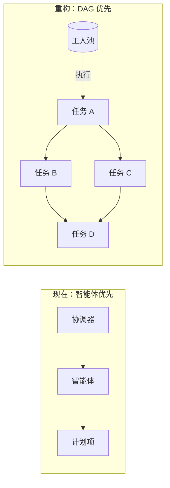
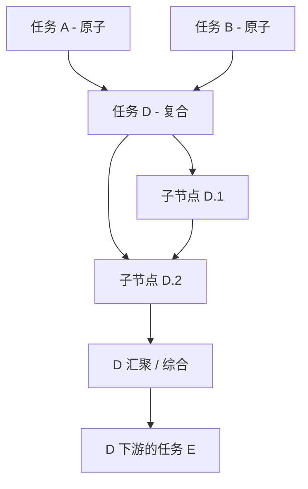
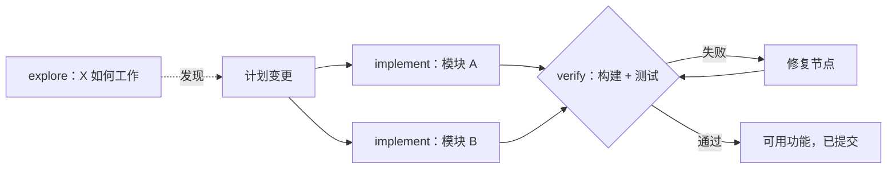
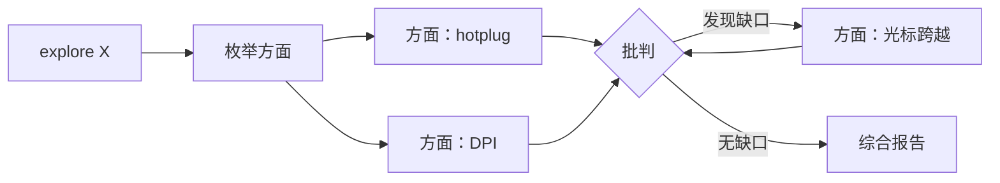
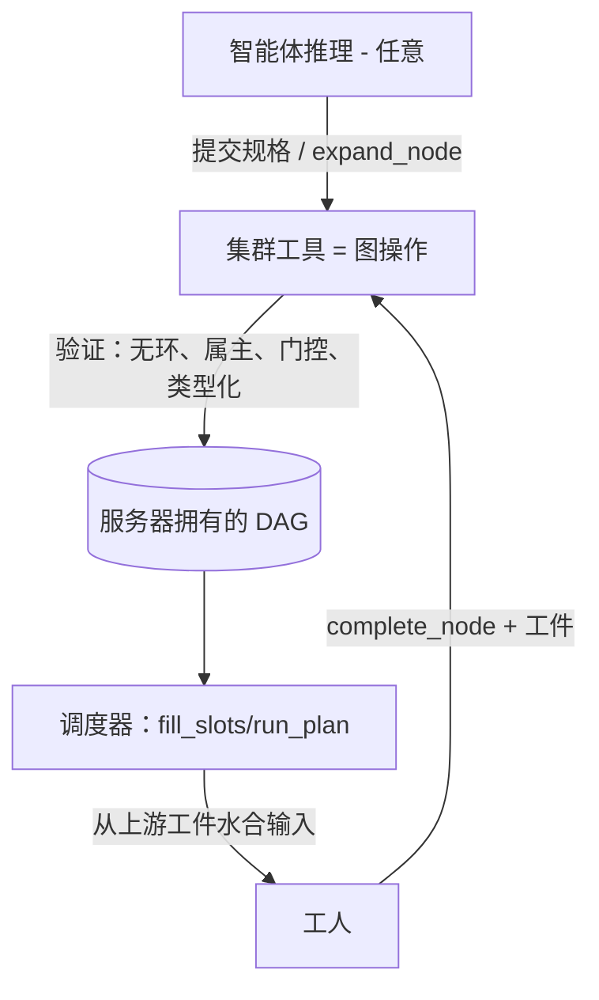
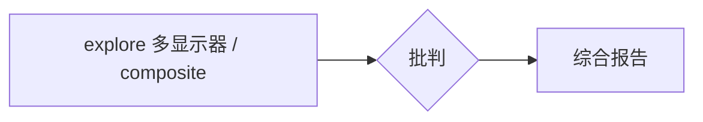
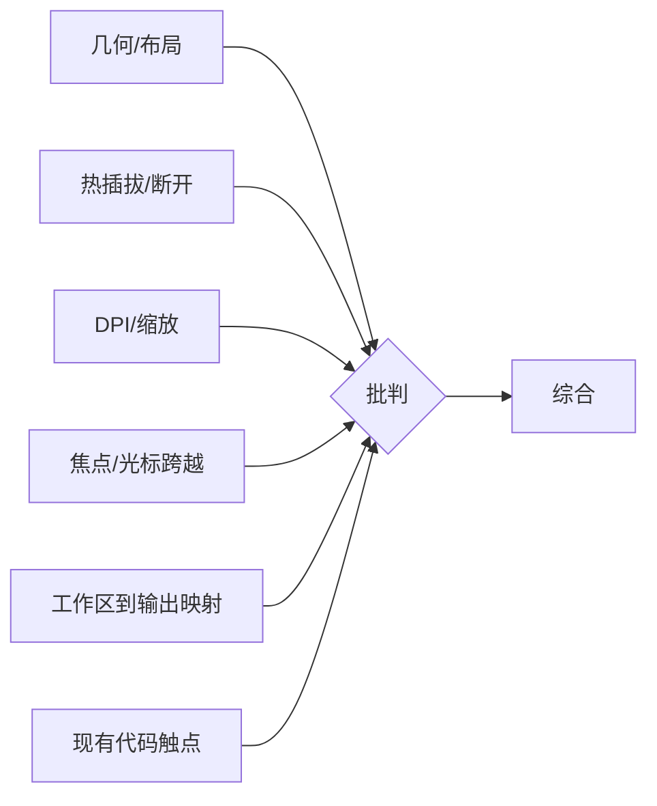
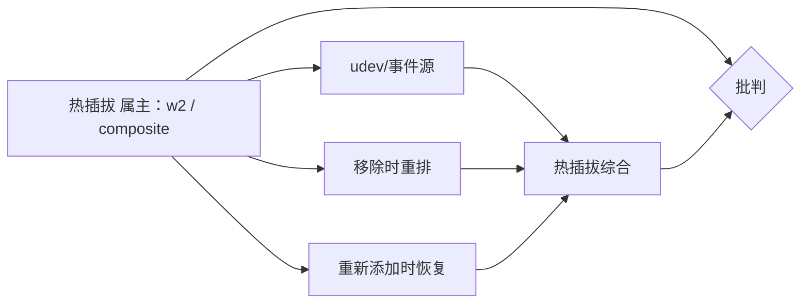
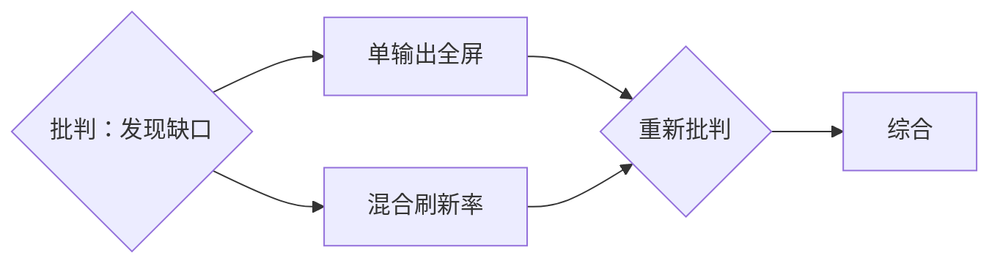

# 集群即任务 DAG（设计）

状态：正在实现（取代[集群架构](集群架构.md)中的智能体优先框架）。DAG 引擎、深度/轻量模式、门控、增长机制和通信迁移步骤 1-2（工件数据流、子树作用域广播）已上线；频道/共享上下文弃用（步骤 3-4）待定。

本文档描述集群模块从以智能体为中心的模型重构为**任务 DAG（有向无环图）**的规划。DAG 成为主要对象；智能体变成可互换的工人，执行、分解和验证节点。它基于设计讨论记录架构、数据模型、完成/覆盖保证、偏见预算和工具面。

---

## 1. 动机与核心重构

今天的集群是**智能体优先**的：你通过派生智能体并与其对话（DM、频道、角色）来驱动工作，旁边再挂一个 `VersionedPlan` 的 `PlanItem` 列表。依赖图已经在底层存在（`PlanItem.blocked_by` 边、`summarize_plan_graph`、`next_runnable_item_ids`、`run_plan`/`fill_slots`），但它只是实现细节。覆盖度和彻底性留给碰巧在驱动的人。

重构使**任务 DAG 成为主要抽象**：

- 你声明一个带依赖边和按节点规格的任务图。
- 调度器遍历 DAG：当依赖完成时节点变为可运行，分配给工人（复用或派生），完成时自动解除其依赖者的阻塞。
- 智能体是从池中取出的工人，不是需要微观管理的实体。
- 协调器 / worktree 管理器角色降级为**调度器策略**，而不是面向用户的概念。

现有的 `jcode-plan` 图代码是基础；这是它的演进，不是重写。

---

## 1a. 两种模式：深度（全面）vs 轻量（扇出）

DAG 引擎以两种**模式**之一运行。这刻意是**一个引擎、两种预设**，而不是两套系统。两种模式使用相同的 DAG 数据模型、调度器、边上数据流和成员上限机制。唯一区别是严谨机制（强制分解 + 批判/验证门 + 递归）是否启用，以及成员上限有多大。

关键框架：**轻量模式就是关闭结构性压力并采用小上限的深度模式。** 将它们构建为带模式旋钮的单一引擎；不要分叉调度器或数据流。

- **深度模式（全面）：** 本文档中的一切。目标是绝不留下未探索的角落。递归、自我加深的树；分解是强制的（默认复合）；任何节点关闭前必须有批判/验证门；递归受鼓励且无深度限制；强制完整的类型化交接模式，包括 `what_i_did_not_check`。可扩展到 1000 智能体成员上限。高成本和延迟，刻意使用。示例："探索 scrollwm 中的多显示器支持"、大型/高风险重构。

- **轻量模式（扇出）：** 为并行速度和适度质量提升而设的更便宜预设，不走向极端。目标只是并行运行独立单元。基本扁平（单级扇出）；分解可选（智能体选择）；批判/验证门关闭，或最多单个可选的最终检查；只有根可以派生智能体，因此递归增长被禁用；交接工件轻量且可自由格式。小工人上限（如 4-16）。低成本和低延迟。这本质上是今天的派生-扇出行为保持便宜。示例："并行运行这 5 个独立编辑"。

| 维度 | 深度（全面） | 轻量（扇出） |
| -------------------- | ------------------------------------------ | -------------------------------- |
| 目标 | 绝不留下未探索角落 | 为速度/质量并行化 |
| 形态 | 递归、自我加深的树 | 基本扁平，单级扇出 |
| 分解 | 强制（默认复合） | 可选，智能体选择 |
| 批判/验证门 | 任何节点关闭前必需 | 关闭（或一个可选的最终检查）|
| 递归 | 受鼓励，深度无界 | 不鼓励/禁用 |
| 交接工件 | 完整类型化模式，`what_i_did_not_check` | 轻量，自由格式即可 |
| 成员上限 | 最多 1000 个智能体 | 小（如 4-16 个工人）|
| 成本 / 延迟 | 高，刻意 | 低，快速 |

两种模式共享：DAG 数据模型、调度器、边上数据流（类型化或轻量工件）和成员上限机制（只有上限不同）。本文档的严谨部分（6、7）描述**深度模式**；轻量模式只是禁用那些门。

---

## 2. 依赖图上的属主树

"每个人都编辑一个共享图"的陷阱在于只有一个共享的 `VersionedPlan`；并发自由格式编辑使其不连贯，这就是计划变更目前由一个协调器门控的原因。解决方案是改变**变更是什么**，而不是加锁。

将其建模为**叠加在依赖图上的属主树**。变更单位是*扩展你拥有的节点*，绝不编辑任意节点。

- 写入**按属主分区**：你只在自有节点下添加子节点，因此两个属主从不写入同一区域。这在不加锁的情况下消除了协调器瓶颈，同时保持一个全局图。
- 图保持单一**服务器拥有的、带版本的**事实来源（复用 `VersionedPlan`），但变更变成**追加式操作**（添加节点、添加边、完成节点），在服务器端验证无环 + 属主，而不是后写胜出的 Blob。
- 新边只能指向**已存在的上游**节点，从构造上保持无环。

---

## 3. 节点种类：原子 vs 复合

每个节点被智能体拾取时都有两种结局之一。状态在运行时翻转，而不是草稿时。节点**不必**预先声明为复合；任何深度的任何智能体都可以选择扩展其被分配的节点。

- **原子**：工人直接执行任务并写入交接工件。
- **复合**：被分配的智能体认为任务太大。它不执行，而是将节点**分解**成它*现在拥有*的子 DAG。原节点成为**汇聚 / 综合点**：它保持进行中直到所有子节点完成，然后属主重新唤醒，读取子节点的工件，并为其依赖者写入一个综合输出。

复合节点的属主**只是规划者 + 集成者**（先映射后归约）：它分解，子节点做工作，它综合。它自己不执行叶子工作。这保持每个节点的职责干净、属主边界清晰。

在**深度模式**中，递归没有固定深度或按节点扇出限制。增长受可配置的活动工人预算和绝对总成员上限（每集群 1000 个智能体，第 10 节）约束。轻量模式禁用递归派生：只有其根可以创建扁平的工人扇出。

---

## 4. 按终止行动分类的节点种类

DAG 与任务类型无关。结构（分解、门、类型化交接）无论任务如何都相同；只有**工件类型和"完成"标准**变化。大多数真实任务是**先探索后行动**，而这种顺序只是依赖边：探索节点供给实现节点。

| 种类 | 工件（输出） | "完成"契约 |
| ----------- | --------------------------------------- | ------------------------------ |
| `explore` | 发现（研究交付物） | 通过批判门 |
| `implement` | 差异 / 提交引用 + 变更了什么 | 通过验证门 |
| `verify` | 通过/失败 + 具体失败 | 已执行检查 |
| `fix` | 补丁 | 重新验证通过 |

- **验证和修复**使系统*行动并自我纠正*，而不只是描述。失败的验证派生修复节点（更多图），完全像批判派生缺口节点。
- 最终的 `synthesize` 节点是**可选的**：对纯探索任务它是交付物；对实现任务交付物是合并、验证过的代码，报告只是交付内容的薄汇总。

---

## 5. 数据流：完成的依赖如何传递信息

关键洞察：**依赖边就是数据通道。** 今天完成汇报流回*派生者*（控制流）。在 DAG 中它还必须向前流向*依赖者*（数据流）。

- 完成时，每个节点存储一个附加到节点的结构化**交接工件**。
- 当下游任务变为可运行（所有依赖完成）时，调度器**组装其输入** = 任务自身的提示词 + 其所有依赖的合并工件，注入工人的起始上下文。扇出（一个依赖解除许多阻塞）和扇入（许多依赖供给一个）都自然出现。
- 工件默认**按引用，不按值**："我在 `crates/foo/api.rs` 构建了 API，类型 X/Y，提交 `abc123`。" 仓库 + git 是共享介质；下游智能体自己读取文件。仅对不在仓库中的东西（决定、设计、分析）按值嵌入。这保持上下文小，在深度时很重要。
- 对复合节点，交接是**先分解后综合**（映射-归约）：子节点完成时，属主用子节点的工件重新唤醒，并写一个集成/综合报告。父节点从不只是拼接子节点噪音；它为下一层产出干净摘要。

---

## 6. 完成与覆盖：结构性全面

目标：完成应如此全面，以致极不可能遗漏任务的任何角落。全面必须是**图的结构属性**，而不是提示词中的请求。三种相互强化的压力：

### 6.1 强制分解（广度）
探索型节点**默认复合**：智能体的第一个工作不是回答，而是将表面区域**枚举**成子节点。覆盖在图谱中变得可见和可审计（有没有 hotplug 的节点？DPI 的？），而不是埋在必须信任的散文中。

### 6.2 批判 / 验证门（对抗性找缺口）
某些节点在父节点可以综合/关闭前获得自动插入的**批判**（对 explore）或**验证**（对代码）依赖者。

- 门是对抗性的："这遗漏了哪个角落？" / "它真的能用吗？"
- 如果发现缺口或失败，它发出**新子节点**回到图中（即递归），父节点在这些节点排空前不能关闭。
- 这就是你得到"极不可能遗漏任何东西"的方式：图字面上不会让父节点带着未解决的缺口或失败的检查完成。

### 6.3 带显式"我未检查什么"的类型化工件（让单薄可见）
交接工件有**必需的模式**，因此浅输出在结构上可检测：

- `findings`（发现）
- `evidence`（文件:行引用 / 提交引用，不是裸声称）
- `edge_cases_considered`（已考虑的边界情况）
- `validation`（代码的验证结果）
- `open_questions`（未解决问题）
- `confidence`（置信度）
- `what_i_did_not_check`（我未检查什么）

`what_i_did_not_check` 是作弊码：强迫智能体列出它*没有*探索的内容会浮出未探索的角落，批判/调度器将其转化为新节点。复杂任务上空的 `open_questions` + `what_i_did_not_check` 本身就是审计者检查的危险信号。

所以全面现在意味着两件事，都以门的形式强制：我们是否覆盖了表面（批判），以及它是否真的有效（验证）。两者都把缺口/失败转化为新节点。

### 6.4 已实现的强制（2026-07：增长机制）

上述压力在 `jcode-plan` 的 `dag` 模块中实现为硬引擎规则，而不是提示词请求：

- **根门（计划级审计）。** 每个深度模式 `seed` 自动插入一个无父门（`plan::gate`），依赖每个根级节点。一个节点全部原子执行的扁平 seed 也无法在没有最终对抗性遍历的情况下到达终止状态，而该遍历可以 `inject_gap` 新的顶层节点（树顶的增长）。重新播种扩大根门的范围，并在它已通过时重新打开它。
- **枚举的门覆盖。** 通过的深度门工件必须按 id 处理其审计范围内每个 DONE 节点（范围 = 门的非门 `depends_on`，复合门和根门共用一个规则），枚举上限为 20。超过上限时，枚举仅对高置信度节点放宽；每个中/低/不可解析置信度节点仍必须按 id 处理。"一切正常，无缺口"在结构上被拒绝（`UncoveredSiblings`）。过期范围规则（`StaleGateScope`）在节点于门分发后进入范围时拒绝通过。
- **工件或无为回合结束。** 深度模式没有自动完成：回合结束时其节点仍在运行的工人，其节点会被重新排队一次给新工人（`no_artifact_requeues`），重复则失败。深度节点关闭的唯一方式是 `expand_node`（分解）或 `complete_node`（已验证的工件）。
- **增长核算。** 每个节点记录一个来源（`seed`/`expand`/`gap`/`gate`）；`PlanGraphStatus` 携带 `seeded_count`/`grown_count`，`plan_status`/`run_plan` 打印增长行，因此从未超出种子的深度计划明显探索不足。

---

## 7. 偏见预算：什么固定 vs 什么涌现

核心张力：预偏见太多，你硬编码了一个脆弱的流程；太少，你失去覆盖保证。划分：

### 第一个智能体决定什么（种子，刻意小）
1. 根任务框架（继承自用户提示词）。
2. 第一级分解：初始方面/子节点及其边。

即使那第一次分解也是**临时**的：每个子节点可以重新分解，门可以注入第一个智能体从未想象过的兄弟节点。第一个智能体设置*种子*，而不是*形状*。

### 系统固定什么（结构性，不是第一个智能体的选择）
- **门纪律**：每个复合节点在可以关闭前都有一个批判/验证依赖者。无法选择不被审计。
- **交接契约**：带 `what_i_did_not_check` / `open_questions` 的类型化工件，强加于每个节点。
- **递归权**：任何后代都可以扩展自己的节点。第一个智能体不能"锁定"它起草的形状。
- **缺口/失败 -> 新节点**：批判和验证无论原始计划如何都把遗漏转化为图。

因此全面保证**不**依赖于第一个智能体聪明。一个平庸的第一次分解仍会被发现并扩展。

我们位于 **B（播种 + 结构门）**：

- **内容 / 领域知识**：几乎全部来自智能体（第一个播种，后代细化）。系统对领域一无所知（例如 scrollwm）。
- **流程 / 严谨 / 覆盖**：几乎没有一个是第一个智能体的选择；它是结构性的，对整棵树统一。
- **最终形状**：大多涌现。第一个智能体的草稿通常是最终节点数的一小部分；大多数节点诞生于重新分解和门派生的缺口/修复。

**要保护的不变量：** 不要把领域假设泄漏到结构层。门必须保持**与领域无关**：批判问"*根据这个任务自身声明的范围和工件*，什么未探索"；验证运行"这个任务声明的验收检查"。对彻底性的偏见是有意的；对特定内容的偏见必须接近零。重新运行同一任务应产生相似的第一级方面（稳定种子），但不同的深层结构（自适应探索）。

---

## 8. 接口：强制图 API，而不是智能体脚本

接口选择决定实际能强制多少严谨。考虑过的选项：

- **A. 重构集群工具（图操作）。** 服务器拥有图并在每个变更上*强制*不变量（无环、属主、强制门、类型化交接）。只有这个选项使"全面是结构性的"成立。
- **B. 智能体写脚本。** 感觉很强大，但预先运行到完成的脚本无法表达从运行时发现中生长的图。它必须阻塞/等待节点结果并重新进入，变成围绕同一 API 的命令式驱动，只是现在严谨住在未验证的智能体代码中，门可绕过。这是欠偏见失败模式。
- **C. 工具原语 + 可选声明式语法糖。** 工具是已验证的基础；对静态部分允许一次性规格，而运行时增长仍通过工具调用。

**决定：A 作为基础，加上 C 的语法糖。** 图是通过验证操作变更的服务器端对象，而不是智能体端脚本。智能体在*决定*图（任意推理/工具使用）上保持完全自由，在*执行*图时零自由跳过结构门。

### 提议的工具面（`swarm` 的演进）
- `swarm task_graph {nodes:[...], edges:[...]}` - 一次调用播种初始 DAG（第一个智能体的草稿）。操作的批处理形式，同样验证。
- `swarm expand_node {node_id, children:[...], edges:[...]}` - 运行时分解（递归）。属主和无环检查。
- `swarm complete_node {node_id, artifact:{findings, evidence, validation,
  edge_cases_considered, open_questions, confidence, what_i_did_not_check}}` -
  门检查的类型化交接。
- `swarm run` - 移交给调度器。
- `spawn` / `dm` / `channel` 保留为低层逃生通道。

智能体真正想要的"更多控制"是按节点提示词、计算的扇出和条件扩展。这些由 (a) 智能体随意计算节点列表*然后*作为验证规格提交，和 (b) 运行时 `expand_node` 调用服务，而不是由绕过强制的脚本语言服务。

---

## 8a. 通信改造：数据流优先，聊天其次

当前集群工具给智能体一个丰富的人类聊天面：DM、集群广播、主题频道（订阅/成员）、共享键值上下文存储，加上投递模式（`notify`/`interrupt`/`wake`）和 `await_members`。那是把人类协作隐喻硬贴在智能体上。对 DAG 模型它既太多又形状不对。改造是**做减法，不是加法**。

### 为什么当前模型不匹配
1. **它是聊天，不是数据流。** 每个现有频道都是*智能体之间*的推送通知消息。但在 DAG 中，主要信息传递是**通过边上的工件从节点到依赖者**，这还不作为通信原语存在。新模型中最重要的"通信"是当前工具集无法表达的那件事，因此智能体将不得不通过互相 DM 模拟数据流——正是我们正在替换的有损协调。
2. **太多重叠原语。** DM vs 广播 vs 频道 vs 共享上下文扇出是把文本推给其他智能体的四种方式，而 `message` 已经在其中三种之间自动路由。代码库已经携带一个动作同义词规范化层，因为模型不断发明动词；那是表面过大的味道。更多动作意味着更多模型错误。
3. **广播不能扩展到成员上限。** 在 1000 成员上限（第 10 节）时整集群扇出每次发送都是一次 1000 路通知风暴。这就是广播式发送按子树作用域的原因（迁移步骤 2，在 `handle_comm_message`/`handle_comm_share` 中实现）：发送者只到达其派生的子树，只有协调器保留整集群可达性。

### 两层目标模型
保留两层并删除中间层：

- **第 1 层 - 结构性数据流（新，主要）。** 边上的交接工件。完成时，节点的类型化工件通过调度器自动向前流向其依赖者，调度器从上游工件水合每个新可运行节点的输入。这取代今天 DM 的大部分用途（"这是我发现的，现在你去"）。与即发即忘的 DM 不同，它是类型化、持久、按引用，并在重载后存活。
- **第 2 层 - 例外渠道（保留，精简）。** 仅对图无法建模的真正非结构化情况保留直接智能体间联系：冲突解决（"我们都在编辑 `foo.rs`"）和沿属主树向上的澄清问题。那就是**DM + 子树作用域广播**，仅此而已。

### 什么被降级或删除
- **共享上下文键值存储**：与仓库（真正的共享介质）加类型化工件基本冗余。仅对具体的非仓库共享状态需求保留；否则它是第二个事实来源，应该去掉。
- **集群广播**：替换为**子树作用域广播**，只到达智能体拥有的后代，因此不会变成成员上限规模的暴风雨。整集群广播成为罕见的协调器专用操作。
- **通用主题频道**：一旦数据流是结构性的就不需要了。频道是*人类*组织临时协作的方式；智能体应通过图边协作，而不是自由格式房间。

### 与 DAG 模型对齐
依赖边成为主要通信渠道（类型化工件），智能体间消息缩小为小型例外路径（DM + 子树广播）。这使通信与 DAG 对齐，消除成员上限下的广播风暴风险，并缩小易错的工具面。

### 分阶段迁移（不要一开始就拆除）
删除频道/共享上下文对现有集群流程是真正的行为变化。分阶段：
1. **已完成。** 工件数据流：完成工件流向依赖者并水合其输入。
2. **已完成。** 广播作用域到发送者派生的子树（包括无订阅者频道回退和共享上下文通知）；整集群广播仅作为协调器逃生通道保留。
3. 迁移现有流程离开频道/共享上下文（工具模式现在不鼓励它们）。
4. 流程迁移后弃用，然后移除冗余的聊天原语。

---

## 9. 工作示例：图的随时间演进

任务："探索 scrollwm 中的多显示器支持。" 状态图例：queued、running、composite（分解中/等待子节点）、critique、done。

### T0 - 第一个智能体起草顶层骨架
根智能体不回答；它播种：explore、gate、synthesize。

### T1 - 根将 explore 扩展成方面（复合 -> 子节点）

### T2 - 调度器分发就绪方面（扇出，并行工人）

### T3 - 一个方面自我分解（递归）
`w2` 发现热插拔很深，扩展自己的节点，现在拥有一个子 DAG。

### T4 - 原子方面完成；边现在携带工件
`F1,F3,F4,F6` 以类型化工件完成；批判被 `F2` 阻塞。

### T5 - 热插拔子节点完成；属主重新唤醒以综合（归约）
`w2` 读取 H1/H2/H3 并写一个干净的热插拔报告；复合关闭。

### T6 - 批判发现缺口并派生新图
审计者读取每个方面的 `what_i_did_not_check`；没有人覆盖单输出全屏或混合刷新率。它注入新节点并重新批判；综合保持阻塞。

### T7 - 缺口节点完成，重新批判通过，综合运行
综合按引用组装所有上游工件到最终报告中。

这个示例展示了：广度（方面作为可见覆盖）、递归（热插拔自我分解）、边上的数据流（工件水合依赖者）、每复合的映射-归约（属主综合），以及作为门的全面性（批判把遗漏转化为图；父节点不能带着未解决缺口关闭）。图从不只起草一次；它在发现深度或缺口的地方生长，并在子树坍缩为综合工件时缩小注意力。

---

## 10. 数据模型变更（针对 `jcode-plan`）

复用 `VersionedPlan` / `PlanItem`（已有 `blocked_by` 边、`summarize_plan_graph`、`next_runnable_item_ids`、`newly_ready_item_ids`、`run_plan`/`fill_slots`）。添加：

- `PlanItem`：`owner_session`、`kind: atomic | composite`（加上终止动作种类：`explore | implement | verify | fix`）、`parent_node` 和 `output: Option<HandoffArtifact>`。
- `HandoffArtifact`：第 6.3 节的类型化模式。
- 新的基于操作符的变更：`expand_node(node_id, children, edges)` 和 `complete_node(node_id, artifact)`，属主检查、无环检查、带版本。`task_graph` 是批处理播种形式。
- 调度器：分发时从上游 `output` 水合工人输入；复合汇聚时重新唤醒属主综合；按门纪律自动插入批判/验证依赖者。
- 角色（协调器 / worktree 管理器）变成调度器策略，而不是面向用户的实体。

### 失控预防：单一总成员上限
失控预防是一个上限，不是限制矩阵。一个集群最多可持有 **`MAX_SWARM_MEMBERS` = 1000** 个活动成员（智能体）。刻意**没有深度上限和按节点广度/扇出上限**：派生树可以自由嵌套和扇出，直到集群达到 1000 个成员，此后进一步派生被拒绝并给出清晰错误。这在 `ensure_spawn_coordinator_swarm`（`server/comm_session.rs`）中实现，通过计数集群的活动成员并在计数达到上限时拒绝派生。旧的 `MAX_SWARM_SPAWN_DEPTH` 深度限制已被移除。

### 诚实的权衡 / 限制
- 单一成员上限是唯一的节流。它限制总并发/成本，但不禁上一棵不均衡的树（例如一个贪婪节点消耗大部分预算）；这留给智能体判断和门纪律。
- 图**排序**工作但**不做**互斥。两个子树编辑同一文件仍然是"无锁，通过 DM 谈清楚"的情况，与今天不变。
- 领域偏见必须保持在结构/门层之外（第 7 节不变量）。

---

## 11. 建议构建顺序

1. 在 `jcode-plan` 中落地类型化 `HandoffArtifact` 模式 + `PlanItem` 字段添加。
2. 添加验证过的 `expand_node` / `complete_node` / `task_graph` 操作（属主 + 无环 + 门自动插入）。
3. 扩展调度器从上游工件水合下游输入，并重新唤醒复合属主进行综合。
4. 构建基于文本的模拟器观察图演进（像第 9 节），在接入实时集群前验证调度器/批判/验证机制。
5. 重构工具面（`task_graph`/`expand_node`/`complete_node`/`run`）和 TUI 为图优先视图；保留 `spawn`/`dm` 作为逃生通道。
6. 更新[集群架构](集群架构.md)指向这个 DAG 优先模型。
