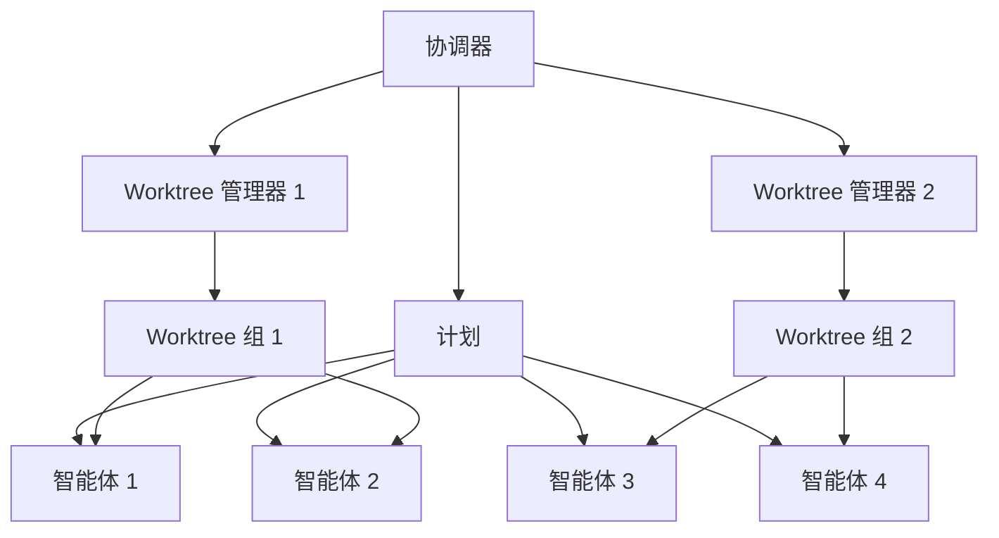
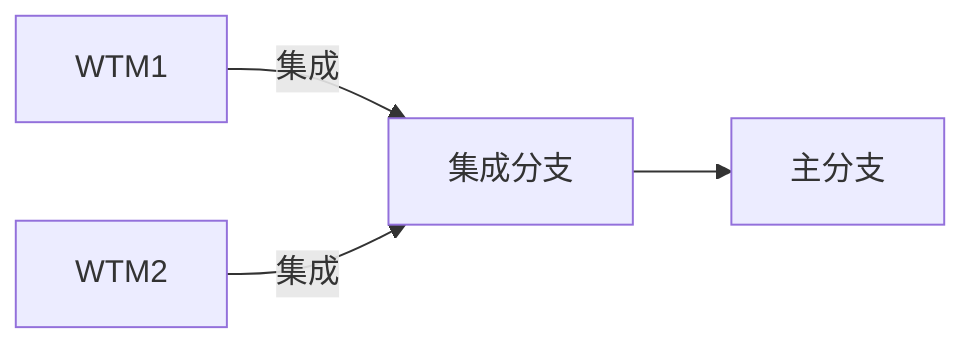
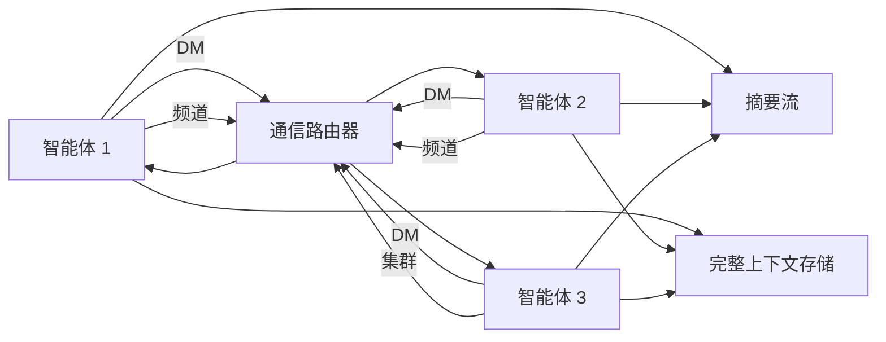
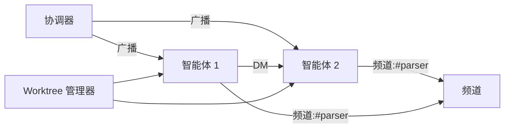
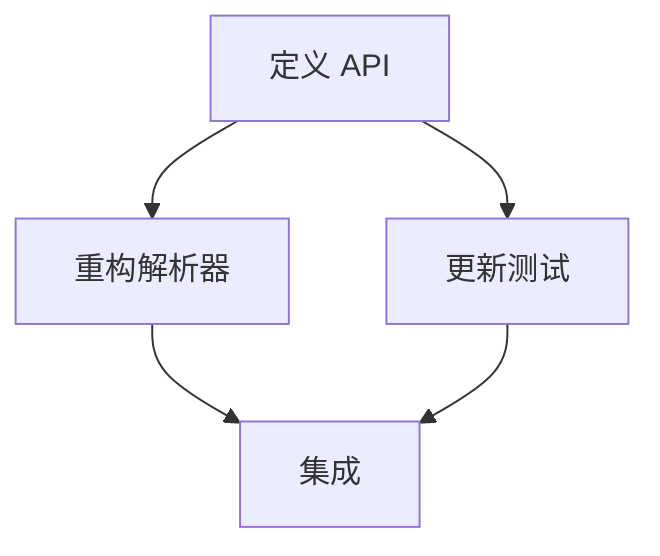

# 集群架构

状态：大体已实现（参见[集群任务图](集群任务图.md)了解取代本文智能体优先框架的 DAG 优先模型；其分阶段通信迁移正在进行中）

本文档描述集群协调设计。它描述智能体如何协调、规划、通信，并与可选的 git worktree 集成工作。

## 目标

- 在许多智能体之间无锁并行工作。
- 有全面的初始计划，但允许随工作进展演变。
- 计划分发带外进行（不存储在仓库中）。
- 集群运行时状态通过守护进程快照在重载和崩溃恢复后存活。
- 通过广播更新、私信和频道进行显式协调。
- 仅在合理时使用可选的 git worktree。
- 集成由 worktree 管理器处理，而非协调器。

## 角色

### 模式门控的派生

普通的临时集群和轻量集群模式是单级扇出：只有根会话可以派生智能体。工人向根汇报其结果，且不能创建下一代。这从构造上限制机会性集群使用。

递归派生仅保留给以 `swarm-deep` 模式运行的根。其后代可以在任意深度派生子级，受可配置的活动工人预算和绝对集群成员上限约束。在仓库中首次派生的根会话是深度 0。

派生/父级边由 `report_back_to_session_id` 编码：被 `P` 派生的子级向 `P` 汇报。沿该链回溯可重建血统和深度，因此每个智能体"拥有"它派生的子树。智能体可以停止其自身子树（自身或传递后代）中的任何智能体；要停止请求者子树之外的会话（例如用户创建的平级会话）仍需要 `force=true`。

当树中间成员离开（停止、崩溃、断开、功能关闭）时，其直接子级会被重新挂载而不是成为孤儿：它们挂到存活的祖辈，回退到当前协调器，否则成为根。会话重命名（恢复）会重写子级的汇报边指向新 id。这使归属、停止权限、子树广播范围和完成汇报在成员更替中保持连贯。

每集群单"协调器"槽仍然存在，但仅用于共享的集群级计划操作（对一个共享计划的提出/批准/分配/任务控制）。只有根会话认领该槽，且仅当它为空或过期时。授权的深度后代在派生时不会认领或干扰此槽。

嵌套属主通过派生提示词、直接消息和停止来协调自己的子树，而非通过共享计划。计划/任务操作（`assign_task`、`assign_next`、`task_control`、`approve_plan`、`reject_plan`）刻意保持由根协调器门控，因为每个 `swarm_id` 恰好有一个 `VersionedPlan`；允许多个协调器并发修改它会使共享计划不连贯。

### 协调器

- 拥有共享的集群级计划：创建它、分配范围、批准更新。
- 审阅计划更新提案并广播已批准的更新。
- 发现计划问题时可以直接发布计划更新。
- 决定是否需要 git worktree，并按 worktree 对智能体分组。
- 为共享计划操作持有每集群协调器槽（提出/批准/分配/任务控制）。这是根会话角色，不是派生的先决条件。
- 不执行合并或集成。

### Worktree 管理器

- 拥有单个 worktree 范围。
- 知道完整计划和 worktree 范围。
- 协调该 worktree 内的工作。
- 该 worktree 范围完成时负责集成。

### 智能体

- 并行执行任务。
- 派生时接收完整计划及各自的范围化指令。
- 发现计划问题或新需求时提出计划更新。
- 通过私信或频道直接与其他智能体协调。
- 启动、完成或意外停止时发出生命周期事件。
- 在深度集群中，可以派生子智能体并停止其派生的子树中的任何智能体。在轻量和临时集群中，工人不能派生。停止自身子树之外的智能体仍需要 `force=true`。

## 智能体生命周期状态

- spawned：会话已创建，尚未就绪。
- ready：已收到计划和范围，等待工作。
- running：正在积极执行任务或工具。
- blocked：无法继续（依赖、冲突或缺少信息）。
- completed：分配的范围已完成，等待新分配。
- failed：不可恢复错误，需要协调器决定。
- stopped：被协调器有意关闭。
- crashed：意外退出（无干净关闭）。

## 智能体生命周期通知

- 每个智能体在其分配范围完成时发出完成事件。
- 每个智能体在无法继续或意外退出时发出停止事件。
- 协调器接收这些事件并决定下一步（重派生、重新分配范围、关闭或标记完成）。
- 生命周期更新驱动集群信息组件的状态指示器。

## 完成汇报策略

- 由协调器派生或分配且拥有汇报属主（`report_back_to_session_id`）的智能体，必须以其工作回合的最后一次有效最终助手响应结束。服务器自动将该最终响应作为完成汇报转发给所属协调器。
- 完成汇报应包括结果/状态、变更或发现、执行的验证，以及阻塞项或后续事项。不应只是 `done`、生命周期状态变更或工具记录。
- 派生提示词、分配的计划任务以及显式的启动/唤醒/恢复/重试任务控制运行都需要汇报。如果工人在产生最终响应前失败，协调器仍会收到失败生命周期通知。
- 空闲的"无提示派生"会话、没有汇报属主的用户创建平级会话、工作仍在运行时的普通状态广播，以及有意清理/停止空闲工人，都不需要汇报。
- 智能体应避免单独发送最终报告私信，除非在结束前需要交互式协调；自动转发的汇报是默认路径。

## 用户交互

- 用户主要与协调器交互。
- 除非协调器路由更新或请求，否则其他智能体不直接呈现给用户。

## 计划分发与更新

- 集群计划是以 `swarm_id` 作用域的服务器级对象（不是会话待办列表）。
- 会话待办保持对每个会话私有，不作为集群计划存储。
- 计划 v1 由协调器创建/拥有。
- 计划更新由智能体提出，必须由协调器审阅。
- 计划更新传播给计划参与者，而非集群中的每个智能体。
- 计划参与是显式的（协调器分配/派生策略或重新同步挂接）。
- 计划不存储在仓库文件中。
- 智能体需要时可以显式请求计划挂接/重新同步。

计划更新流程：

## Worktree 使用

- Worktree 是可选的，仅在隔离有帮助时使用（大型重构、风险变更或分叉依赖）。
- 大多数工作应留在主工作区，除非 worktree 合理。
- 许多智能体可以共享单个 worktree。
- 每个 worktree 有一个拥有集成的 Worktree 管理器。
- 每个 worktree 被分配逻辑 `swarm_id`，因此通信、计划更新和 UI 视图跨越同一集群中的所有 worktree。

Worktree 分组：

集成：

## 通信

协调和冲突解决需要显式的智能体间通信。系统支持：

- 直接消息（DM）——首选的例外渠道
- 子树广播（只到达发送者派生的子树；集群协调器保留整集群可达性作为逃生通道）
- 主题频道（群聊）——不鼓励；优先使用 DM 和任务图工件
- 共享上下文键（设置/读取/追加）——不鼓励；优先使用仓库和类型化节点工件。共享通知像广播一样按子树作用域。
- 频道发现和成员检查

所有智能体都可以发送 DM 和子树广播。

所有智能体间通信都以通知形式投递（DM、频道消息、广播、计划更新、意图通知和生命周期事件）。通知作为软中断排队，并在安全点注入到正在运行的智能体中，因此消息可以在回合期间交错，而无需开始新回合。

已完成或空闲的智能体在通知到达时不会自动恢复。它们只在协调器分配新工作、显式启动或唤醒已分配任务、或重新派生它们时恢复。恢复交接也是显式的：重试保持同一受派人，重新分配把工作移给另一个现有智能体，替换在安全状态检查后换成新受派人，抢救则保留任务进度上下文重新分配。

状态快照、摘要读取和完整上下文读取是分离的操作：

- 状态快照：无锁成员元数据加上当前处理/工具快照。即使目标智能体正忙也必须保持可用。
- 摘要读取：简短活动流（带意图的工具调用、简要结果，以及可选的暴露思考）。
- 完整上下文读取：对智能体完整上下文和工具输出的显式、重量级读取。应少用以避免上下文膨胀。

通信拓扑：

## UI（TUI）

集群系统伴随两个实时组件：集群信息组件和计划信息组件。两者都从事件流持续更新。

### 集群信息组件

- 智能体、worktree 管理器、协调器和频道的图形视图。
- 边表示通信路径：DM、频道和集群广播。
- 节点显示状态（空闲、运行中、阻塞）和当前任务或意图。
- 基于通信事件、生命周期事件和工具意图事件实时更新。

集群图形视图：

### 计划信息组件

- 带依赖关系的任务 DAG 图形视图。
- 节点显示属主、范围和状态（queued、running、running_stale、done、blocked、failed）。
- 检查点显示为节点徽章或子节点。
- 协调器可以检查持久化的按任务进度，包括分配元数据、心跳年龄和最后检查点摘要。
- 通过已完成节点数、关键路径状态以及重载后持久化的检查点/心跳数据可见进度。
- 从计划广播和任务状态事件实时更新。

计划图形视图：

## 文件触碰与意图

- 文件触碰通知用于冲突检测。
- 计划在工具调用上提供一个可选的简短 `intent` 字段，为工具试图做什么提供预防性摘要。
- 意图应简短，用于构建摘要活动流。

## 冲突处理（无锁）

- 系统默认乐观（无锁）。
- 冲突应促使涉及的智能体直接通信。
- 协调通过 DM 或频道进行，不经过协调器。

## 总结

本设计强调并行、显式通信和可选的 worktree 隔离。协调器负责规划和计划更新；worktree 管理器负责集成；智能体直接协作解决冲突。
